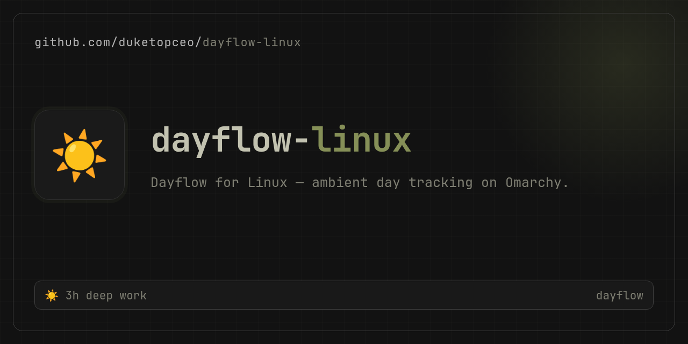

# Dayflow for Omarchy / Wayland

<p align="center">
  
</p>

A private, automatic work journal for Linux — a port of [Dayflow](https://www.dayflow.so/) (macOS) built for [Omarchy](https://omarchy.org)/Hyprland and other wlroots compositors.

It captures a lightweight screenshot every 10 seconds, deduplicates unchanged frames, and every 15 minutes asks a vision model (Gemma 4 via [OpenRouter](https://openrouter.ai) by default — $0.09/M tokens) to write a plain-language summary of what you were actually doing. The result is a readable timeline of your day — shown in a bar panel or from the CLI.

- **Local-first**: frames and the SQLite database live in `~/.local/share/dayflow/`. Nothing leaves your machine except the sampled frames sent for summarization.
- **Cheap**: — ~30 JPEG frames per 15-min block → `google/gemma-4-31b-it` by default. Any OpenRouter vision model works; non-vision models are rejected at config time.
- **Light**: single static Go binary, ~25MB RAM, sub-1% CPU.
- **Private controls**: pause toggle, per-app ignore list, automatic frame deletion, retention pruning.
- **Activity chunking**: each block is split into per-app segments (`activities[]`) and consecutive same-app blocks merge into cards. Failed summaries retry automatically (max 3 attempts, then `dead`; `dayflow retry` resets).
- **Multi-provider routing**: configure multiple OpenRouter / custom / local / MCP providers and route vision, summary, review, standup, chat, and classification tasks to different endpoints.
- **Jev classification**: after the vision model writes title/summary, [TypeSafe Jev](https://openrouter.ai/typesafe/jev-1.13) (`typesafe/jev-1.13` via OpenRouter's decisions API) picks category and productive flag — fast, typed, and calibrated instead of asking the vision model to guess both.
- **Agent-session recaps**: Claude Code and Codex sessions get a generated one-line recap of what was accomplished — Jev judges which sessions are worth summarizing and scores the result. Cached per transcript; `dayflow agents --no-recaps` for the raw list.
- **Daily goals + streaks**: set a goal for the day, check it off, and track your consecutive-day completion streak (current, best, and all-time totals).
- **Week-over-week trends**: the weekly view diffs this week against last — tracked/focus/distraction/shift deltas plus per-category movement in minutes and share points.
- **Chat with your journal**: ask natural-language questions about your timeline, standup, weekly analytics, or search your journal.
- **Inline editing**: correct a block's title, category, summary, or productive flag; edits overlay the raw row and flow into analytics.
- **Standup drafts**: save highlights, tasks, blockers, and priorities; they appear in generated standup updates.
- **Daily workflow grid**: a macOS-style 15-minute slot view of the day by category.
- **Weekly analytics**: category donut, app treemap, context-shift Sankey, focus blocks, highlights, and suggestions.

## Repository layout

This repo is both the Omarchy plugin and the engine:

```
manifest.json      # Omarchy plugin manifest (repo root, per marketplace rules)
BarWidget.qml      # bar indicator: recording state, click for panel
Panel.qml          # timeline panel + settings footer
engine/            # Go CLI/daemon (the tracking engine)
scripts/stress.sh  # live stress test
preview.png        # marketplace preview
```

## Requirements

- Wayland compositor where `grim` works (Hyprland, sway, river, … — any wlroots-based compositor, any GPU vendor). On non-wlroots compositors set `capture_command` to a tool that writes an image to stdout.
- `systemd --user` for the background units
- `hyprctl` (optional) for the app ignore list — Hyprland only
- An OpenRouter API key
- Go to build the engine (prebuilt binaries: see Releases)

## Install the engine

```sh
cd engine
go build -o dayflow .
install -Dm755 dayflow ~/.local/bin/dayflow
dayflow install    # writes + enables systemd user units
systemctl --user enable --now dayflow-capture.service
```

Onboarding:

```sh
dayflow setup      # interactive: paste key, it validates + picks a vision model
dayflow doctor     # sanity-check session, grim, key, model
dayflow models     # list vision-capable models for your key
```

Or set the key manually: `dayflow config set openrouter_api_key sk-or-...`, `OPENROUTER_API_KEY` env, or `~/.config/openrouter/keys.json` (auto-detected). Use a dedicated OpenRouter key if you want separate spend tracking.

### Using a local model (Ollama / LM Studio)

```sh
dayflow config set api_base_url http://localhost:11434/v1
dayflow config set model llama3.2-vision   # or any vision model served by your endpoint
dayflow config set openrouter_api_key ""     # local endpoints usually need no key
```

Dayflow uses the OpenAI-compatible `/chat/completions` endpoint. Any local server that accepts base64 `image_url` payloads works.

### Upgrading the engine

The panel, the engine binary, and the database schema must stay in sync. After pulling a new release:

```sh
cd engine && go build -o dayflow . && install -Dm755 dayflow ~/.local/bin/dayflow
systemctl --user restart dayflow-capture.service
```

Then restart any long-lived `dayflow mcp` clients (editors and agents keep their own process running the old binary). `dayflow doctor` reports the engine version, the database schema version, integrity, and untracked frame files; run it after every upgrade. Migrations run automatically on the next engine start and are additive — existing journal data is preserved.

## Install the plugin

```sh
omarchy plugin add https://github.com/duketopceo/dayflow-linux.git --enable
```

or for local development:

```sh
cp -r . ~/.config/omarchy/plugins/io.github.duketopceo.dayflow   # excludes .git
omarchy-shell shell rescanPlugins
omarchy plugin enable io.github.duketopceo.dayflow
```

Bar widget: recording indicator; left-click opens the timeline panel, right-click pauses/resumes. The panel shows today's blocks, engine stats, the ignore list, and pause / ignore-focused-app / summarize-now / standup / insights controls.

The panel's **Full view** button opens a standalone window with Today/Week timelines, a timelapse frame scrubber (requires `dayflow playback on`), a context-shift flow diagram, Claude Code/Codex session recaps, and a next-day forecast.

## Uninstall

```sh
omarchy plugin disable io.github.duketopceo.dayflow
omarchy plugin remove io.github.duketopceo.dayflow   # or rm -rf ~/.config/omarchy/plugins/io.github.duketopceo.dayflow
dayflow uninstall                                       # removes systemd user units
dayflow pause
rm -rf ~/.local/share/dayflow                         # wipes all captured frames and the journal
rm -rf ~/.config/dayflow                              # wipes config
```

Uninstalling leaves your data in place until you `rm -rf` it, so you can back out or migrate first.

## CLI

```sh
dayflow today                  # today's timeline
dayflow day 2026-09-03         # any day
dayflow day --grid             # macOS-style daily workflow grid
dayflow status                 # state, counts, model
dayflow standup                # yesterday/today standup update
dayflow standup save           # save draft fields for today
dayflow standup draft          # load saved draft
dayflow insights [day|week|month] # focus, categories, apps, distractions
dayflow weekly                 # weekly analytics + charts
dayflow chat "What did I work on this week?" [--conversation-id N]
dayflow conversations          # list chat threads
dayflow edit <start> <field> <value>   # correct title/category/summary/productive
dayflow provider list|add|set|remove|test  # multi-provider routing
dayflow summarize --now        # force summarization including the current block
dayflow pause | resume | toggle
dayflow ignore <class>         # never capture while this app is focused
dayflow ignore --active        # ignore the currently focused app (Hyprland)
dayflow unignore <class>
dayflow events -n 20           # full audit log: captures, skips, errors
dayflow usage                  # token totals across all API calls
dayflow blocks                 # failed summaries (auto-retried)
dayflow frames [YYYY-MM-DD]    # list captured frames for a day
dayflow playback on|off|status # opt-in frame retention for timelapse (10GB cap)
dayflow agents [YYYY-MM-DD]    # Claude Code / Codex sessions + generated recaps
dayflow agents --no-recaps     # fast session list, no model calls
dayflow forecast [YYYY-MM-DD]  # predict a day's category mix from history (default: tomorrow)
dayflow goal [set <text>|done|clear] [--date D]  # daily goal + completion streak
dayflow key set|status|del     # store API keys in OmaSeal instead of config.json
dayflow log <msg>              # append a UI action line to debug.log
dayflow week | month           # multi-day rollups
dayflow export week [--copy]   # markdown export to stdout (or clipboard)
dayflow export week --out <path> # atomic file export (0600; used by dayflow-export.timer)
dayflow search <query>         # search titles, summaries, apps
dayflow retry                  # reset failed/dead blocks for re-summarization
dayflow reconcile [--dry-run]  # report/quarantine frame files missing from the index
dayflow backup [dir]           # snapshot db + config (redacted) + frames
dayflow backup-verify <dir>    # check a backup's manifest and db integrity
dayflow restore <dir> [--force] # restore a backup (stop capture first)
dayflow scrub <query>          # delete blocks matching a query
dayflow tui                    # interactive terminal timeline, standup, insights
dayflow mcp                    # MCP server for agents (stdio)
dayflow config set <k> <v>     # live settings
dayflow uninstall              # remove systemd units (data stays)
```

All query commands accept `--json`.

## Config

`~/.config/dayflow/config.json`:

| key | default | notes |
|---|---|---|
| `model` | `google/gemma-4-31b-it` | any vision model |
| `api_base_url` | `""` | OpenAI-compatible endpoint; empty = OpenRouter. Set to `http://localhost:11434/v1` for Ollama. |
| `capture_interval_sec` | 10 | frame interval |
| `block_minutes` | 15 | summary granularity |
| `frames_per_block` | 30 | frames sampled per API call |
| `jpeg_quality` | 55 | grim JPEG quality |
| `keep_frames` | false | keep raw frames after summarizing |
| `retention_days` | 7 | prunes frames, events, and api logs |
| `max_storage_mb` | 10240 | cap on the whole data dir (frames + db + wal); 0 = unlimited |
| `auto_pause_locked` | true | pause capture while the session is locked (via loginctl) |
| `ignore_apps` | `[]` | window classes never captured (Hyprland) |
| `output` | `""` | restrict capture to one monitor (`grim -o`) |
| `capture_command` | `""` | custom screenshot command (writes image to stdout) |
| `openrouter_api_key` | `""` | API key |
| `jev_classification` | `true` | TypeSafe Jev calibrated judgments — category, merge, quality, triage, forecast. Judge calls egress to OpenRouter's decisions endpoint; set `false` to keep every block local. |
| `agent_recaps` | `true` | Generate agent-session recaps. Generation sends a bounded, scrubbed transcript excerpt (paths → `~`, common token shapes → `[redacted]`) to the chat provider; `false` serves cached recaps only — a durable no-egress opt-out. |
| `classification_model` | `typesafe/jev-1.13` | Jev model slug (OpenRouter decisions API) |
| `site_name` | `dayflow-linux` | X-Title header for OpenRouter |

## Backups

`dayflow install` enables a daily `dayflow-backup.timer` that snapshots the
database, a secret-redacted copy of the config, and any retained frames into
`~/.local/share/dayflow-backups/dayflow-<timestamp>/` (keeps the last 7).
Override the location with `DAYFLOW_BACKUP_DIR`.

```sh
dayflow backup                  # snapshot now (default dir)
dayflow backup /mnt/backup      # snapshot somewhere else
dayflow backup --no-frames      # db + config only
dayflow backup-verify <dir>     # manifest + integrity check
```

To restore, stop capture, restore, and restart:

```sh
systemctl --user stop dayflow-capture.service dayflow-summarize.timer
dayflow restore ~/.local/share/dayflow-backups/dayflow-<timestamp>
systemctl --user start dayflow-capture.service dayflow-summarize.timer
```

Restore refuses to overwrite a live database without `--force` and rejects
backups from a newer engine schema. The config file is restored manually —
API keys are redacted from backups on purpose, so re-set them with
`dayflow config set openrouter_api_key <key>`.

## Privacy

- `dayflow pause` (or right-click the bar widget) drops a flag file the daemon checks before every capture.
- Capture automatically pauses while your session is locked when `auto_pause_locked` is true (via `loginctl`).
- Ignored apps are skipped at capture time — their frames are never written to disk.
- All frames are deleted after summarization unless `keep_frames` is on; retention pruning removes anything older than `retention_days`.
- `max_storage_mb` caps the entire data directory; oldest summarized frames and then oldest journal rows are pruned and vacuumed.
- Everything lives in `~/.local/share/dayflow/` — `rm -rf` it to wipe all data.

For a plain-language summary, see [PRIVACY.md](PRIVACY.md).

## Cross-hardware / portability

Capture goes through `grim` → the compositor's screencopy protocol, which is hardware-agnostic (Intel, AMD, NVIDIA, ARM). The Go binary is pure-Go + `modernc.org/sqlite` (no cgo) and builds for `amd64`, `arm64`, etc. AI can run on OpenRouter or any OpenAI-compatible local endpoint (`api_base_url` = `http://localhost:11434/v1` for Ollama, `http://localhost:1234/v1` for LM Studio, etc.). On non-wlroots compositors (KDE, GNOME), set `capture_command` — e.g. `"gnome-screenshot -f /dev/stdout"` or a small wrapper.

## MCP / agent access

`dayflow mcp` is a stdio MCP server exposing `get_timeline`, `get_status`,
`search_journal`, `get_events`, `get_usage`, `get_stats`, `get_standup`,
`get_insights`, and `chat`. All tools except `chat` are pure reads; `chat`
writes conversation history and calls the configured AI provider. Use
`--read-only` (or `DAYFLOW_MCP_READONLY=1`) to hide and block `chat`.
See [docs/agent-contract.md](docs/agent-contract.md) for the agent contract
(read rules, schema, Tailscale/remote access).

```sh
claude mcp add dayflow -- ~/.local/bin/dayflow mcp
# remote over Tailscale SSH (never Funnel):
claude mcp add dayflow-remote -- ssh <host>.<tailnet>.ts.net ~/.local/bin/dayflow mcp --read-only
```

## Testing

```sh
cd engine && go test ./...   # unit + end-to-end tests with a stubbed API
scripts/stress.sh            # live stress test against a sandboxed data dir
```

## Not a 1:1 port

No audio capture, no menu-bar app, no onboarding wizard. Just the tracking engine plus a minimal bar widget. MIT licensed, like the original.
