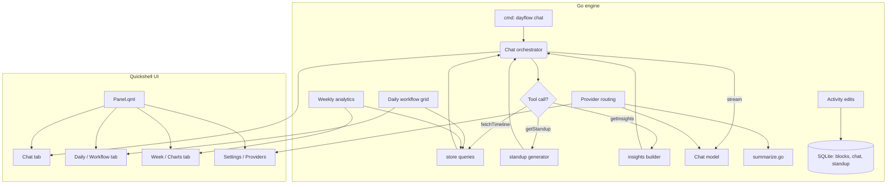

# Dayflow Linux macOS Parity Roadmap: Chat, Workflow, Providers, and Weekly Analytics

## Summary

Dayflow Linux has reached core feature parity with Dayflow macOS for capture, summarization, daily/weekly timelines, settings, and MCP. The gap is now in the product experience: macOS has a native **Chat with your work journal**, a richer **Daily/Standup workflow**, multi-provider routing with prompt overrides, and richer **weekly analytics/charts**. This plan defines a phased, non-rewrite path to close those gaps while keeping the existing Quickshell panel and Go engine architecture.

The recommendation is **not** to turn the project into a standalone GUI app. Instead, the Quickshell panel grows new tabs, the Go engine grows richer data and chat services, and the UI stays inside the existing Omarchy plugin lifecycle.

## Problem Frame

The Dayflow Linux repository is an Omarchy plugin (`BarWidget.qml` + `Panel.qml`) with a Go engine (`engine/*.go`) that captures Wayland frames, summarizes them via vision models, and stores results in a small SQLite schema. It already supports:

- Capture, deduplication, pause, and privacy scrubbing.
- Today, Standup, Week, and Settings tabs.
- MCP server for agents.
- OpenRouter, local endpoints, and custom providers.
- Markdown export and search.

Compared with the open-source macOS reference (`JerryZLiu/Dayflow`), Linux is missing or only partial in:

1. **Chat with the journal** — there is no conversational UI or chat history.
2. **Daily workflow / activity grid** — no GitHub-style focus grid or editable standup blockers.
3. **Provider routing** — only one provider/model at a time; no failover or per-provider prompt overrides.
4. **Weekly analytics** — only totals and a heatmap; no donut/treemap/Sankey/highlight charts.
5. **Inline activity editing** — users cannot correct titles/categories in the panel.

These are the highest-value gaps for the official Omarchy marketplace because they are the features users can demo immediately.

## Scope Boundaries

### In scope

- Schema additions for chat, standup drafts, journal, provider routing, and activity edits.
- Go engine changes to support multi-provider routing, tool-mediated chat, daily workflow computation, and richer weekly analytics.
- Quickshell UI changes: new Chat tab, Daily workflow grid, richer Week tab, editable standup draft, inline activity editing.
- CLI additions (`dayflow chat`, `dayflow provider`, richer `dayflow standup`, `dayflow weekly`).
- Per-provider prompt overrides and local key storage (file-based, 0600 permissions).
- Test scenarios and engine unit tests for each implementation unit.

### Deferred to follow-up work

- Video/timelapse playback and HEVC segment storage.
- Native agent recap UI for Codex/Claude CLI sessions.
- Journal beta with morning/evening reflections and AI video summary.
- Flow web-app integration (requires Dayflow account backend).
- Onboarding wizard (the current `dayflow setup` is sufficient for CLI-first users).
- Keychain-level API secret storage (defer until a libsecret/secret-tool integration is justified).

### Out of scope

- Rewriting the app as a standalone Qt/GTK/Electron desktop application.
- Audio capture.
- macOS-specific AppKit/ScreenCaptureKit code or assets.

## Key Technical Decisions

### KTD1. Keep the Quickshell panel architecture

**Decision:** Continue to ship as an Omarchy Quickshell plugin with a Go engine; do not build a separate GUI app.

**Rationale:** A full SwiftUI-style GUI rewrite would replace a working, already-installed panel. The macOS visualizations can be approximated in QML Canvas, SVG, or small web views later. The data and chat logic is the harder, more valuable part.

### KTD2. Store chat, standup, and journal data in SQLite alongside blocks

**Decision:** Extend the existing SQLite database with new tables rather than moving to a document store or the macOS GRDB schema.

**Rationale:** `engine/store.go` already uses `modernc.org/sqlite` with WAL mode. Adding migrations keeps the local-first, single-file deployment model and avoids a database migration project.

### KTD3. Use a tool-mediated chat model

**Decision:** Implement chat with the same pattern as macOS: the model emits JSON tool calls (`fetchTimeline`, `fetchObservations`, `getStandup`, `getInsights`) and the engine executes them before continuing the conversation.

**Rationale:** Tool calls keep the chat grounded in the actual database, reduce token usage, and avoid dumping the whole journal into context. This maps cleanly onto the existing MCP tool surface.

### KTD4. Add provider routing in `engine/config.go` before adding chat/standup AI features

**Decision:** Refactor the single-provider config into a primary/secondary routing structure and per-provider prompt overrides before building Chat/Daily/Weekly AI features.

**Rationale:** Chat and standup require different prompt types (title, summary, detailed, chat). Provider routing makes it possible to send vision tasks to one model and text/chat to another, which is how macOS separates `gemini`, `chatgpt`, `claude`, and `local`.

### KTD5. Render weekly charts as JSON-backed QML Canvas/SVG, not a web view

**Decision:** The first version of weekly charts will be QML `Canvas` or pre-computed SVG shapes fed by the Go engine.

**Rationale:** This avoids a new dependency stack and keeps the panel offline and lightweight. If richer interactivity is needed later, a local web view can replace the canvas.

## High-Level Technical Design



The engine remains the source of truth. The panel requests JSON over the existing `Process` invocations and renders tabs with the current `Dayflow` model.

## Output Structure

```text
docs/plans/2026-09-05-001-feat-dayflow-macos-parity-roadmap-plan.md
engine/
  chat.go              # chat orchestrator, tool executor, persistence
  chat_test.go         # chat tool parsing and context tests
  provider.go          # provider routing, per-provider prompts
  provider_test.go     # routing and prompt selection tests
  daily.go             # daily workflow computation and standup draft
  daily_test.go        # workflow grid and draft tests
  weekly.go            # weekly analytics queries and chart payload
  weekly_test.go       # chart payload tests
  edit.go              # inline block edit commands
  edit_test.go         # edit persistence tests
  store.go             # schema and migrations
  config.go            # provider config and prompt overrides
  main.go              # new CLI subcommands
  mcp.go               # expose chat tools to MCP
Panel.qml              # new tabs and properties
Chat.qml               # new Chat tab component
DailyWorkflowGrid.qml  # new daily workflow grid component
Settings.qml           # provider routing and prompt override UI
```

## Implementation Units

### U1. Extend the SQLite schema and migrations

**Goal:** Add tables for chat, standup drafts, provider routing snapshots, and user edits so later units have a place to persist data.

**Requirements:** R1, R2, R3, R4

**Dependencies:** None.

**Files:**
- `engine/store.go`
- `engine/setup.go`
- `engine/main_test.go`

**Approach:**
1. Add `chat_conversations`, `chat_messages`, `standup_drafts`, `journal_entries`, `day_goals`, `llm_calls`, and `block_edits` tables via migrations.
2. Keep `frames`, `blocks`, `events`, `api_calls` unchanged; new tables reference `blocks.start_ts`.
3. Run migrations on `openDB()` before any query.
4. Add a `migrations_test` or extend `main_test.go` to assert all tables exist after open.

**Patterns to follow:**
- Use `ALTER TABLE ... ADD COLUMN` ignore-errors pattern from `engine/store.go` line 59-71.
- WAL mode and busy timeout are already set; keep them.

**Test scenarios:**
- Happy path: opening a fresh database creates all new tables.
- Edge case: opening an existing database with old tables applies migrations without errors.
- Error path: migration returns clear error if the database file is read-only or corrupt.

**Verification:** `go test ./...` passes and `dayflow doctor` reports the new schema version.

---

### U2. Provider routing and per-provider prompt overrides

**Goal:** Support multiple LLM providers with primary/secondary routing and per-provider prompt overrides for vision, text, and chat.

**Requirements:** R5, R6

**Dependencies:** U1.

**Files:**
- `engine/config.go`
- `engine/provider.go` (new)
- `engine/provider_test.go` (new)
- `engine/summarize.go`
- `engine/main.go`
- `Settings.qml`

**Approach:**
1. Introduce a `Providers` list in `Config` with fields: `id`, `name`, `kind`, `api_base_url`, `api_key`, `model`, `vision`, `chat`, `enabled`, and `prompt_overrides`.
2. Add a `ProviderRouting` struct with `primary` and `secondary` IDs and `task->provider` map (`title`, `summary`, `detailed`, `chat`, `standup`).
3. Refactor `callLLM` and `callLLMText` to accept a `task` string and pick the provider from routing.
4. Add `dayflow provider list`, `dayflow provider set`, and `dayflow provider test`.
5. Extend `Settings.qml` to show provider rows, a routing matrix, and per-provider prompt override fields.

**Patterns to follow:**
- `engine/summarize.go` line 40-54 already builds category prompts; per-provider overrides follow the same pattern with a map of `title`, `summary`, `detailed`, `chat` prompts.

**Test scenarios:**
- Happy path: a `chat` task routes to the `openrouter` primary model even when `local` is the vision primary.
- Edge case: missing secondary provider falls back to primary for any task.
- Error path: a provider with an empty `api_key` is skipped and the next candidate is tried; if none work, return a clear error.
- Integration scenario: changing `provider` in `config.json` is reflected by `dayflow config` and `dayflow status --json`.

**Verification:** `go test ./...`, `dayflow provider test` succeeds for each configured provider, and the Settings UI shows the new fields.

---

### U3. Daily workflow heat grid and standup drafts

**Goal:** Add the macOS-style daily activity grid and an editable standup draft with blockers and priorities.

**Requirements:** R7, R8

**Dependencies:** U1, U2.

**Files:**
- `engine/daily.go` (new)
- `engine/daily_test.go` (new)
- `engine/standup.go`
- `engine/main.go`
- `Panel.qml`
- `DailyWorkflowGrid.qml` (new)

**Approach:**
1. Port the slot-filling algorithm from `DailyWorkflowComputation.swift`: for a day, build 15-minute slots, group consecutive slots of the same category, mark distractions, and compute category totals.
2. Add `dayflow day --grid` and `dayflow standup draft` CLI outputs.
3. Persist standup drafts in `standup_drafts` (highlights, tasks, blockers, priorities) keyed by date.
4. Add `dayflow standup save` and `dayflow standup load`.
5. In `Panel.qml`, add a new Daily tab (or extend Standup) to show `DailyWorkflowGrid.qml` and editable `TextArea` fields for blockers/priorities.

**Patterns to follow:**
- `engine/standup.go` already aggregates by app+category; the grid adds time-slot orientation.
- `Panel.qml` already uses `Dayflow` properties and `Process` invocations for tabs.

**Test scenarios:**
- Happy path: a day with 3 hours of `coding` and 1 hour of `media` produces the correct grid and category totals.
- Edge case: a day with no blocks returns an empty grid rather than a panic.
- Error path: saving a draft without a date returns a validation error.
- Integration scenario: editing blockers in the panel calls `dayflow standup save` and the next `dayflow standup` includes the text.

**Verification:** `go test ./...`, the Daily tab renders the grid, and `dayflow standup` still works unchanged for users who do not edit the draft.

---

### U4. Chat with your work journal

**Goal:** Add a conversational chat UI and back end that lets the user ask questions about their journal.

**Requirements:** R9, R10

**Dependencies:** U1, U2, U3.

**Files:**
- `engine/chat.go` (new)
- `engine/chat_test.go` (new)
- `engine/mcp.go`
- `engine/main.go`
- `Panel.qml`
- `Chat.qml` (new)

**Approach:**
1. Add `chat_conversations` and `chat_messages` tables; messages have `role`, `content`, `tool_calls`, and `created_at`.
2. Implement a chat orchestrator that builds a message list with a system prompt and user turns.
3. Implement `ChatToolExecutor` with at least `fetchTimeline`, `fetchObservations` (per-app details), `getStandup`, and `getInsights`.
4. Model returns text or JSON `{"tool": "...", "args": {...}}`; the engine executes it and appends the result as a `tool` message.
5. Add `dayflow chat "<query>"` and `dayflow chat --interactive`.
6. Add a `chat` command to `mcp.go` so MCP clients can query.
7. Add a Chat tab in `Panel.qml` using `Chat.qml` with a message list, composer, and streaming indicator.

**Patterns to follow:**
- `engine/review.go` already calls a text model with `callLLMText`; chat uses the same `callLLMText` from the provider router.
- `engine/mcp.go` already maps tool names to Go functions; chat tools extend that map.

**Test scenarios:**
- Happy path: user asks "What did I do yesterday?" and the model calls `fetchTimeline` for yesterday, receives blocks, and answers in plain language.
- Edge case: a model response with invalid tool JSON is treated as plain text and stored without executing.
- Error path: the chat command without any configured chat provider returns an error.
- Integration scenario: a conversation persists across `dayflow chat` invocations for the same `conversation_id`.

**Verification:** `go test ./...`, `dayflow chat "what did I do this week?"` returns an answer, and the panel Chat tab displays history correctly.

---

### U5. Inline activity editing and corrections

**Goal:** Let users correct a block's title, category, or productive flag from the Today panel.

**Requirements:** R11, R12

**Dependencies:** U1.

**Files:**
- `engine/edit.go` (new)
- `engine/edit_test.go` (new)
- `engine/store.go`
- `engine/main.go`
- `Panel.qml`

**Approach:**
1. Add `block_edits` table to record `start_ts`, `field`, `old_value`, `new_value`, `edited_at`.
2. Apply edits to `blocks` by overlaying the latest edit on the base row.
3. Add `dayflow edit <start_ts> title|category|productive <value>` and `dayflow edits <start_ts>`.
4. In `Panel.qml`, add editable fields to each activity card when expanded and a "Save edit" button.
5. When `filter_inappropriate` is on, reject edits that put sensitive content back into the ledger.

**Patterns to follow:**
- The `blocks` table is append-only for summarization; edits are stored as overlay rows, mirroring the macOS `timeline_review_ratings` pattern.

**Test scenarios:**
- Happy path: editing the title of a block returns the new title in `dayflow today`.
- Edge case: multiple edits to the same field return the latest value.
- Error path: editing a nonexistent block returns a clear error.
- Integration scenario: a corrected category changes the next `dayflow insights` distribution.

**Verification:** `go test ./...`, the Today panel allows saving an edit, and the change is visible in the next timeline refresh.

---

### U6. Weekly analytics and basic charts

**Goal:** Expand the Week tab with richer analytics and simple chart payloads (donut, treemap, context-shift) backed by Go.

**Requirements:** R13, R14

**Dependencies:** U1, U2.

**Files:**
- `engine/weekly.go` (new)
- `engine/weekly_test.go` (new)
- `engine/insights.go`
- `engine/main.go`
- `Panel.qml`

**Approach:**
1. Add `dayflow week --json` payload fields for: category donut, app treemap, Sankey-style context-shift, focus heatmap, top highlights, and suggestions.
2. Implement analytics queries in `engine/weekly.go` without adding heavy chart dependencies in Go.
3. Pre-compute suggestions and highlights with a lightweight text model call (if a `weekly_review` provider is configured) or use heuristics.
4. Render charts in the Week tab using QML `Canvas` or SVG `Image` elements fed by the JSON payload.
5. Keep the existing AI weekly review (`engine/review.go`) but move its output under a new "Review" sub-card in the Week tab.

**Patterns to follow:**
- `engine/insights.go` already produces distributions; `engine/weekly.go` extends it with visual-ready structures.

**Test scenarios:**
- Happy path: `dayflow week --json` returns a payload with all chart data types for a week with recorded blocks.
- Edge case: a week with only idle blocks returns an empty/zero chart set and no divide-by-zero.
- Error path: a missing range argument defaults to the current week and prints a warning.
- Integration scenario: changing the `blockMinutes` config still produces correct minute totals in the weekly payload.

**Verification:** `go test ./...`, the Week tab renders charts, and `dayflow export week` still works.

## Open Questions

1. Should the provider routing UI distinguish `gemini` as a separate endpoint style, or is it enough to support it through the `openai_compatible` path with a custom base URL and bearer key?
2. Should chat messages support multi-turn streaming in the panel immediately, or is a synchronous "ask and wait" model acceptable for the first version?
3. Should `DailyWorkflowGrid.qml` use 15-minute slots or finer 5-minute slots to match macOS? The macOS `DailyWorkflowComputation` uses 15-minute slots.
4. Do we want user rating of summaries (`timeline_review_ratings`) before or alongside activity editing? This affects U5.

## Risks & Dependencies

- **Provider routing complexity:** Supporting many providers can bloat `Config`. Mitigation: start with `openrouter`, `local`, and `custom` under the new routing struct; add `gemini` and `claude` only if needed.
- **QML Canvas rendering:** Chart rendering in QML is less polished than macOS SwiftUI. Mitigation: first version uses simple shapes and SVG; consider a web view only if the panel cannot draw the needed charts.
- **Token cost:** Chat and weekly AI review make API calls. Mitigation: tool-mediated chat limits context; weekly review remains on-demand; provider routing can route chat to a cheap local model.
- **Schema migration on active installs:** The database is live on the user's machine. Mitigation: all migrations are `ALTER TABLE` style and run automatically on open; never drop tables.

## Verification Contract

- `go test ./...` passes for every unit before it is considered landed.
- `dayflow doctor` reports no issues after each unit.
- The active Omarchy plugin is reloaded and visually verified for any QML change.
- New CLI commands (`dayflow chat`, `dayflow provider`, `dayflow standup save`, `dayflow day --grid`, `dayflow week --json`) are exercised manually.
- The panel is checked on the user's 1920x1080, scale 1.25 display.

## Definition of Done

- All U1-U6 implementation units are landed with passing tests.
- The Quickshell panel exposes Chat, Daily (workflow + standup draft), and richer Week tabs.
- The engine supports multi-provider routing and per-provider prompt overrides.
- Users can edit a block's title, category, and productive flag from the Today panel.
- `dayflow chat` can answer questions about the journal using tool calls.
- The repository remains professional, public, and free of job-application or hiring references.

## Sources & Research

- macOS reference architecture discovered in `/tmp/dayflow-mac`:
  - `Dayflow/Dayflow/Core/AI/ChatToolExecutor.swift` (tool-mediated chat)
  - `Dayflow/Dayflow/Core/AI/LLMProviderRouting.swift` (primary/secondary provider routing)
  - `Dayflow/Dayflow/Core/Recording/StorageManager+Migrations.swift` (schema migration patterns)
  - `Dayflow/Dayflow/Views/UI/DailyWorkflowComputation.swift` (15-minute workflow grid logic)
  - `Dayflow/Dayflow/Views/UI/WeeklyView.swift` and `Views/UI/Weekly/Sections/*.swift` (chart breakdowns)
  - `Dayflow/Dayflow/Core/Recording/StorageManager+DailyStandup.swift` (per-day standup JSON payload)
- Linux base:
  - `engine/store.go` (current SQLite schema and migration pattern)
  - `engine/config.go` (current provider/model config)
  - `engine/summarize.go` (vision prompt and per-app activities)
  - `engine/standup.go` (aggregated standup entries)
  - `engine/insights.go` (focus/distraction analytics)
  - `engine/review.go` (text-only AI review)
  - `engine/mcp.go` (existing MCP tool surface)
  - `Panel.qml` (current tab model and property surface)
  - `Settings.qml` (current settings UI)
