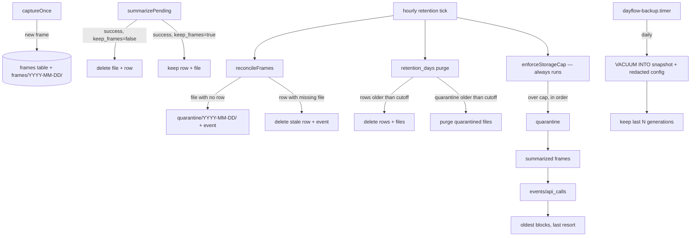
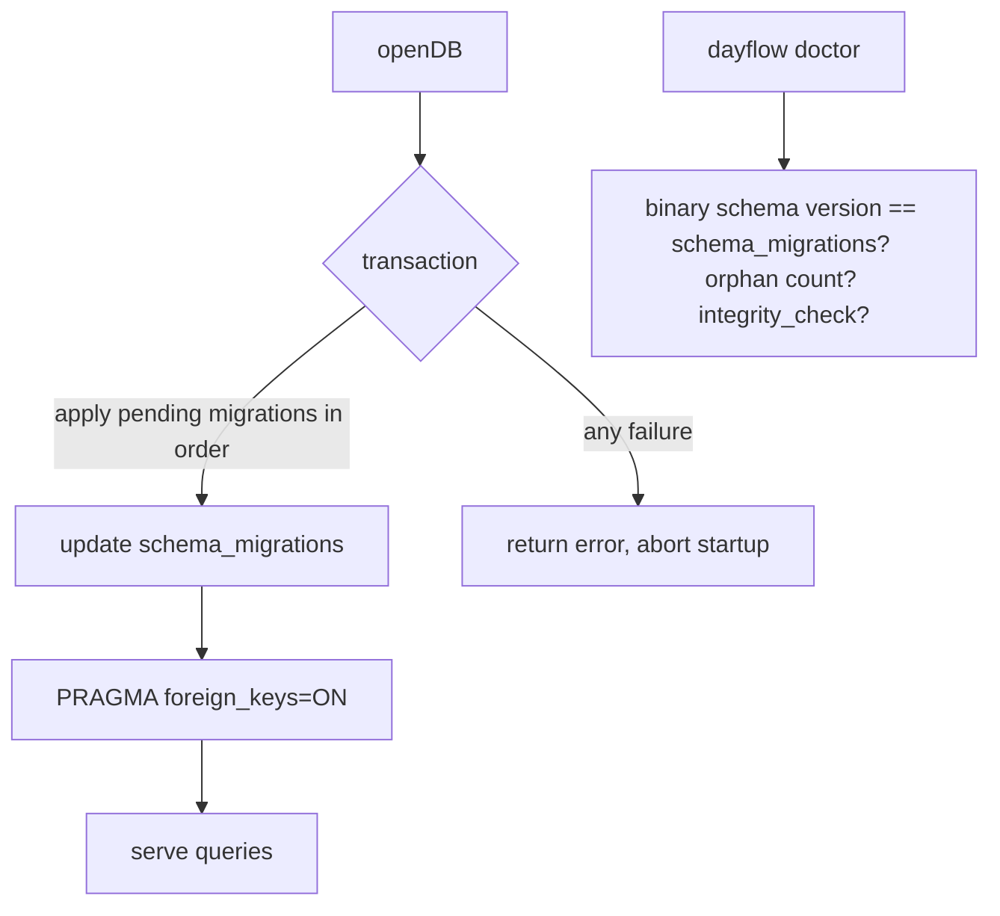

# Dayflow Linux Audit Hardening - Plan

## Goal Capsule

- **Objective:** A user running Dayflow Linux can trust it: the installed engine, panel, and database are mutually compatible, screenshots are deleted or retained exactly as configured, the journal survives disk pressure and host failure through tested backups, and agents get the journal through a documented least-privilege interface.
- **Means:** Harden the existing Go engine + Quickshell plugin in place — versioned SQLite migrations, a filesystem/frames reconciliation pass, corrected storage-cap enforcement, a `VACUUM INTO`-based backup/restore with a systemd user timer, a read-only MCP mode plus an agent contract doc, and targeted QML correctness fixes. No architecture change (KTD1).
- **Authority hierarchy:** this plan's Requirements > the audit evidence cited under Sources > the parity roadmap at `docs/plans/2026-09-05-001-feat-dayflow-macos-parity-roadmap-plan.md` (already implemented; reference only).
- **Stop conditions:** live data loss risk detected mid-work (stop, back up first); a migration cannot be made additive; QML changes cannot be validated on the user's display.
- **Execution profile:** engine-first, then agent surface, then UI; each unit lands independently with `go test ./...` green.
- **Finishing:** the executor ships all units, runs the Verification Contract, and confirms Definition of Done.

---

## Product Contract

### Summary

The audit found the source tree healthy but the installed system untrustworthy: the panel runs `1.0.1` UI against a `1.0.0` engine and a partially migrated database, 309 screenshot files exist with no database row (despite `keep_frames=false`), the storage cap deletes every summarized frame once triggered, there is no backup or restore path, migrations can silently fail with foreign keys off, the dedup hash silently discards 3/4 of its samples, and `dayflow doctor` reports all of this as healthy. This plan remediates those findings in the current architecture, and fixes the highest-value panel defects (dead chat history, zero-value settings, eager loading).

### Problem Frame

Dayflow captures screenshots of everything on screen and sends them to a vision model. That makes data handling correctness the product's core promise: a frame that outlives its configured retention, a journal that cannot be restored, or a "healthy" doctor report on a broken install each break that promise. The 2026-09-14 audit produced concrete evidence for each gap (309 orphan JPEGs, `PRAGMA foreign_keys = 0`, installed binary `1.0.0` vs source `1.0.1`, no backup units), so the work here is remediation of verified defects, not speculative hardening.

### Requirements

**Release and compatibility**

- R1. The installed engine binary, the Quickshell panel, and the SQLite schema are mutually version-compatible after upgrade, and `dayflow doctor` detects and reports any future drift (engine version, schema version, missing tables) instead of reporting healthy.
- R2. Upgrading the engine migrates the live database additively — no existing rows are dropped — and a failed migration aborts startup with an explicit error rather than running against a partial schema.
- R3. An upgrade runbook documents the sequence (build, install, restart `dayflow-capture.service`, restart MCP clients) and `dayflow install`/doctor output points to it.

**Data integrity and storage**

- R4. Every file under the frames directory is either referenced by a `frames` row or reconciled: reported in dry-run mode by default, moved to a quarantine directory with an audit event when applied, and purged from quarantine after `retention_days`.
- R5. Retention and storage-cap enforcement are independent: `retention_days <= 0` no longer disables the cap, and the cap stops deleting once enough space is recovered rather than selecting every summarized frame.
- R6. The storage cap deletes in a documented priority order — orphaned/quarantined frames, then summarized frames oldest-first, then old `events`/`api_calls` rows, then oldest blocks only as a last resort with a `storage_cap` event per class — and never loops when the cap is below the irreducible database size.
- R7. `PRAGMA foreign_keys=ON` on every connection, `PRAGMA integrity_check` runs in `doctor`, and a `schema_migrations` table records the applied schema version.
- R8. The deduplication perceptual hash uses all of its sampled pixels (correcting the 256-sample-into-64-bit truncation in `engine/capture.go`), with the hamming threshold and comment updated to match the real bit width.

**Backup and recovery**

- R9. `dayflow backup <dest>` produces a consistent SQLite snapshot (WAL-safe, via `VACUUM INTO` or the online backup API) plus a redacted copy of `config.json`, under a timestamped directory, and `dayflow backup verify <path>` confirms the snapshot opens and passes `quick_check`.
- R10. `dayflow restore <backup>` restores into a temporary directory, verifies it, then swaps it into place only after stopping the capture service or explicit `--force` confirmation; it never deletes the existing data directory without a verified replacement.
- R11. A `dayflow-backup.timer` systemd user unit runs backups on a schedule with generation retention (keep last N), documented in `README.md` alongside the restore procedure.

**Agent access**

- R12. `dayflow mcp` stays stdio-only; remote use is documented as `ssh <tailscale-host> dayflow mcp` over Tailscale SSH, with no network listener added and Tailscale never treated as an authorization layer.
- R13. `dayflow mcp --read-only` serves only the non-mutating tools (everything except `chat`, which writes conversations and calls a provider), so a least-privilege agent profile exists.
- R14. `AGENTS.md` exists and documents the MCP tool list, per-tool read/write boundary, date-range semantics, error behavior, and the Tailscale SSH recipe — matching the link `README.md` already makes.

**Panel correctness**

- R15. Selecting a conversation in the Chat tab loads that conversation's messages; a new-conversation action exists; Enter sends and Shift+Enter inserts a newline; the tab shows an empty state and provider/model disclosure.
- R16. Settings display valid zero values correctly — `max_storage_mb = 0` shows "unlimited", not the default — by replacing truthiness fallbacks with explicit null/undefined checks across `Settings.qml` and `Panel.qml`.
- R17. Opening the panel loads only the active tab's data; other tabs fetch on first activation, removing the seven-process burst on every open.
- R18. QML changes are verified by a parse check (e.g. `qmllint`) plus a manual pass at the user's display (3456x2160, scale 1.5), keeping the bar widget as status/launcher and not attempting full-dashboard parity inside the popover.

### Key Decisions

- **KD1. Quarantine, don't blind-delete, existing orphans.** The 309 untracked JPEGs predate the earliest journal day; reconciliation moves them to a quarantine dir for one retention window before purge instead of unlinking on sight. Governs R4.
- **KD2. Secrets stay out of backups by default.** `config.json` is backed up with API keys redacted; an opt-in flag includes it verbatim for users who back up to encrypted storage. Governs R9.
- **KD3. The bar panel remains the only UI surface.** Rich Daily/Weekly/Chat UX inside a 340–560px popover is improved, not rebuilt; a dedicated larger surface is follow-up work, not this plan. Governs R15, R18.

### Success Criteria

- `dayflow doctor` on the live install reports engine `1.0.1`+ and schema version match, zero orphan frames, `foreign_keys` on, and `integrity_check` ok.
- A scripted backup→restore round-trip into a scratch `DAYFLOW_DATA_DIR` reproduces the journal, verified by `quick_check` and block-count parity.
- Setting `max_storage_mb` just below the live data-dir size shrinks it under the cap by deleting frames first, and leaves all `done` blocks intact.
- An MCP client connected with `--read-only` sees no `chat` tool; a normal client sees all nine.
- The panel opens with one engine call instead of seven, and chat conversation switching shows that conversation's history.

### Scope Boundaries

**Deferred to Follow-Up Work**

- A dedicated larger Dayflow window/surface for Daily, Week, Chat, and Settings (the structural macOS-parity lesson) — the panel fixes here are scoped to correctness and load behavior.
- OmaSeal/libsecret-backed API-key storage; this round only keeps keys out of backups and documents the `0600` posture.
- A remote/network MCP transport (Tailscale Serve + auth); stdio-over-SSH covers the actual use case.
- Weekly-analytics visual upgrades toward the macOS heatmap/treemap/Sankey set.
- Enforcing provider `vision`/`chat` capability flags during routing, and true failover from primary to secondary on API failure.

**Outside this product's identity**

- A standalone Qt/GTK/Electron application; audio or video capture; any always-on network listener for the journal.

---

## Planning Contract

### Key Technical Decisions

- KTD1. **Versioned migrations via a `schema_migrations` table.** Replace the ignore-all-errors `ALTER TABLE` loop with numbered, additive migrations applied in one transaction, recording each applied version; `openDB` returns the error on failure. Rationale: the current code silently swallows real failures (read-only disk, corruption) and there is no way for doctor to know which schema the binary expects.
- KTD2. **Orphan reconciliation lives in the engine, not a script.** A `reconcileFrames` pass walks `frames/` on daemon start and on the hourly retention tick; files with no `frames` row move to `<data-dir>/quarantine/YYYY-MM-DD/` with a `reconcile_quarantined` event; quarantined files older than `retention_days` are purged. A `dayflow reconcile --dry-run` command reports without touching anything. Rationale: deletion policy belongs next to the retention code that already owns the lifecycle, and a CLI dry-run gives the user a safe preview (implements KD1).
- KTD3. **Backups use `VACUUM INTO`, restore uses a staging directory.** `VACUUM INTO` gives a consistent single-file snapshot under WAL without holding a read lock long; `modernc.org/sqlite` supports it (SQLite ≥ 3.27). Restore stages into a sibling temp dir, verifies, then renames. Rationale: simpler and more portable than the online backup API through `database/sql`, and staging makes restore crash-safe.
- KTD4. **Scheduling stays on systemd user timers; no cron.** A `dayflow-backup.service`/`.timer` pair ships alongside the existing summarize timer; install gains a `--with-backup` path or a separate `dayflow install-backup` step. Rationale: cron is not installed on this system and user timers already work; `loginctl enable-linger` is documented for headless operation.
- KTD5. **Remote agent access is stdio-over-SSH, not a new server.** The MCP server gains no socket; `ssh omarchy-macbook-m1.tailaf1559.ts.net dayflow mcp` transports it inside Tailscale's authenticated channel, and `--read-only` bounds what a client can do. Rationale: a listener would need its own authn/authz/audit stack for near-zero benefit (implements KD3's threat model; R12, R13).
- KTD6. **Fix the perceptual hash by shrinking the grid to 8x8.** `ahash` samples 16x16=256 pixels into a `uint64`, discarding bits 64-255. Reduce the sample grid to 8x8 (64 bits, exactly filling the return type) and set the dedup threshold to keep the same effective sensitivity (~5-8 of 64). Rationale: an honest 64-bit hash that uses every sample beats a nominal 256-bit hash that drops three quarters; the hash is in-memory only, so no stored data migrates.
- KTD7. **Panel loads lazily per tab.** `refreshAll()` splits into per-tab loaders gated on `visible`/first-activation flags, so opening the panel spawns one `Process` instead of seven. Rationale: the eager burst causes visible stalls and redundant engine work on every open (R17).
- KTD8. **Engine/UI compatibility is enforced by `doctor`, not by a new protocol.** `doctor` compares the binary's expected schema version against `schema_migrations`, counts orphan frame files, checks `foreign_keys`, and reports the panel plugin's presence/version marker. Rationale: the mismatch that caused this audit was detectable with information already on disk; a version handshake between QML and the engine is overkill for a co-installed plugin.

### High-Level Technical Design

Storage lifecycle after this plan:

Upgrade/migration flow:

### Assumptions

- The user accepted the safer default for existing orphans (quarantine + review window) and file-based secrets this round, per the scoping defaults recorded when planning resumed without redirect.
- `modernc.org/sqlite` in `go.mod` is new enough for `VACUUM INTO` (any recent release is); if it is not, fall back to checkpoint-then-copy and record the substitution in the implementation notes.
- The panel and engine are always installed from the same repo revision, so `doctor` comparing binary version against schema version is sufficient — no separate UI version handshake.
- `qmllint` or an equivalent QML parse check is available via the installed Qt tooling; if not, the panel-reload smoke test is the gate.

### Sources / Research

- Audit evidence gathered on the live install the week of 2026-09-12: 410 JPEGs vs 101 frame rows, `foreign_keys=0`, installed binary `1.0.0` vs source `1.0.1`, missing `chat_*`/`standup_drafts`/`block_edits` tables, 121 MB data dir, Tailscale SSH up with no Serve config.
- `engine/store.go` — schema const, error-ignoring `migrate()`, `openDB` WAL pragmas (no `foreign_keys`).
- `engine/capture.go` — `ahash` 16x16→`uint64` truncation; `runRetention` early-returns before `enforceStorageCap` when `retention_days <= 0`; cap loop never decrements `total` while selecting frames.
- `engine/summarize.go` — deletes frame files and rows only after successful upsert when `!KeepFrames`; no reconciliation for files lacking rows.
- `engine/mcp.go` — nine stdio tools; `chat` is the only mutating/provider-calling tool.
- `engine/install.go` — writes capture service + summarize timer; the pattern new backup units follow.
- `docs/plans/2026-09-05-001-feat-dayflow-macos-parity-roadmap-plan.md` — prior roadmap (chat, daily grid, providers, weekly, edits); implemented in source, retained as architecture rationale.
- macOS reference: `JerryZLiu/Dayflow` — full-app surface, ScreenCaptureKit, GRDB; used for UX comparison only, not implementation shape.

---

## Implementation Units

Phase A — engine integrity (land in order; each is independently shippable):

### U1. Versioned schema migrations and foreign keys

**Goal:** Make schema state explicit, additive, and failure-safe, and enforce declared foreign keys.

**Requirements:** R2, R7

**Dependencies:** None.

**Files:**
- `engine/store.go`
- `engine/store_test.go` (new or extend `engine/main_test.go`)

**Approach:**
1. Add `schema_migrations(version INTEGER PRIMARY KEY, applied_at INTEGER NOT NULL)`.
2. Convert `migrations` to ordered `(version, sql)` pairs; assign version 1 to the current `schema` const + legacy ALTER list, versions 2+ to the newer tables (`chat_conversations`, `chat_messages`, `standup_drafts`, `journal_entries`, `day_goals`, `llm_calls`, `block_edits`) so a `1.0.0`-era database upgrades incrementally.
3. Apply pending migrations inside a single transaction; record each version; return the first real error (no blanket ignore — detect "duplicate column" by inspecting schema, not by swallowing errors).
4. Add `_pragma=foreign_keys(1)` to the DSN in `openDB`.
5. Export `const schemaVersion` for `doctor` (U2) to compare.

**Patterns to follow:** existing `openDB`/`schema` structure; keep WAL + busy_timeout.

**Test scenarios:**
- Happy path: fresh `openDB` creates all tables and writes `schema_migrations` rows up to `schemaVersion`.
- Edge case: a database built from only the `1.0.0`-era tables (frames, blocks, events, api_calls + legacy columns) opens successfully and gains the new tables with all prior rows intact.
- Edge case: reopening a fully migrated database applies zero migrations.
- Error path: a migration failure rolls back and `openDB` returns an error naming the failing version.
- Integration: deleting a `chat_conversations` row cascades to `chat_messages` (foreign keys actually enforced).

**Verification:** `go test ./...`; `PRAGMA foreign_keys` returns 1 on a live connection; `doctor` (U2) reports schema version.

### U2. Upgrade path and `doctor` compatibility checks

**Goal:** Detect — and document recovery from — the engine/UI/schema drift this audit found.

**Requirements:** R1, R3, R7

**Dependencies:** U1.

**Files:**
- `engine/setup.go` (extend `runDoctor`)
- `engine/main.go` (version reporting)
- `README.md` (upgrade runbook section)
- `engine/install.go` (print post-upgrade restart guidance)

**Approach:**
1. `doctor` gains checks: schema version in `schema_migrations` equals the binary's `schemaVersion`; `PRAGMA quick_check` result; `foreign_keys` pragma state; count of frame files lacking `frames` rows (warn with pointer to `dayflow reconcile --dry-run`); config/data dir permissions.
2. `dayflow install` output already covers first install; extend it (or a short README "Upgrading" section) to state the sequence: rebuild → install to `~/.local/bin` → `systemctl --user restart dayflow-capture` → restart MCP clients (editors holding `dayflow mcp` processes).
3. No panel↔engine handshake; doctor's binary-vs-schema check is the drift detector (KTD8).

**Patterns to follow:** `runDoctor`'s `check(name, ok, hint)` helper.

**Test scenarios:**
- Happy path: on a healthy install every new check reports ok.
- Error path: a database at a lower schema version than the binary reports FAIL with a migration hint.
- Error path: orphan frame files present produce a warn, not a silent pass.

**Verification:** `go test ./...`; manual `dayflow doctor` on the live install after U1-U8 land shows zero FAIL.

### U3. Orphan frame reconciliation and quarantine

**Goal:** Every file under `frames/` is accounted for by the `frames` table, and untracked files are quarantined for one retention window before purge.

**Requirements:** R4, R6

**Dependencies:** U1.

**Files:**
- `engine/reconcile.go` (new)
- `engine/reconcile_test.go` (new)
- `engine/capture.go` (call from `runRetention` + daemon start)
- `engine/main.go` (`dayflow reconcile [--dry-run]` command)
- `README.md` (privacy/retention wording)

**Approach:**
1. `reconcileFrames(db, cfg, dryRun)` walks `framesDir()`: file with no matching `frames` row → move to `<data-dir>/quarantine/<date>/` preserving basename, log `reconcile_quarantined` event; `frames` row whose file is missing → delete the row, log `reconcile_stale_row`.
2. Newly written files younger than one capture interval are skipped (concurrent-capture race guard).
3. Quarantine purge: files under `quarantine/` older than `retention_days` are deleted with a `reconcile_purged` event; `retention_days <= 0` means quarantine is kept until manually cleared.
4. Daemon runs reconciliation once at startup and on each retention tick; `--dry-run` reports counts and paths to stdout without moving anything.
5. The one-time backlog (the 309 files) is handled by the same pass — first run after upgrade quarantines them; no separate cleanup script.

**Patterns to follow:** `framesBefore` for row/file pairing; `logEvent` for audit trail; `dataDir()` helpers for the quarantine path.

**Test scenarios:**
- Happy path: a JPEG with no row is moved to quarantine and an event is logged; a row with a missing file is removed.
- Edge case: a file created within the last capture interval is left alone (simulated via `Chtimes` or a clock injection point).
- Edge case: `--dry-run` reports the same counts but touches nothing.
- Error path: an unwritable quarantine dir leaves files in place, logs `reconcile_error`, and does not fail the daemon.
- Integration: quarantined files past `retention_days` are purged on the next retention tick; empty date dirs are removed.

**Verification:** `go test ./...`; on the live install, `dayflow reconcile --dry-run` reports ~309 orphans before the daemon applies the pass.

### U4. Storage-cap correctness

**Goal:** `max_storage_mb` bounds the data dir by deleting the cheapest data first and stopping as soon as the cap is satisfied.

**Requirements:** R5, R6

**Dependencies:** U3 (cap order consumes the quarantine class).

**Files:**
- `engine/capture.go` (`enforceStorageCap`, `runRetention`)
- `engine/capture_test.go` (new or extend `main_test.go`)

**Approach:**
1. Run `enforceStorageCap` unconditionally from `runRetention` — move it above the `retention_days <= 0` early return (R5).
2. Fix the phase-1 selection loop to track the running total correctly — decrement `total` (or compare against `total - freed`) inside the iteration so selection stops at the cap boundary instead of after scanning all frames (R5).
3. Reorder deletion classes: quarantined files, then summarized frames oldest-first, then `events`/`api_calls` beyond the recent window, then oldest `blocks` as a last resort — one `storage_cap_*` event per class with bytes freed (R6).
4. Guard the irreducible case: if the cap is below the size of the database alone after frames and logs are gone, prune at most one bounded chunk of blocks per pass, log a `storage_cap_floor` event, and return — never spin deleting everything.
5. Keep `wal_checkpoint(TRUNCATE)` + `VACUUM`, but check their errors and log failure events instead of ignoring them.

**Patterns to follow:** existing `dataDirSize`, `blockExists`, `logEvent` usage; keep the hourly cadence.

**Test scenarios:**
- Happy path: a data dir just over cap loses exactly enough oldest summarized frames to get under cap; newer frames and all `done` blocks survive.
- Edge case: `max_storage_mb = 0` disables enforcement entirely.
- Edge case: `retention_days = 0` with a positive cap still enforces the cap.
- Edge case: all frames already deleted and still over cap → events/api_calls pruned, then at most one bounded block chunk per pass.
- Error path: VACUUM failure is logged as an event and does not crash the loop.
- Integration: after enforcement, `dataDirSize()` ≤ limit when reducible data existed.

**Verification:** `go test ./...`; a scratch `DAYFLOW_DATA_DIR` seeded over a small cap converges under it across passes.

### U5. Backup, restore, and scheduled backup timer

**Goal:** A consistent, verified, restorable backup exists and refreshes on a schedule without user action.

**Requirements:** R9, R10, R11

**Dependencies:** U1.

**Files:**
- `engine/backup.go` (new)
- `engine/backup_test.go` (new)
- `engine/install.go` (`dayflow-backup.service`/`.timer` units)
- `engine/main.go` (`backup`, `backup verify`, `restore` commands)
- `README.md` (backup/restore/ops section)

**Approach:**
1. `dayflow backup <dest-dir>`: open the DB, `VACUUM INTO '<dest>/dayflow-<timestamp>.db'`; write `config-redacted.json` (keys stripped, KD2) beside it; `--include-config` copies `config.json` verbatim for encrypted destinations; `--include-frames` optionally tars `frames/` (default off — frames are transient per `keep_frames`).
2. `dayflow backup verify <path>`: open the snapshot read-only, run `quick_check`, report block/frame counts.
3. `dayflow restore <backup-dir>`: refuse while `dayflow-capture.service` is active unless `--force`; stage into `<data-dir>.restore-<ts>`, verify, then rename swap with the old dir preserved as `<data-dir>.pre-restore-<ts>`; print the rollback path.
4. `install.go` writes `dayflow-backup.service` (oneshot → `dayflow backup ~/.local/share/dayflow/backups` — inside the data dir is wrong; use `~/.local/share/dayflow-backups` outside the data dir so the cap cannot eat backups) and `dayflow-backup.timer` (`OnCalendar=daily`, `Persistent=true`), enabled by `install` or a documented `dayflow install --backup` step; generation retention keeps the last 7 snapshots.
5. Document Tailscale transport (`scp`/restic over tailnet) as optional — transport is not built into the command.

**Patterns to follow:** `install.go`'s unit template + `systemctl` runner; `config`'s redaction approach for keys.

**Test scenarios:**
- Happy path: backup while a WAL exists produces a snapshot that opens, passes `quick_check`, and matches source block counts.
- Edge case: `verify` on a truncated/corrupt snapshot reports failure, not a panic.
- Edge case: restore into an empty data dir succeeds; restore over live data requires `--force` and preserves the old dir.
- Error path: restore of an incompatible/undreadable backup leaves the live data dir untouched.
- Integration: the timer unit file is valid (`systemd-analyze verify` or manual enable) and runs the binary's absolute path.
- Secret handling: `config-redacted.json` in the backup contains no `api_key` value.

**Verification:** `go test ./...`; scripted round-trip on a scratch `DAYFLOW_DATA_DIR`; `systemctl --user list-timers` shows the backup timer after install.

Phase B — agent surface:

### U6. Perceptual hash fix

**Goal:** Dedup decisions use every sampled pixel.

**Requirements:** R8

**Dependencies:** None.

**Files:**
- `engine/capture.go` (`ahash`, `dedupThreshold`)
- `engine/capture_test.go` (extend)

**Approach:**
1. Reduce the sample grid to 8x8 so 64 samples map exactly onto `uint64` (KTD6).
2. Set `dedupThreshold` to preserve prior effective sensitivity (5/64 ≈ 8%; keep 5 and fix the comment, or raise to 8 with justification in the code comment — implementer picks from test evidence, record choice in commit).
3. Keep the "first frame always saved" behavior (`haveHash` reset on lock) unchanged.

**Test scenarios:**
- Happy path: identical frames hash equal; a change confined to the lower half of the screen (previously invisible to bits 64-255) now changes the hash.
- Edge case: single-pixel-level changes within threshold still dedupe.
- Integration: capture loop on a static screen produces no new frames; on a changing screen produces frames.

**Verification:** `go test ./...`; the lower-half-change test fails on the old implementation and passes on the new one.

### U7. MCP read-only mode and agent contract

**Goal:** A least-privilege agent profile exists and the whole surface is documented where `README.md` already points.

**Requirements:** R12, R13, R14

**Dependencies:** U1 (MCP tests exercise migrated schema).

**Files:**
- `engine/mcp.go` (`--read-only` filtering)
- `engine/mcp_test.go` (new)
- `engine/main.go` (flag wiring)
- `AGENTS.md` (new — the file README links to)
- `README.md` (MCP/Tailscale section refresh)

**Approach:**
1. `dayflow mcp --read-only` filters `chat` out of `tools/list` and rejects `tools/call` for it with a clear error; all other tools are already read-only.
2. `AGENTS.md` documents: launch (`claude mcp add dayflow -- dayflow mcp [--read-only]`), the tool table with read/write boundary per tool, date semantics (`today|yesterday|week|month|YYYY-MM-DD`), error shape (`-32000` with message), and the remote recipe `ssh <tailnet-host> dayflow mcp`.
3. README: fix the AGENTS.md link, state stdio-only posture, note that Tailscale ACLs govern which devices can SSH but the MCP process itself still enforces read-only when requested — Tailscale is transport, not authorization.
4. Document restart-after-upgrade for long-lived `dayflow mcp` client processes.

**Test scenarios:**
- Happy path: `tools/list` under `--read-only` omits `chat`; `tools/call chat` returns an error; `get_timeline` works.
- Edge case: normal mode lists all nine tools.
- Error path: malformed `tools/call` params return `-32602`; unknown tool returns an error.
- Integration: a scripted JSON-RPC session (initialize → initialized → tools/list → tools/call) completes over stdio in a test harness.

**Verification:** `go test ./...`; `claude mcp` (or equivalent) connects in both modes; AGENTS.md resolves from README.

Phase C — panel correctness:

### U8. Chat tab correctness

**Goal:** Conversation selection works, composition is predictable, and the tab is honest about what it does.

**Requirements:** R15

**Dependencies:** U1 (chat tables on live DB).

**Files:**
- `ChatTab.qml`
- `engine/main.go` (new `conversation <id> [--json]` read path — `getConversation` in `engine/chat.go` already returns messages but no CLI exposes them)
- `Panel.qml` (wiring if needed)

**Approach:**
1. Add `dayflow conversation <id> --json` that returns the stored messages for a conversation id, then have `ChatTab.qml` call it on selection — selection currently only sets `chatConversation`.
2. Add a "New conversation" control that resets `chatConversation` and clears the list.
3. Composer keys: Enter sends, Shift+Enter inserts a newline.
4. Add an empty state (prompt suggestions), an in-flight indicator with cancel, a failed-send retry affordance, and a small footer naming the routed chat provider/model from `dayflow config --json`/`provider list`.

**Patterns to follow:** existing `Process` invocation pattern in `Panel.qml`; `Dayflow` model properties.

**Test scenarios:**
- Happy path: selecting a stored conversation shows its messages; "new conversation" starts empty; Enter sends once, Shift+Enter does not.
- Edge case: engine error on load shows a retry state, not a blank panel.
- Integration: a message sent from the panel appears in `dayflow conversations` history.

**Verification:** `qmllint` (or plugin reload) clean; manual pass at 3456x2160 scale 1.5 covering select/new/send/retry.

### U9. Settings zero-values and lazy panel loading

**Goal:** Valid zero-valued settings render correctly and the panel stops its seven-process open burst.

**Requirements:** R16, R17, R18

**Dependencies:** None (independent of U8; land after so the reload pass happens once).

**Files:**
- `Settings.qml`
- `Panel.qml`
- `SettingsField.qml` (if it shares the truthiness pattern)

**Approach:**
1. Replace `value || default` fallbacks with explicit `typeof x === "undefined" || x === null ? default : x` semantics for `max_storage_mb`, `retention_days`, `capture_interval_sec`, and every numeric/boolean field; render `max_storage_mb: 0` as "Unlimited".
2. Split `refreshAll()` into per-tab loaders; gate each on first activation (and refresh-on-return for time-sensitive tabs like Today); opening the panel runs only the active tab's loader.
3. Keep the change to load orchestration and display logic — no visual redesign in this unit (KD3).

**Test scenarios:**
- Happy path: `max_storage_mb=0` displays "Unlimited"; `retention_days=0` displays as set, not defaulted.
- Edge case: absent keys still show defaults.
- Integration: opening the panel spawns one engine process; switching to a tab for the first time loads its data then.

**Verification:** `qmllint`/reload clean; observe process spawn count on panel open; manual pass at native resolution.

---

## Risks & Dependencies

| Risk | Mitigation |
|---|---|
| First reconciliation run quarantines 309 existing screenshots | Dry-run command ships in the same unit; daemon logs one summary event; quarantine window gives a retention period to recover |
| `VACUUM INTO` unsupported or too slow on the live DB | Fallback: `wal_checkpoint(TRUNCATE)` + file copy; DB is ~460 KB + 4 MB WAL, so either path is trivial |
| Migration numbering misreads a partially-migrated 1.0.0 DB | U1 inspects `sqlite_master` per migration rather than trusting version alone; failure aborts startup with a named version instead of a half-applied state |
| Enabling `foreign_keys` surfaces latent orphaned rows | FKs are enforced on write; existing orphans (e.g. `chat_messages` without parents) are reported by a `doctor` check, not auto-deleted |
| Storage cap vs. small disks: user sets cap below journal size | R6's floor rule prunes one bounded block chunk per pass and logs `storage_cap_floor` instead of wiping history |
| QML changes regress the installed plugin silently | `qmllint` in the verification contract plus a manual reload pass on the user's display before the unit is done |
| Backup timer runs while user session is down | `Persistent=true` catches up on next login; `loginctl enable-linger` documented for headless use |
| Long-lived MCP processes keep the old binary after upgrade | U2's runbook step + doctor note; client restart is documented, not automated |

---

## Verification Contract

| Gate | Applies to |
|---|---|
| `go test ./...` (in `engine/`) | every unit |
| `go vet ./...` | every unit |
| `go build` + `--version` reports new version | U1-U7 |
| `dayflow doctor` on the live install: version match, schema match, `foreign_keys` on, `quick_check` ok, zero orphans | U1, U2, U3 |
| Migration tests: fresh DB, 1.0.0-era DB upgrade, reopen, failure rollback, FK cascade | U1 |
| Reconcile tests: orphan quarantine, stale row, concurrent-capture skip, dry-run, quarantine purge | U3 |
| Storage-cap tests: just-below/just-above cap, `retention_days=0` + cap set, db-only overage, cap=0 | U4 |
| Backup tests: backup-with-WAL, verify, restore empty dir, restore-with-force, corrupt snapshot, secret redaction | U5 |
| MCP JSON-RPC contract tests: initialize, tools/list both modes, tools/call errors | U7 |
| Hash tests: lower-half-change detection, threshold dedup | U6 |
| `qmllint` or plugin reload + manual pass at 3456x2160 scale 1.5: Chat select/new/send/retry, Settings zero values, per-tab lazy load | U8, U9 |
| `systemctl --user status dayflow-capture`, `list-timers` shows summarize + backup timers | U2, U5 |
| Remote smoke: `ssh <tailscale-host> dayflow status --json` and `ssh <host> dayflow mcp` stdio handshake | U7 |

---

## Definition of Done

- All units U1-U9 landed; `go test ./...` and `go vet ./...` clean; installed binary rebuilt and reporting the new version.
- Live install state after U1-U5: schema at `schemaVersion`, `foreign_keys=1`, zero untracked files under `frames/` (quarantine holds the audit backlog), `max_storage_mb` respected, daily backup timer active and at least one verified backup exists.
- `dayflow doctor` detects drift it previously missed: wrong schema version, orphan frames, disabled foreign keys.
- `AGENTS.md` exists and matches the real tool list; `dayflow mcp --read-only` hides `chat`.
- Chat conversation switching, new-conversation, Enter/Shift+Enter, Settings zero values, and lazy panel loading verified on the user's display.
- No production behavior the plan didn't authorize: no network listener added, no existing data deleted outside the quarantine→retention window path, no abandoned-attempt code left in the diff.
