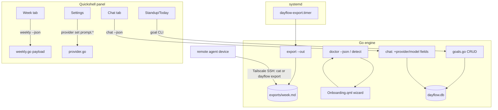

# Dayflow Linux parity tranche: week charts, chat polish, day goals, prompt overrides, onboarding, and SSH export feed

## Goal Capsule

- **Objective:** the panel renders the weekly analytics the engine already computes (heatmap, context shifts), chat reads like a real conversation UI, users can set and review a daily goal, provider prompt overrides are editable in Settings, a first-run onboarding wizard exists, and remote agents can pull a week-timeline markdown export from this machine over SSH.
- **Means:** extend the existing Go engine + Quickshell plugin in place — no standalone GUI, no web view — plus one new systemd user timer for the export feed (KTD1).
- **Authority:** this plan's Product Contract and Planning Contract govern; the audit-hardening plan (docs/plans/2026-09-14-0313) governs data-integrity behavior where they overlap.
- **Stop conditions:** do not add a webview for charts; do not build Agents/Fable recap or frame playback; do not touch Flow/account features.
- **Execution profile:** mixed — some units are plugin-only QML, some engine-only Go, some both. Each unit lands as an atomic commit with `go test ./...` green.

---

## Product Contract

### Summary

The 2026-09-05 parity roadmap landed the engine capabilities (chat, provider routing, weekly analytics payload, daily grid, edits). What remains is mostly *rendering and wiring*: the `weekly` payload's heatmap and context-shift data are unrendered, chat is plain-text-only, `day_goals` is a dead table, and provider prompt overrides have no UI. This tranche closes those gaps plus a first-run onboarding wizard, and adds an SSH-consumable markdown export feed for remote consumers.

### Problem Frame

The Week tab fetches `weekly --json` — a payload containing `heatmap` (7×24 hour buckets) and `context_shifts` — but draws only donut-bars, a treemap list, and text highlights. Chat works but lacks markdown, suggested prompts, and provider attribution. Day goals exist in schema (schema v2, `day_goals`) with no writer or reader. Settings has no prompt-override fields despite `provider set <id> prompt.<field>` existing in the CLI. There is no onboarding UI — first-run is `dayflow setup` on a terminal. And a remote agent, running on a separate device, needs a stable file (or command) to consume the week timeline over Tailscale SSH.

### Requirements

**Remote export feed (engine, not plugin)**

- R1. `dayflow export <range> --out <path>` writes the markdown atomically (tmp + rename) instead of only to stdout.
- R2. A `dayflow-export` systemd user timer refreshes `~/.local/share/dayflow/exports/week.md` (and `today.md`) on a daily cadence, written by `dayflow install`.
- R3. Remote access path is Tailscale SSH only — either `ssh <host> dayflow export week` on demand or `scp`/`ssh cat` of the stable file. No network listener is added.

**Week tab charts (plugin)**

- R4. The Week tab renders the `heatmap` field as a 7-day × 24-hour intensity grid.
- R5. The Week tab renders `context_shifts` as a readable list/visualization of top app-to-app transitions.

**Chat polish (plugin + small engine)**

- R6. `ChatResponse` JSON carries `provider` and `model` so the panel can attribute answers.
- R7. The Chat tab shows provider/model attribution, suggested prompt chips when the conversation is empty, and basic markdown-ish formatting (bold, code spans, lists — not a full parser).

**Day goals (both)**

- R8. Engine CRUD for `day_goals`: `dayflow goal set "<text>" [--date]`, `dayflow goal` (show today), `dayflow goal done`.
- R9. Panel shows today's goal with set/complete affordances on the Standup or Today tab.

**Settings prompt overrides (plugin only)**

- R10. Settings exposes per-provider prompt override fields (title, summary, detailed, chat) wired to the existing `provider set` CLI.

**Onboarding (plugin + small engine)**

- R11. A first-run path detects "unconfigured" state (no config file or doctor failure) and offers a guided wizard inside the panel: provider choice (OpenRouter key vs local endpoint auto-probe of :11434/:1234), connection test, then install/enable services.
- R12. Engine exposes machine-checkable setup probes: `dayflow doctor --json` and `dayflow detect` (probe local endpoints, list preset models) for the wizard to consume.

### Key Decisions

- **Scope = four tractable parity gaps + onboarding + remote export feed** (session-settled: user-directed — chose all four tractable items and onboarding; declined frame playback, Agents recap). Governs R4–R12.
- **Remote consumers pull via SSH, not a served endpoint** (session-settled: user-directed — remote device consumes over SSH). Governs R1–R3.
- **QML-native rendering, no webview** — carried from the 2026-09-05 roadmap (KTD5 there); charts draw as Canvas/Rectangles fed by the existing JSON payload.

### Scope Boundaries

**In scope:** the six items above; the `exports/` directory under the data dir; a new `dayflow-export` timer; a new `Onboarding.qml`.

**Deferred to follow-up work:** frame review/playback UI, Agents/Fable-style session recap, Sankey interaction graph, onboarding polish beyond the functional wizard, OmaSeal keyring.

**Out of scope:** standalone GUI app, Flow/account features, audio capture, network listeners of any kind.

---

## Planning Contract

### Key Technical Decisions

- KTD1. **Everything stays in the existing two-process architecture.** Engine does data + JSON out; Quickshell plugin renders via `Process` + `StdioCollector`. Charts are QML `Canvas`/Repeater shapes fed by `weekly --json` — the payload already exists; this plan draws it, it does not extend the payload except for R6's two fields.
- KTD2. **Export feed = file + timer, not a service.** `--out` on `export` plus `dayflow-export.timer` (OnCalendar=daily, Persistent=true, mirroring `dayflow-backup.timer` from U5 of the audit plan). SSH is the transport; docs/agent-contract.md already documents the Tailscale SSH pattern to reference.
- KTD3. **Day goals are engine-first.** The table exists; add CRUD in a small `goals.go`, CLI surface, then a compact panel section. Keep it minimal — set/show/done, no streaks or history UI this tranche.
- KTD4. **Onboarding lives inside the panel, not a separate window.** A `first-run` state in `Panel.qml` swaps the tab strip for a `Loader`→`Onboarding.qml` wizard when `dayflow status --json`/`doctor --json` reports unconfigured. Engine side is two read commands (`doctor --json`, `detect`); writes stay on existing `setup`/`config set`/`install` commands invoked by the wizard's Process calls.

### High-Level Technical Design

### Assumptions

- Remote agents reach this host via Tailscale SSH and pull rather than push.
- `exports/` files are small (~5-20KB); storing them inside the data dir is fine and they count toward `max_storage_mb` harmlessly.
- The Onboarding wizard is functional, not pixel-finished — first-run detection + working steps is the bar.

---

## Implementation Units

### U1. Remote export feed (`export --out` + export timer)

**Goal:** stable markdown files a remote agent can pull over SSH.

**Requirements:** R1, R2, R3

**Dependencies:** none.

**Files:**
- `engine/export.go` (extend: `--out <path>` flag, atomic tmp+rename write)
- `engine/export_test.go` or extend `main_test.go`
- `engine/install.go` (add `dayflow-export.service` + `dayflow-export.timer`, enable in install, remove in uninstall)
- `README.md`, `docs/agent-contract.md` (document the SSH pull pattern)

**Approach:**
1. `dayflow export <range> --out <path>`: write to `path.tmp`, rename to `path`; stdout behavior unchanged when `--out` absent. `--out` creates parent dirs (`0700`) and writes the file `0600` — the export carries full journal text.
2. `dayflow-export.service` runs `dayflow export week --out ~/.local/share/dayflow/exports/week.md` and `dayflow export today --out .../today.md` (two ExecStart lines or a small `--all` mode — implementer's choice).
3. Timer `OnCalendar=daily`, `Persistent=true`. Ensure `exports/` is `0700`.
4. Docs: show `ssh <host>.ts.net 'dayflow export week'` and `scp`/`cat` of the stable file.

**Test scenarios:**
- `--out` writes a file whose content matches stdout output for the same range.
- `--out` to an unwritable path returns a clear error and leaves no `.tmp` file.
- Atomic write: the target path is never a partial file (write-then-rename).
- `install` writes and enables the new timer; `uninstall` removes both units.

**Verification:** `go test ./...`; run `dayflow export week --out` on live data; `systemctl --user list-timers` shows the new timer.

---

### U2. Week tab heatmap + context shifts

**Goal:** render the unrendered parts of the weekly payload.

**Requirements:** R4, R5

**Dependencies:** none (payload exists in `engine/weekly.go`).

**Files:**
- `Panel.qml` (weekTab component)
- optionally a new `WeekCharts.qml` component to keep Panel.qml from growing

**Approach:**
1. Heatmap: Repeater over `weeklyPayload.heatmap` — 7 rows × 24 columns of cells, color intensity = minutes/active level, matching the DailyWorkflowGrid cell pattern.
2. Context shifts: list of top transitions (`from_app → to_app`, count), rendered as text rows with arrows; keep it compact.
3. Reuse `dayflow.weeklyPayload` already fetched by `refreshForTab("week")` — no new data plumbing.

**Patterns to follow:** `DailyWorkflowGrid.qml` cell coloring; existing donut/treemap rendering in the weekTab block.

**Test scenarios:**
- Happy path: week with activity shows a populated 7×24 grid and non-empty context-shift list.
- Edge: empty week → grid renders all-empty cells, context-shift section hidden (`visible:` gate like existing sections).
- Edge: payload missing `heatmap`/`context_shifts` fields → sections hidden, no crash.

**Verification:** `qmllint` clean of new errors; reload panel and visually verify on the user's display.

---

### U3. Chat polish: attribution, suggested prompts, markdown-ish

**Goal:** chat answers carry provider attribution; the tab has an empty state with suggested prompts and basic formatting.

**Requirements:** R6, R7

**Dependencies:** none.

**Files:**
- `engine/chat.go` (add `Provider`/`Model` to `ChatResponse`)
- `engine/main.go` (no change needed if fields flow through `--json`)
- `ChatTab.qml`

**Approach:**
1. `ChatResponse` gains `provider` and `model` from the routed provider used for the turn; also include them in the `conversation` read path so loaded history can attribute.
2. ChatTab: when `chatMessages` is empty and no conversation selected, show 3-4 suggested prompt chips ("What did I work on yesterday?", "Standup for today", etc.) that populate the input/send.
3. Markdown-ish: a small `function fmtMsg(s)` that converts `**bold**`, `` `code` ``, and `- ` list lines to Qt rich text; apply to assistant bubbles only.
4. Attribution line under assistant bubbles: `provider · model`.

**Test scenarios:**
- Engine test: `ChatResponse` includes provider/model after a stubbed chat turn.
- Engine test: `conversation <id> --json` output shape unchanged except added fields.
- QML (manual): empty chat shows chips; sending shows attribution under the reply.

**Verification:** `go test ./...`; panel reload, send a chat, verify attribution + chips + formatting.

---

### U4. Day goals (engine CRUD + panel section)

**Goal:** `day_goals` becomes live — set, show, complete today's goal.

**Requirements:** R8, R9

**Dependencies:** none.

**Files:**
- `engine/goals.go` (new: getGoalForDate, setGoal, completeGoal)
- `engine/goals_test.go` (new)
- `engine/main.go` (`goal` command)
- `Panel.qml` or `DailyWorkflowGrid.qml` / standup tab (goal display + set/complete)

**Approach:**
1. `day_goals` schema (store.go) has `id`, `date` (TEXT), `goal` (TEXT), `completed` (INTEGER), `created_at` — write CRUD against these; no migration needed.
2. CLI: `dayflow goal` prints today's goal; `dayflow goal set "text"` upserts today; `dayflow goal done` marks complete; `--date YYYY-MM-DD` optional; `--json` supported.
3. Panel: a compact goal line on the Standup tab (or top of Today) — shows goal + done checkbox + edit affordance calling the CLI.

**Test scenarios:**
- Set a goal for today, read it back, mark done — all via CLI functions.
- Setting twice upserts (no duplicate row for same date).
- Goal for a past date reads correctly with `--date`.
- `goal` with no goal set prints a friendly empty state, not an error.
- `--json` output parses and contains date/goal/done fields.

**Verification:** `go test ./...`; `dayflow goal set`/`done` on live data; panel shows the goal.

---

### U5. Settings: per-provider prompt overrides

**Goal:** expose the existing `provider set <id> prompt.<field>` capability in Settings.

**Requirements:** R10

**Dependencies:** none (engine support exists at `engine/provider.go`).

**Files:**
- `Settings.qml`
- possibly `Panel.qml` (if provider list rendering lives there)

**Approach:**
1. Provider rows in Settings get four optional text fields (title/summary/detailed/chat prompts), populated from `provider list --json` output (verify it emits `prompt_overrides`).
2. Edits call `dayflow provider set <id> prompt.<field> <value>`; empty clears the override (verify `provider set` accepts empty — if not, small engine fix in scope).
3. Keep fields collapsed/secondary — they're advanced.

**Test scenarios:**
- Engine (if changed): `provider set p1 prompt.title ""` clears the override.
- Manual: set an override in Settings, verify `dayflow provider list --json` reflects it and a summarize uses it.

**Verification:** `go test ./...`; set + clear an override via the panel and confirm via CLI.

---

### U6. Onboarding wizard

**Goal:** a first-run guided path inside the panel for unconfigured installs.

**Requirements:** R11, R12

**Dependencies:** U1–U5 not required; can land earlier if preferred. Engine probes (`doctor --json`, `detect`) are self-contained.

**Files:**
- `engine/setup.go` (add `doctor --json` machine-readable output; add `detect` command probing http://localhost:11434/v1 and http://localhost:1234/v1 + listing model presets)
- `engine/setup_test.go` or `main_test.go` (detect/doctor-json tests)
- `Onboarding.qml` (new)
- `Panel.qml` (first-run gate + Loader wiring)

**Approach:**
1. `dayflow doctor --json`: emit `{checks:[{name,status,detail}...], version, schema_version}` — same checks as the text output.
2. `dayflow detect --json`: `{ollama: bool, lmstudio: bool, presets: [...]}` probing the two well-known local endpoints with a short timeout.
3. `Panel.qml`: on open, if `status`/`doctor --json` reports unconfigured (no config or no provider), show `Onboarding.qml` instead of the tab strip.
4. `Onboarding.qml` steps: welcome → provider choice (OpenRouter key field / detected local endpoint) → test connection (runs `dayflow doctor` or a chat-free probe) → finish (writes config via `config set`/`provider add`, offers `install` for services).
5. Wizard never blocks the panel permanently — a "skip" affordance returns to normal tabs.

**Test scenarios:**
- `doctor --json` parses and lists every check with a status field.
- `detect` reports correctly when no local endpoints are up (both false, presets still listed).
- `detect` is fast — endpoint probes bounded by a short timeout (≤2s each).
- Manual: fresh data dir (no config) → panel opens into wizard; configured dir → normal tabs.

**Verification:** `go test ./...`; exercise `doctor --json` and `detect` on live data; visually verify wizard gating.

---

## Verification Contract

- `go test ./...` green after every unit; `go vet` and `gofmt` clean.
- `qmllint` on touched QML files produces no new errors (pre-existing unresolved `qs.*` module warnings are expected).
- Live checks: `dayflow export week --out`, `dayflow goal` round-trip, `dayflow doctor --json`, `dayflow detect --json`, `systemctl --user list-timers dayflow-*`.
- Panel reload after each QML unit; verify on the user's display (3456×2160 @ scale 1.5, eDP-1).
- Remote pull verified once with a real `ssh`/`scp` command, not just the file existing.

## Definition of Done

- All six units landed on the working branch with green tests.
- Week tab renders heatmap + context shifts; chat shows attribution/prompts/formatting; goal is settable/completable from the panel; prompt overrides editable; first-run wizard works.
- `~/.local/share/dayflow/exports/week.md` refreshes on the timer; a remote `ssh` fetch of the export succeeds.
- No webview, no network listener, no Agents/Flow/playback scope creep.
- Abandoned-approach code removed before done is declared.

## Risks & Dependencies

- **QML chart legibility at 340px** — the heatmap is 168 cells; keep it in the 560px expanded mode or make the panel grow for the Week tab. Decide at implementation, flagged here.
- **Onboarding gating** — detection must not false-positive on a working install; the wizard is an offer with a skip, never a trap.
- **`provider list --json` may not emit `prompt_overrides`** — verify in U5; a one-line fix if missing.

## Sources / Research

- OG macOS repo view inventory (`JerryZLiu/Dayflow`, `Dayflow/Dayflow/Views/UI/`) — Weekly/Sections, Chat*, Daily*, Onboarding/* enumerated in this session's comparison.
- Prior plan: docs/plans/2026-09-05-001-feat-dayflow-macos-parity-roadmap-plan.md (units U1–U6 landed).
- Audit-hardening plan: docs/plans/2026-09-14-0313-fix-dayflow-audit-hardening-plan.md (landed this session).
- Engine facts verified inline: `PromptOverrides` + `provider set ... prompt.*` exist (engine/provider.go); `day_goals` table exists but is unread/unwritten (engine/store.go); `weekly` payload carries `heatmap`/`context_shifts` (engine/weekly.go); `export` writes markdown to stdout only (engine/export.go).
