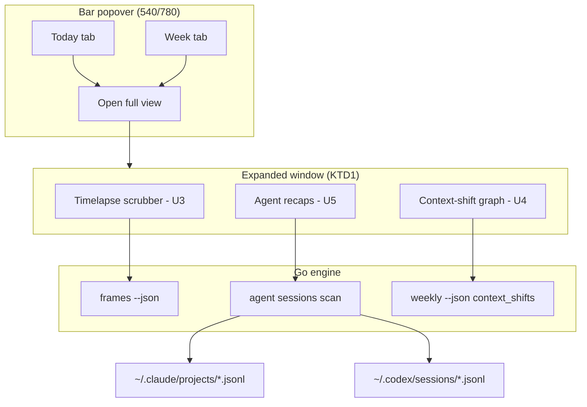

# Dayflow Linux 1.0 — Full Feature Release

## Goal Capsule

- **Objective:** Dayflow Linux is feature-complete against the macOS reference for a single-user local install — timelapse playback, context-shift visualization, agent-session recaps, and a real expanded view — hardened enough that work shifts from building features to maintenance and patching, tagged `v1.1.0`.
- **Means:** land the remaining roadmap as phased units on the existing Go engine + Quickshell panel architecture, then run a dedicated QA/perf/UX hardening pass, then tag and verify a fresh install (KTD1–KTD5).
- **Authority:** this plan's Product Contract and KTDs; the completed parity plan `docs/plans/2026-09-05-001-feat-dayflow-macos-parity-roadmap-plan.md` carries the deferred items this plan picks up.
- **Stop conditions:** a unit that requires architectural change beyond its stated approach (e.g., playback needs video transcode because JPEG scrubbing is unusably slow at real frame counts) pauses for a decision rather than silently expanding.
- **Who ships it:** the executing agent/operator — this is a single-user personal install, not a distributed product.

---

## Product Contract

### Summary

All remaining "big build" items from the audit and parity work land in one release program, followed by a hardening pass and a `v1.1.0` tag. After this plan, dayflow-linux is maintained, not built.

### Problem Frame

Feature tranches have landed weekly and the core loop (capture → summarize → timeline/chat/week analytics) is solid. What remains is the payoff layer: the dense visualizations and playback that make the captured data legible, plus the confidence work — the recent bug history (masked-key clobber, stuck loading flags, stale plugin deploys) shows the QML↔engine seams regress without coverage. A "full feature release" needs both halves: the features, and the QA that lets the project switch to maintenance mode credibly.

### Requirements

**Features**

- R1. The Week tab renders context shifts as a graph (Sankey-style or equivalent directed-flow visualization), not only the current source → target list.
- R2. The user can opt in to frame retention and scrub/play back a day's captured frames as a timelapse, honoring the existing storage cap.
- R3. Agent sessions (Claude Code and Codex CLI, read from their local JSONL logs) appear as workstream recaps tied to the day they happened.
- R4. A separate expanded window (beyond the 540/780px popover) hosts dense views — playback, graph, multi-column analytics — opened from the panel.
- R5. Copy/export and all existing actions keep working from both the popover and the expanded window.

**Hardening**

- R6. The seams that have regressed in practice get regression coverage: masked-key config round-trips, loading-flag lifecycle on subprocess failure, stdin secret writes, and date-aware export/copy.
- R7. Every panel action surfaces loading and error states consistently; no silent failure paths remain reachable.
- R8. A performance pass confirms the engine stays cheap on real data (status/timeline/weekly queries, capture CPU, panel memory) with a stated acceptable bound.
- R9. `dayflow install` on a clean environment, plus `dayflow doctor`/`doctor --deep`, is verified end to end and the docs (README, agent contract) match shipped behavior.
- R10. The release is tagged `v1.1.0` on master only after R1–R9 are done.

### Success Criteria

- A fresh clone → `dayflow install` → configured → panel working is a documented, verified path with zero manual fixes.
- Every feature-bearing unit's tests pass; `go test ./...` green on the tag commit.
- `ui:` action logging shows no unhandled failure for a normal day's click-through.
- The maintainer's posture after tagging is patch-only: no known missing marquee feature remains on the internal roadmap.

### Scope Boundaries

#### In scope

- Expanded-window surface (new Quickshell window, separate from the popover).
- Timelapse playback as a JPEG-sequence scrubber over retained frames.
- Sankey/flow rendering of the existing `context_shifts` payload.
- Claude Code (`~/.claude/projects/**/*.jsonl`) and Codex (`~/.codex/sessions/**/*.jsonl`) session recap parsing.
- QA, performance, and UI/UX hardening passes described above.
- Fresh-install verification and the `v1.1.0` tag.

#### Deferred to Follow-Up Work

- ffmpeg/HEVC video-segment encoding for playback (only if JPEG scrubbing proves inadequate).
- Journal morning/evening reflections and AI video summary (macOS journal beta).
- Flow hosted-web-app integration (requires a Dayflow account backend).
- Distribution packaging (AUR, binary releases) — the release is a tag + verified install path.

#### Outside this product's identity

- Standalone Electron/GTK rewrite, audio capture, cloud sync.

---

## Planning Contract

### Key Technical Decisions

- KTD1. **Expanded view is a second Quickshell window, not a bigger popover.** (session-settled: user-directed — chosen over growing the bar panel: dense views need real window geometry.) A `FloatingWindow`-style surface declared alongside the popover, sharing the same `dayflow` state object and Process helpers, opened from a header action. The popover stays the glance surface; the window is the work surface.
- KTD2. **Playback is a JPEG-sequence scrubber, not video transcode.** Frames already land as `frames/YYYY-MM-DD/HHMMSS.jpg`; a QML `Image` + index scrubber plays them back at variable speed with zero new storage format. ffmpeg HEVC encoding is deferred until measured need.
- KTD3. **Frame retention is opt-in, capped at the existing storage budget.** (session-settled: user-directed — matches the macOS default of ~10GB on disk.) `keep_frames: true` + `max_storage_mb: 10240` is the documented playback preset; `enforceStorageCap` already deletes oldest-summarized frames first, so playback degrades gracefully (older days lose frames before blocks are touched).
- KTD4. **Agent recaps parse session JSONL read-only, heuristics first.** Claude Code and Codex write JSONL transcripts under `~/.claude/projects/` and `~/.codex/sessions/`; the engine reads them into a `agent_sessions` table (start/end, project, turn count, files touched, tool summary) and recaps render without an LLM call — LLM summarization is a per-session opt-in action, not a batch job, to keep capture costs at zero.
- KTD5. **"Release" = tag + verified install, not packaging.** (session-settled: user-directed — chosen over AUR/binary distribution.) `v1.1.0` tag on master (the binary already reports `1.0.1`, so the feature-complete milestone takes the next minor — "1.0" intent, not a literal `v1.0.0`), `dayflow install` verified on a clean environment, README and `docs/agent-contract.md` regenerated against shipped behavior.
- KTD6. **QA covers seams, not line coverage.** The regression list is drawn from observed failures (provider key clobber via masked sentinel, timelineLoading stuck on proc failure, stdin EOF hangs) — each becomes a named test, not a coverage percentage target.

### High-Level Technical Design

### Assumptions

- Quickshell on this machine supports declaring a second window from plugin code (FloatingWindow/PanelWindow). If the shell's plugin sandbox forbids it, the fallback is a `dayflow ui` standalone QML run via `quickshell`/`qs` — flagged at U1 verification, not blocking plan-write.
- Claude Code JSONL files contain `type`/`message`/`timestamp` fields per line; Codex JSONL similar. Exact field mapping is an implementation-time detail (U5).
- The user's real data volume (~125MB/day observed) keeps `go test` fixtures small and perf bounds testable locally.

### Sequencing

Phase A (foundation): U1, U2 → Phase B (features): U3, U4, U5 → Phase C (harden + ship): U6, U7, U8, U9. U3 depends on U1+U2; U4 and U5 depend on U1 only for their home surface but can build engine-side independently.

---

## Implementation Units

### U1. Expanded window surface

**Goal:** A separate Quickshell window hosts dense views; the popover gains an "Open full view" affordance.
**Requirements:** R4, R5.
**Dependencies:** none.
**Files:** `Panel.qml`, new `FullView.qml`, `plugin.json` or manifest if window registration needs declaring.
**Approach:**
- Declare a second window (FloatingWindow/PanelWindow per what the omarchy shell exposes) whose `visible`/`active` binds to a `fullViewOpen` property; share `dayflow` state so tabs and procs work identically.
- Start it with one landing view (the Week analytics stack, already built) so the window is useful before U3–U5 fill it.
- The popover keeps working unchanged; window close just hides it.
**Patterns to follow:** the existing `Panel`/`KeyboardPanel` usage in `Panel.qml`; tab Loader pattern for view switching.
**Test scenarios:**
- Opening from the header shows the window at a multi-column size with Week content rendered.
- Closing and reopening preserves selected tab/date.
- Shell plugin rescan leaves no duplicate windows or QML errors in the journal.
**Verification:** visual check on the live shell; `qmldom` clean; journal free of QML errors.

### U2. Frames listing + playback storage plumbing

**Goal:** Engine can enumerate retained frames for a date range and the playback preset is documented/wired.
**Requirements:** R2 (engine half), R3 prerequisite for nothing — standalone.
**Dependencies:** none.
**Files:** `engine/store.go` or new `engine/playback.go`, `engine/main.go`, `engine/playback_test.go`, `README.md`.
**Approach:**
- `dayflow frames <date|YYYY-MM-DD> --json` → ordered list of frame paths + timestamps from the frames table (not directory glob — DB is authoritative, quarantined files excluded).
- Document/verify the playback preset: `keep_frames: true`, `max_storage_mb: 10240`. Confirm `enforceStorageCap` eviction order is playback-friendly (it is: quarantine → oldest summarized frames).
- Guard: when `keep_frames` is off, the command reports that honestly rather than listing an empty dir.
**Test scenarios:**
- Frames for a date return in timestamp order with correct paths.
- `keep_frames: false` reports the retention mode instead of empty output.
- A date with no frames returns an empty list, exit 0.
- Frames in quarantine are excluded.
**Verification:** `go test ./...`; live `dayflow frames <today> --json` returns today's captures.

### U3. Timelapse scrubber in the expanded window

**Goal:** Scrub or play through a day's captured frames.
**Requirements:** R2.
**Dependencies:** U1, U2.
**Files:** `FullView.qml` (or `PlaybackView.qml` component), `Panel.qml` (entry point).
**Approach:**
- `dayflow frames <date> --json` populates a frame list; a slider + play/pause button drives an `Image` element through indices (timer-based playback, e.g. 4–10 fps feel; adjustable).
- Date navigation reuses `dayOffset`/`viewDateStr` conventions; shows frame timestamp + derived block title if it overlaps a summarized block.
- Empty state explains `keep_frames` opt-in when no frames exist, with a Settings deep-link style hint.
**Test scenarios:**
- A day with frames: scrub moves the image; timestamp tracks.
- A day without frames: honest empty state, no crash.
- Playback toggles and stops at the last frame.
**Verification:** visual check against real captured frames; journal clean.

### U4. Context-shift graph in the expanded window

**Goal:** Render `context_shifts` as a directed flow graph rather than the text list.
**Requirements:** R1.
**Dependencies:** U1.
**Files:** new `SankeyView.qml` or Canvas-based component in `FullView.qml`, `Panel.qml` week charts card (link-through button).
**Approach:**
- Canvas-based Sankey-ish render: left column = sources, right = targets, band width ∝ count, colored by target category color (reuse `payloadColor`).
- Data is `weeklyPayload.context_shifts` — no engine change needed unless top-N trimming is required for legibility (cap ~8 sources × 8 targets).
- Keep the existing text list as the collapsed popover version; the graph lives in the expanded window.
**Test scenarios:** none for drawing itself — verify by visual check; engine-side no changes.
**Verification:** visual check; overlapping bands and empty payload handled.

### U5. Agent-session recaps

**Goal:** Claude Code and Codex sessions appear as per-workstream recaps on the day they ran.
**Requirements:** R3.
**Dependencies:** none engine-side; U1 for its UI home.
**Files:** new `engine/sessions.go`, `engine/sessions_test.go`, `engine/main.go`, `engine/store.go` (schema v4: `agent_sessions` table), `FullView.qml`/`Panel.qml` recap card.
**Approach:**
- Scanner walks `~/.claude/projects/**/*.jsonl` and `~/.codex/sessions/**/*.jsonl`, extracts per-session: project dir, start/end timestamps, turn count, tool-call counts, files touched. Incremental — track high-water mark by file mtime.
- `dayflow sessions [--date] [--json]` lists them; `dayflow recap <session-id>` generates an LLM recap on demand (reuses provider plumbing; stores result for cache).
- UI: a "Sessions" section in the expanded window (and/or a card on the Standup tab) listing today's agent sessions with a per-session "Recap" action.
**Test scenarios:**
- A synthetic Claude JSONL fixture parses to one session with correct bounds and turn count.
- A synthetic Codex fixture parses likewise; malformed lines are skipped, not fatal.
- Incremental scan doesn't re-ingest unchanged files.
- `recap` caches: second call doesn't re-hit the provider.
- Missing log dirs → empty list, exit 0.
**Verification:** `go test ./...`; live `dayflow sessions --json` lists real sessions from this machine.

### U6. Seam regression coverage

**Goal:** The failure modes we've actually hit get named tests.
**Requirements:** R6.
**Dependencies:** none (can start immediately).
**Files:** `engine/config_test.go` (or existing test files), `engine/main_test.go`, possibly `engine/stdin` test helpers.
**Approach:** enumerate the known-bad seams and write one regression test each:
- masked `***redacted***` provider key round-trip through `config patch` (covered — verify it's still meaningful after keyring work).
- `timelineLoading` semantics: engine-side it's QML, so cover the CLI side — `dayflow timeline --json` on a corrupt/missing DB exits nonzero rather than hanging.
- stdin `-` reads terminate on a single line without EOF (regression for the ReadString fix).
- `export <future-date>` and `export <garbage>` fail cleanly.
- keyring fallback when omaseal absent vs. present with empty account.
**Test scenarios:** the list above IS the test list.
**Verification:** `go test ./...` green including new cases.

### U7. UI/UX consistency pass

**Goal:** One visual language across popover + window: spacing, typography, states.
**Requirements:** R7.
**Dependencies:** U1–U5 (polish lands on finished surfaces).
**Files:** all `*.qml`.
**Approach:** audit pass with a checklist — every async action shows BusyBar or inline state; every failure path sets `notice`/`errorText`; empty states are written (not blank); the week-day chips and calendar agree on "today" styling; keyboard focus order sane in the expanded window. Fix what's found; document the recurring component patterns (BusyBar, chip, card) in a short `docs/ui-conventions.md`.
**Test scenarios:** none unit — verification is the checklist walk on a live panel plus journal-clean rescans.
**Verification:** click-through with `ui:` logging shows every action acknowledged; no QML warnings in journal beyond pre-existing noise.

### U8. Performance pass

**Goal:** Confirmed cheap on real data; stated bounds.
**Requirements:** R8.
**Dependencies:** none blocking; best after features land so it measures the final shape.
**Files:** wherever the profile points (likely `engine/store.go`, `engine/weekly.go`).
**Approach:** measure `timeline`, `weekly`, `status`, `sessions`, `frames` on the live multi-week DB; add indexes or query fixes only where measurement shows need; bound panel memory via image unloading in the scrubber (don't hold all frames decoded). State the bound in the plan's done criteria: status/timeline < ~500ms, weekly < ~2s on this machine's dataset.
**Test scenarios:**
- Benchmark or timed runs recorded in commit output for each command.
- Scrubber doesn't decode all frames up front (measure RSS or note lazy loading).
**Verification:** measured timings under bound; `go test ./...` green.

### U9. Release tag

**Goal:** Tag, fresh-install verified, docs true.
**Requirements:** R9, R10.
**Dependencies:** all prior units.
**Files:** `README.md`, `docs/agent-contract.md`, `engine/version.go` (or wherever version lives), `SUBMISSION.md` if stale.
**Approach:**
- Bump version to 1.1.0; changelog section in README summarizing the feature set.
- Fresh-env verification: clean `XDG_CONFIG_HOME`/data dir, `dayflow install`, onboarding or manual config, `doctor --deep` all-ok, capture running, panel loads — run against a scratch prefix to not disturb the live install, then reinstall live.
- `git tag v1.1.0`, push tag; post-tag smoke on the live machine.
**Test scenarios:** none unit — the fresh-install script IS the test.
**Verification:** `v1.1.0` tag exists; doctor all-green on a clean prefix.

---

## Verification Contract

| Check | Command | Applies to |
|---|---|---|
| Engine tests | `cd engine && go test ./...` | every unit |
| QML parse | `qmldom <file>` clean of errors | U1, U3, U4, U5, U7 |
| Live health | `dayflow doctor --deep` all-ok | U2, U5, U9 |
| Plugin deploy | sync QML to `~/.config/omarchy/plugins/io.github.duketopceo.dayflow/` + `omarchy-shell shell rescanPlugins`, journal clean | all QML units |
| Release | `git tag v1.1.0` + fresh-prefix install verification | U9 |

---

## Definition of Done

- All units landed on master; `go test ./...` green at the tag commit.
- `v1.1.0` tagged and pushed; fresh-prefix install verified end to end.
- Live install rebuilt, plugin synced, shell rescanned — running the release code.
- No dead-end code from abandoned approaches left in the diff; no new TODO/FIXME without an issue.
- README + `docs/agent-contract.md` describe shipped behavior, not aspirations.

## Sources / Research

- `docs/plans/2026-09-05-001-feat-dayflow-macos-parity-roadmap-plan.md` — parity gap list and its deferred items (playback, agent recaps, journal, Flow); this plan picks up the deferred half except journal/Flow (deferred again, deliberately).
- `engine/weekly.go` — `context_shifts` payload already emitted; U4 is render-only.
- `engine/summarize.go` — `KeepFrames` gate on frame deletion; `engine/capture.go` `enforceStorageCap` eviction order.
- Session log locations verified on this machine: `~/.claude/projects/<slug>/*.jsonl`, `~/.codex/sessions/<YYYY>/<MM>/<DD>/*.jsonl`.
- Regression targets drawn from observed bugs this cycle: masked-key clobber (PR #14), timelineLoading stick (e165dce), stdin EOF hang fix.
