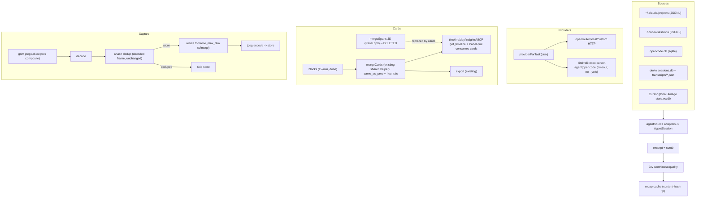

# feat: v1.3 macOS parity — multi-tool agent recaps, semantic cards, frame normalization, CLI providers

## Summary

Close the four verified gaps against macOS Dayflow, adapted to the operator's actual toolset: agent-session recaps extend from Claude Code/Codex to OpenCode, Devin, and Cursor; the QML panel's divergent `mergeSpans` re-implementation is replaced by the engine-emitted `cards` array (one merge algorithm everywhere); captured frames normalize to a bounded dimension before storage; and a new `cli` provider kind lets subscription-auth'd agent CLIs (cursor-agent, opencode) serve chat/review tasks without a dayflow-held API key.

## Problem Frame

The v1.2 feature comparison against macOS Dayflow surfaced three real architectural gaps — variable-duration semantic cards (theirs split on activity continuity, ours are fixed 15-min windows), frame normalization (they capture ~1080p; we store native 3.4K), and subscription-CLI providers (they piggyback Codex/Claude CLI auth, avoiding API keys). A fourth gap is ours alone: the agent-recap feature only scans Claude Code and Codex transcripts, but the operator's actual tools are OpenCode, Devin, and Cursor — so recaps currently miss most real sessions.

Two of these turn out cheaper than they look — and one is partially shipped. `mergeCards` already exists as a shared Go helper (consumed by `export.go`, `main.go`'s `day`/`timeline`/`today --json`, `chat.go`, `standup.go`, `tui.go`); the actual divergence is `Panel.qml`'s `mergeSpans`, a JS re-implementation that has already drifted (it merges null-app blocks the Go version splits). And the provider layer already routes per-task via `Routing.TaskProvider`, so CLI providers slot in as a new `Provider.Kind` rather than a new subsystem — though the dispatch point is `callProviderChat`, the real funnel for chat/vision/review calls.

---

## Requirements

**Agent session coverage**

- R1. `dayflow agents` lists sessions from OpenCode, Devin, and Cursor alongside Claude Code/Codex, filtered to the queried day, with `source` naming the tool.
- R2. Recap generation (worthiness judging, excerpt extraction, scrubbing, fingerprint caching, quality scoring) works identically for the new sources — same privacy guarantees, same cache invalidation on transcript growth.
- R3. A missing or schema-incompatible tool store degrades to "no sessions from that source," never a hard error — these DBs are undocumented and version-fragile.
- R3b. Silent drift is not acceptable: when a previously-productive source yields zero sessions across consecutive scans, the degradation is surfaced (event log + note in `dayflow agents` output), not hidden. Skip/error logging records identifiers and sizes only — never excerpt or blob content.
- R4. Existing Claude/Codex adapters keep working unchanged.

**Semantic cards (consolidation, not new pipeline)**

- R5. The Go `mergeCards` helper (already shared by export, `day`/`timeline`/`today --json`, chat, standup, TUI) becomes the single merge implementation: `insights --json` and MCP `get_timeline` gain the same `cards` array, and `Panel.qml` consumes engine-emitted `cards` instead of its own `mergeSpans` JS.
- R6. `mergeSpans` in `Panel.qml` is deleted once QML consumes `cards` — exactly one merge implementation survives, so read paths cannot diverge further.
- R7. Underlying blocks stay fixed-window; merge is a read-path transform. No capture or summarize pipeline changes.

**Frame normalization**

- R8. Captured frames are downscaled so the longer edge is bounded by a configurable max (default 1920px) before JPEG storage; `frame_max_dim` config key, `0` disables. grim captures a composite of all outputs — when docked, a ~6900px composite normalized to 1920 yields ~960px per display, so the effective per-display fidelity varies with dock state; that tradeoff is documented and the key is tunable for dual-display use.
- R9. Dedup hashing keeps its current semantics — ahash runs on the decoded frame before resize (it samples a fixed 16x16 grid either way), so resize cost is paid only on stored captures. All downstream consumers read stored bytes unchanged; existing stored frames are untouched.

**CLI providers**

- R10. A `cli` provider kind invokes a configured external command (cursor-agent, opencode) for text tasks served by `callProviderChat` (chat, standup, review — agent recaps reach it via the `chat` task). When the command supports file reads, ad-hoc vision calls on sampled frames pass frame-path references; cli kinds are not routed to the per-block `vision`/`summary` loop by default (minutes-per-call latency), only via explicit opt-in config.
- R11. Exec-boundary hardening: `execve`-style argv invocation (never a shell); untrusted prompt content passed on stdin or strictly after a `--` terminator, never parsed as flags; the escalate-flag deny-list (`--yolo`, `--force`, `--auto`, plus per-CLI equivalents) is enforced on the final computed argv at exec time, not only at config validation; child environment is a minimal allowlist (PATH, scratch HOME, plus only the auth vars the specific CLI needs) — the daemon's env, including any provider API keys, is not inherited; cwd is a scratch dir; hard timeout (default 180s, configurable). Per-CLI, the default tool-permission surface in headless mode is verified at implementation time and any CLI-side read-only/approval flag is used; the plan records the residual that flag denial does not bind the CLI's own configured permission profile. If a CLI cannot read frame paths outside its cwd, sampled frames are staged (copied/symlinked) into the scratch dir before invocation.
- R12. Provider add/list/test UX and config schema cover the new kind; a CLI provider that fails falls back through the existing provider-error path. CLI output is stored as plain text with control characters stripped, and rendered without rich-text/HTML interpretation.
- R13. Egress honesty: CLI providers change credential management (subscription auth, no dayflow-held API key), not data residency — prompts and any frames the CLI reads leave the machine via that tool's configured model backend. PRIVACY.md and provider setup copy must say this plainly; the feature does not claim "nothing leaves the machine."

---

## Assumptions

Forks resolved by default under pipeline mode — correct any before `ce-work` lands them:

- **Keep Claude/Codex adapters.** The plugin is public; other users' tools stay supported even though the operator doesn't use them.
- **Semantic = merge layer, not pipeline rewrite.** Blocks stay 15-min and `same_as_prev` joins them at read time. macOS emits model-decided boundaries at analysis time; ours is cheaper and reversible, at some cost to narrative quality.
- **Normalize before storage.** ~1080p frames cut disk and egress together; timelapse playback stays legible at 1080p on a 2160p panel. The alternative (store full-res, downscale only for egress) keeps playback crisp but forfeits the storage win. Note: grim emits a composite of all outputs, so docked frames reach ~960px/display at the default cap — acceptable for journal evidence, tunable via `frame_max_dim`.
- **Devin is a transcript source only, not a provider.** `devin` is an agent runtime without a chat-completion surface; cursor-agent and opencode are the provider candidates.
- **Merge stays owner-gated.** All units land on one feature branch; the PR waits for the #4992 marketplace baseline before merge, preserving the `1cbed21` freeze. One branch is deliberate: U3/U4 share U2's seam and a single freeze-gated PR keeps the attestation simple — but U1 and U6 are independent and can split into their own PRs if the branch stalls.

---

## Key Technical Decisions

| KTD | Decision | Rationale |
|---|---|---|
| KTD1 | New `agentSource` seam: per-source adapters produce `[]AgentSession` + a `sessionExcerpt`-compatible text sample | `scanJSONL` assumes file-per-session JSONL; all three new stores are sqlite/JSON DBs, so the seam generalizes rather than forces JSONL |
| KTD2 | Recap seam: `AgentSession` gains a stable source-scoped key; the source adapter supplies (cacheable fingerprint, excerpt) so `attachRecaps` never stats `File` for DB-backed sources | `fingerprint()` is os.Stat-based and load-bearing — attachRecaps skips sessions whose File can't stat, and generation requires before/after stat equality. File+mtime on a shared DB file would thrash the cache on every write by any session; content-hash the session's message set instead |
| KTD3 | CLI provider kind: `kind: "cli"` with `command` + `args` template on Provider; `kind == "cli"` dispatches inside `callProviderChat` and is added to the `providerNeedsAuth` exemption list | `callProvider` is not the funnel — chat/recaps route through `callChatModel` → `callProviderChat`, and `provider test` calls `callProviderChat` directly. Routing via `providerForTask`/`TaskProvider` stays untouched |
| KTD4 | Vision via CLI = frame file paths, intercepted in `callOpenRouter` where `paths` is still in scope | By the time the message layer sees a request, frame paths are already base64 `orContent` — intercept `kind=cli` before encoding (or add an optional path field to `orContent`). Avoids duplicating the base64 wire format for a subprocess boundary |
| KTD5 | Resize between ahash and store in `captureOnce`, using `golang.org/x/image/draw` | Hash the decoded frame first (unchanged dedup semantics, no per-tick resize cost), then resize only the frames actually stored. Only new dependency; ApproxBiLinear suffices — frames are journal evidence, not print assets |
| KTD6 | Card consolidation: `Panel.qml` `mergeSpans` is deleted and QML consumes the engine-emitted `cards` array; `cards` is added to `insights --json` and MCP `get_timeline` | `mergeCards` is already shared Go-side — the real divergence is the JS re-implementation, which has already drifted (no `App != ""` guard). One merge algorithm survives |

## High-Level Technical Design

---

## Implementation Units

### U1. Frame normalization

- **Goal:** Captured frames store at a bounded resolution instead of native panel size.
- **Requirements:** R8, R9
- **Files:** `engine/capture.go`, `engine/config.go`, `engine/capture_test.go`, `engine/go.mod` (add `golang.org/x/image`), `README.md`, `Settings.qml`
- **Approach:** After `image.Decode` in `captureOnce`, run ahash on the decoded frame exactly as today (dedup semantics unchanged, no per-tick resize cost). When storing, downscale the decoded image so the longer edge is ≤ `frame_max_dim` (default 1920, `0` = off) via `x/image/draw` ApproxBiLinear, then `jpeg.Encode` at `cfg.JPEGQuality`. grim emits an all-outputs composite — docked frames exceed 1920 in both dimensions and land ~960px/display at default; the key is the lever for dual-display fidelity. Expose the key in `config set` and Settings.
- **Test scenarios:**
  - Happy path: a 3456x2160 frame stores at 1920x1200, JPEG-decodable, `frames.bytes` reflects the smaller size.
  - Multi-output: a ~6900x2160 composite stores with the longer edge ≤ `frame_max_dim`.
  - Edge: `frame_max_dim` 0 → byte-identical passthrough; frame narrower than max → passthrough without re-encode cost.
  - Edge: portrait inputs bound the taller edge.
  - Dedup: ahash of a captured frame is computed pre-resize → identical captures dedup exactly as today.
  - Failure: corrupt JPEG → existing decode-error path unchanged.
- **Verification:** new captures store ≤1920px on the long edge; `dayflow stats` frame bytes/day drops visibly; timelapse still plays; spot-check `dayflow summarize` output on normalized frames for summary legibility (small UI text survives 1920px).

### U2. Agent-source seam + OpenCode adapter

- **Goal:** Generalize session discovery beyond JSONL roots and add OpenCode as a source.
- **Requirements:** R1–R4 (OpenCode), R2 (cache parity)
- **Dependencies:** none — but U3 and U4 build on the seam this unit introduces
- **Files:** `engine/agents.go`, `engine/agents_opencode.go` (new), `engine/agents_recap.go`, `engine/agents_test.go` (+ fixture builder)
- **Approach:** Introduce a source interface (discover sessions in [s,e], produce excerpt text, stable session key, cacheable fingerprint). Refactor `scanClaude`/`scanCodex` onto it unchanged — JSONL sources keep File+mtime fingerprints; DB sources supply a content hash (session message IDs + update times). Refactor `attachRecaps`' stat-gate to ask the adapter for fingerprint+excerpt rather than statting `File` — a synthetic DB session key must still enter the generation queue (add a regression test: DB-backed session with non-stat-able key generates and caches a recap). OpenCode adapter opens `~/.local/share/opencode/opencode.db` (and `opencode-next.db` when present) with `mode=ro`; on open failure against a live WAL DB, retry with a temp-file copy before degrading to "no sessions". Joins `session`→`session_message`/`message`/`part` in the day window, extracts first/last user text. `DAYFLOW_OPENCODE_DB` env override. R3b drift-surfacing lands here: per-source scan status recorded so a previously-productive source going silent is visible.
- **Test scenarios:**
  - Happy path: fixture DB with a session spanning the day boundary → one `AgentSession{Source:"opencode"}` with correct start/end/message count.
  - Edge: session with no user messages → skipped or excerpt-empty but never panics.
  - Failure: missing DB file → empty result, no error; missing table (schema drift) → logged skip, other sources still scan.
  - Cache: identical messages → cache hit; appended message → fingerprint invalidates.
- **Verification:** `dayflow agents --json` lists real OpenCode sessions on this machine with correct titles.

### U3. Devin adapter

- **Goal:** Devin CLI sessions appear in `dayflow agents` with recaps.
- **Requirements:** R1–R3
- **Dependencies:** U2 (source seam)
- **Files:** `engine/agents_devin.go` (new), `engine/agents_test.go`
- **Approach:** Read `~/.local/share/devin/cli/sessions.db` read-only: `sessions` gives id/title/working_directory/timestamps; `message_nodes.chat_message` (JSON) provides excerpt text. `transcripts/*.json` (ATIF-v1.7) is the fallback when sessions.db misses a session — parse `schema_version`, `session_id`, message nodes. `DAYFLOW_DEVIN_DIR` env override.
- **Test scenarios:**
  - Happy path: fixture sessions.db + transcript JSON → sessions listed with project from `working_directory`.
  - Edge: session in sessions.db but no transcript file → listed from DB alone.
  - Failure: ATIF schema_version unrecognized → skip that file, log once, continue.
- **Verification:** real Devin sessions (including this one) appear in `dayflow agents` output.

### U4. Cursor adapter

- **Goal:** Cursor composer sessions appear in `dayflow agents`.
- **Requirements:** R1–R3
- **Dependencies:** U2 (source seam)
- **Files:** `engine/agents_cursor.go` (new), `engine/agents_test.go`
- **Approach:** Open `~/.config/Cursor/User/globalStorage/state.vscdb` read-only: `composerHeaders` yields composerId/workspaceId/timestamps; `cursorDiskKV` keys `composer.content.<id>` hold full conversation JSON — extract user turns for the excerpt. Map workspaceId → project directory via per-workspace `workspace.json` when needed for the project field. `DAYFLOW_CURSOR_DB` override. Format is undocumented — parse defensively, tolerate missing keys.
- **Test scenarios:**
  - Happy path: fixture vscdb with one composer.content blob → session with correct range and message count.
  - Edge: composer content without user turns → skipped.
  - Failure: unexpected blob shape → skip + debug log, never error out the whole scan.
- **Verification:** `dayflow agents` lists Cursor sessions on this machine.

### U5. CLI provider kind

- **Goal:** Providers can shell out to subscription-auth'd agent CLIs.
- **Requirements:** R10, R11, R12, R13
- **Dependencies:** none (vision tests use fixture frame paths; normalization is a storage win, not a prerequisite)
- **Files:** `engine/provider.go`, `engine/provider_cli.go` (new), `engine/summarize.go` (cli intercept in `callOpenRouter`), `engine/chat.go` (dispatch in `callProviderChat`), `engine/config.go`, `engine/provider_test.go`, `engine/setup.go`, `PRIVACY.md`
- **Approach:** `Provider{Kind:"cli"}` carries `command` (`cursor-agent`, `opencode`) and a prompt template. `kind == "cli"` dispatches inside `callProviderChat` (the real funnel — reached by callProvider, callChatModel, and `provider test`) and is added to the `providerNeedsAuth` exemption. Text prompts go on stdin or after `--`, never as parseable flags; exec is `execve`-style argv, no shell; deny-list enforced on the final argv; env is a minimal allowlist. Vision intercepts `kind=cli` inside `callOpenRouter` where `paths` is still in scope — stage frame copies into the scratch dir if the CLI can't read outside its cwd. cli kinds are excluded from `vision`/`summary` task routing unless explicitly opted in. Failure surfaces through the existing provider-error/fallback path.
- **Test scenarios:**
  - Happy path: fake executable in PATH that echoes its stdin → chat call returns its output; routed via `task_provider` for `chat`.
  - Vision: fake CLI records received frame paths → correct count, absolute paths intact.
  - Injection: prompt text beginning with `--force` arrives on stdin/after `--`, never parsed as a flag.
  - Env: daemon env vars (API keys) absent from child environment.
  - Failure: nonzero exit, timeout kill, missing binary → each returns the provider error path, daemon keeps running.
  - Config: `provider add` with `kind=cli`, `command`, model label; `provider test` exercises the exec path.
- **Verification:** `dayflow provider test` against real `cursor-agent` succeeds for a text task (subscription auth, no API key); confirm the installed cursor-agent/opencode headless tool-permission defaults and record them in PRIVACY.md.

### U6. Card consolidation — one merge implementation

- **Goal:** Every card surface consumes the shared Go `mergeCards`; the divergent JS copy is deleted.
- **Requirements:** R5, R6, R7
- **Dependencies:** none (self-contained read-path change)
- **Files:** `Panel.qml` (delete `mergeSpans`, consume `d.cards` at the ~325 and ~492 call sites), `engine/insights.go` (`cards` in `insights --json`), `engine/mcp.go` (`get_timeline` emits `cards`), `engine/export_test.go` or `engine/cards_test.go`, `docs/agent-contract.md`
- **Approach:** `mergeCards`/`Card` are already shared Go-side — no extraction needed. Migrate `Panel.qml`'s `mergeSpans(d.blocks)` consumers to `d.cards` (fixing the drifted null-app merge) and delete the JS function. Add `cards` to `insights` JSON output and to `get_timeline` MCP responses (same array shape as `timeline --json`). `agent-contract` documents the card fields. No schema changes.
- **Test scenarios:**
  - Contract: `insights --json` and MCP `get_timeline` emit `cards` identical to `timeline --json` for the same day.
  - Regression: `export` output unchanged; `day --json`/`timeline --json` `cards` unchanged.
  - Manual: QML panel renders engine-emitted cards; a run of null-app blocks that `mergeSpans` used to merge incorrectly now renders as Go does.
- **Verification:** `grep mergeSpans Panel.qml` returns nothing; `dayflow today --json` and MCP `get_timeline` show the same merged cards for the same day.

### U7. Docs, config surface, and deploy

- **Goal:** New behaviors are discoverable and privacy-honest.
- **Requirements:** R12, R13 (doc surface)
- **Dependencies:** U1–U6 (documents every unit's shipped surface)
- **Files:** `README.md`, `engine/config.go` (usage text), `engine/mcp.go` (tool descriptions)
- **Approach:** README gains the feature table rows (new agent sources, card surfaces, `frame_max_dim`, cli providers with the egress caveat) and `mcp.go` tool descriptions name the new sources and `cards` output. Per-unit doc ownership prevents double-edits: U1 owns `Settings.qml` `frame_max_dim` + README capture text; U5 owns the `PRIVACY.md` CLI disclosure; U6 owns `agent-contract` `cards` fields. U7 keeps README feature table, usage/help text, and MCP descriptions.
- **Test expectation:** none — docs/config surface only (config validation paths are covered under U5).
- **Verification:** `dayflow config set`/`provider` help text mentions new keys; docs match shipped behavior; PRIVACY.md nowhere claims CLI providers keep data on-device.

---

## Scope Boundaries

**Deferred to follow-up work:**

- **Model-emitted card boundaries** (true macOS parity — the LLM decides where activities split inside a batch). The merge layer ships the value now; this is a summarize-pipeline change for later.
- **Devin as provider** — no chat-completion surface; revisit if Devin CLI gains one.
- **opencode serve HTTP mode** — `run` is sufficient; the server path is a perf optimization.
- **System audio capture** — separate PipeWire problem, unrelated to these gaps.
- **Multi-display selection** — grim captures everything; defer with the other deferred items.

**Outside this product's identity:** hosted/cloud tier, manual timers, app-usage metadata tracking.

## System-Wide Impact

- **MCP parity.** `mcp.go` `get_agent_sessions` calls `agentSessionsForDay` directly, so new sources flow through automatically — but its tool description names only Claude Code and Codex; update it in U7. `get_timeline` gains the `cards` array in U6 (decision resolved: emit it — agent consumers benefit most).
- **Config gates.** The `agent_recaps` toggle must gate recaps for the new sources identically; the scanning itself stays local either way. `ignore_apps` already covers the new tools' window classes if the user adds them — scanning transcripts is unaffected by capture-time ignores.
- **Frame-byte accounting.** U1 shrinks `frames.bytes` for new captures, which shifts the 20 GB frame cap's effective runway upward and changes `stats` numbers users already see — note it in U7 docs.
- **Egress posture.** CLI providers change credential management (subscription auth, no dayflow-held API key), **not** data residency — the subprocess forwards prompts and any frames it reads to its own configured model backend, typically cloud. Per R13, U5's PRIVACY.md disclosure must say exactly this; the worst outcome this plan could ship is a false "nothing leaves the machine" claim while a marketplace security review is pending.
- **Fingerprint seam.** KTD2 means `attachRecaps` must stop statting `File` — DB session keys are synthetic. Existing JSONL rows keyed on file path+size+mtime keep working; don't migrate them, branch on source kind.

---

## Risks & Dependencies

- **Undocumented stores (Cursor, opencode, devin sqlite).** Schemas are internal and can drift per version. Mitigation: read-only opens, defensive parsing, per-source skip-on-error, fixture-based tests.
- **CLI provider safety.** Agent CLIs have tool/shell access governed by their own per-user permission config, which a flag deny-list does not bind — cwd is a process attribute, not confinement. Mitigations per R11 (argv-only exec, stdin/`--` for untrusted text, env allowlist, scratch cwd, timeout) shrink the blast radius; the named residual is that an injected agent can still act within whatever tools the CLI's own config permits. Verify each CLI's default headless tool surface at impl time.
- **`x/image` dependency.** New module dep (mature, golang.org/x). Pin a tagged release ≥7 days old.
- **Latency.** cursor-agent per call is minutes-scale; cli kinds are excluded from the per-block `vision`/`summary` loop by default (R10). Recaps route via the `chat` task, so routing `chat` to a cli provider also affects recap generation — `attachRecaps` runs synchronously under a 45s wall-clock deadline, so a cli `chat` provider may starve recaps; document this or gate cli eligibility for the recap path.
- **Composite frames.** grim captures all outputs; normalization bounds the composite's long edge, so docked fidelity is lower than undocked (R8).
- **Freeze.** Branch holds until #4992 baseline completes; merging moves the attested SHA — that's expected post-baseline, not a violation.

## Sources & Research

- macOS parity claims: `github.com/JerryZLiu/Dayflow` README + docs (batching by continuity + min-5-min + merge-check; ~1080p JPEG q85; Codex/Claude CLI providers).
- `cursor-agent` headless: cursor.com/docs/cli/headless.md — `-p`, `--output-format`, image reads via file-path prompts.
- `opencode run`: opencode.ai/docs/cli — `--file`, `--format json`, `--attach`; upstream MIME-type fix for image attachments (verify installed version at impl time).
- Local stores verified live: opencode.db (`session`/`session_message`/`part`), devin sessions.db + ATIF transcripts, Cursor globalStorage `state.vscdb` (`composerHeaders` + `cursorDiskKV` `composer.content.*`).
- Repo seams: `engine/agents.go` (`scanJSONL`, `AgentSession`), `engine/provider.go` (`Provider`, `Routing.TaskProvider`), `engine/export.go` (existing merge loop), `engine/capture.go` (`captureOnce` decode→store path).
