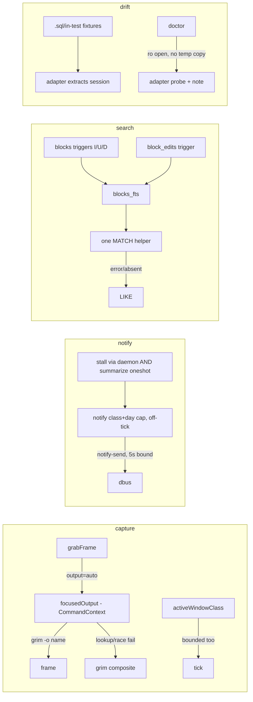

# feat: dayflow completion — parity finish, beyond-parity features, drift-watch maintenance

## Summary

Take Dayflow Linux from "v1.3.1 parity-shipped" to "done + maintainable" as a stepwise program. Settled scope: (1) close the remaining macOS-parity gaps — focus-following display capture, notifications, UI polish/distribution finish — plus the consent-surface defect v1.3.1 created (recaps are now opt-in but nothing exposes the opt-in); (2) add beyond-parity features — an FTS5 full-text search upgrade and a real usage/cost surface over the existing `usage` command; (3) run a scoped PipeWire audio-capture *spike* delivering a go/no-go decision doc, not feature code; (4) establish the maintenance posture — semantic store-contract drift checks, upgrade-safety probes, dependency cadence. Multi-machine sync is **deferred pending explicit sign-off** (Assumption A1 — it conflicts with the local-first posture; the operator's rsync workflow covers the actual need). Marketplace approval (#4992) is an in-flight external process, not plan scope.

## Problem Frame

v1.3.1 closed the big parity gaps and the recaps consent defect — but created a new one: recaps are off by default and no UI surfaces the opt-in. Beyond that, `output` is a static string while macOS Dayflow follows the active display; nothing notifies the operator when capture stalls; `search` is LIKE-based in three divergent implementations while `journal_entries` sits empty (vestigial — the live authored-text table is `standup_drafts`); `dayflow usage` exists but lacks day windows, latency, per-day grouping, and dollar rendering; and the undocumented agent stores (Cursor `state.vscdb`, OpenCode sqlite, Devin `sessions.db`) have productivity-drift events but no schema-shape contract. Two latent bugs the plan must fix while touching these files: `activeWindowClass()` execs `hyprctl` per tick with no timeout (a hung hyprctl wedges the whole capture loop, and then *nothing* can report the stall), and `dayflow search ""` indexes `args[0][0]` on an empty arg — a panic today.

## Requirements

| ID | Requirement |
|----|-------------|
| R1 | `output` gains `"auto"` (opt-in — composite capture stays the default): each capture tick resolves the focused monitor via `hyprctl monitors -j` (`focused: true`) and passes `grim -o <name>`; explicit names keep working; lookup failure, `grim -o` failure, non-Hyprland, or HEADLESS-* outputs fall back to composite. `capture_command` set → `auto` is ignored with a doctor warning. |
| R2 | A notification helper emits `notify-send` calls for operator-meaningful states — capture stall, long pause, standup ready, daily goal pending — behind a per-class config gate. `stall` defaults on (silence = data loss); nudge classes default off. Emission is off the capture tick path with a `CommandContext` timeout; bodies carry event-class labels only, never journal text. The capture unit gains `DBUS_SESSION_BUS_ADDRESS` in `PassEnvironment` (verified absent on omarchy-max today — daemon can't reach the bus). |
| R3 | `search` upgrades to FTS5 full-text: a `blocks_fts` external-content index over the *effective* (post-`block_edits` overlay) title/summary/category/app, and `standup_fts` over `standup_drafts` (`journal_entries` is vestigial — skip it). Index maintained by triggers on `blocks` (insert/update/delete — deletes mandatory, or `scrub`/retention/`retry` deletes stay searchable) and `block_edits`; backfill inside the migration transaction; migration failure degrades to LIKE, never fatal. All three search call sites (`printSearch`, MCP `search_journal`, chat `searchBlocks`) share one helper with MATCH→LIKE fallback on error (not just on absent index). Fix the `args[0]` empty-arg panic and move `--reindex` parsing inside the case while touching it. |
| R4 | Extend the existing `dayflow usage`/`printUsage`/`usageSummary`/MCP `get_usage` (not a new surface): `--days N` window, per-day grouping in localtime, avg latency, failure rate, `status != 'ok'` convention; optional `pricing` config map renders dollars; output shows a coverage floor (`data since <min(ts)>`) so log trimming is visible; decide whether `llm_calls` joins the trim lists (currently `api_calls` is capped at 2000 rows + `retention_days`, `llm_calls` is unbounded — a cost ledger that silently hits a ceiling while outliving the journal). |
| R5 | Onboarding gains an explicit recaps opt-in step — Onboarding.qml has no privacy copy today (verify before writing), so this adds a new step whose text names all five stores (Claude Code, Codex, OpenCode, Devin, Cursor), states transcripts are read locally either way, and names both egress endpoints (chat provider + decisions endpoint). "Skip" must never write `agent_recaps: true`; setup's prompt defaults to no on empty/non-interactive input and only appears when a store is detected. Settings.qml needs a bool-toggle row (none exists — add the pattern). Verify `provider add`/`set` help covers `cli` — add if not. |
| R6 | Drift-watch as **semantic contracts**, not schema assertions: contract = "the adapter extracts ≥1 expected session from a fixture of this store's shape" — a `{table→columns}` check alone false-positives on Cursor's two supported layouts and misses payload-shape drift. Fixtures are committed as `.sql` text dumps or in-test builders (the existing `writeOpencodeDB`/`writeDevinDB`/`writeCursorDB` pattern) — never binary sqlite (undiffable, freelist-leaks content). The `fixtures capture` helper extracts *schema only* (`sqlite_master` DDL + `pragma_table_info`) and synthesizes sentinel rows — it never serializes real row payloads. `doctor` gains an `agent stores` check that probes `mode=ro`/`immutable` opens **without** the `openROStore` temp-copy fallback (Cursor's state.vscdb can be hundreds of MB — a doctor run must not pay that copy) and reports via the same scan-note plumbing as runtime drift — one drift vocabulary, not two. |
| R7 | Upgrade safety: `doctor` asserts binary version == installed plugin `manifest.json` version at `~/.config/omarchy/plugins/io.github.duketopceo.dayflow/manifest.json` (absent manifest = "engine-only install" info line, not a failure) and reports `schema_migrations`/`schemaVersion` state via the existing `peekSchemaVersion`. `docs/maintenance.md` records dep-update cadence + the upgrade smoke checklist. |
| R8 | Audio spike (research only): probe `pw-record` against the default sink's monitor node — correct invocation is `wpctl inspect @DEFAULT_AUDIO_SINK@` → node id → `pw-record --target <id>` (the `.monitor` suffix is a PulseAudio name; `pw-record --target` takes an object id). The decision doc `docs/research/audio-capture-spike.md` must state the consent bar the feature would need to be shippable: default-off flag, persistent recording indicator (no portal consent fires for monitor capture — the OS gives zero signal), per-app exclusion, local capped-retention storage, transcription local-by-default with provider egress as a *separate* opt-in, and explicit third-party-speech treatment (sink monitor records remote call participants — categorically heavier than own-transcript excerpts). Probe hygiene: sample deleted after measurement, never committed, no audio content quoted, don't probe during calls. |
| R9 | UI polish: empty/error state copy sweep across panes; `preview.png` regenerated; install smoke uses `DAYFLOW_CONFIG`/`DAYFLOW_DATA_DIR` scoping (never `env HOME=` — `XDG_CONFIG_HOME` bypasses HOME) with `systemctl` stubbed on PATH — `dayflow install` otherwise runs `daemon-reload`/`enable --now` against the real user manager. Honest limitation noted: unit-environment coverage (PassEnvironment) needs `systemd-run --user`, not a smoke trick. |

Explicitly **out**: marketplace approval mechanics, hosted/sync tier, audio-capture implementation (conditional on the spike), multi-machine sync (A1 — needs user sign-off to stay out), QML unit-test harness (still deferred), `llm_calls` per-block/judge correlation (U5's aggregates cover the visible need).

## Assumptions

| # | Assumption | Revisit trigger |
|---|-----------|-----------------|
| A1 | Multi-machine sync deferred — **flagged to the operator for sign-off**, since it appeared in the selected scope list. | User says "no, build it" |
| A2 | ~~FTS5 in `modernc.org/sqlite`~~ — **verified 2026-09-28**: `CREATE VIRTUAL TABLE … USING fts5` + `MATCH` round-trip passes in-tree (v1.58.0). | n/a |
| A3 | `hyprctl monitors -j` exposes `focused: true` per output — **verified on omarchy-max**. | Non-Hyprland user report |
| A4 | #4992 accepts the v1.3.1 consent fix; further findings are normal review cycles, not plan scope. | New blocker comment |
| A5 | ~~`notify-send`/`pw-record` on PATH~~ — **verified on omarchy-max**; doctor still checks for other installs. | Fresh install smoke |
| A6 | The capture service's `PassEnvironment` doesn't pass `DBUS_SESSION_BUS_ADDRESS` — **verified on omarchy-max** (`show-environment` has it; unit doesn't). GLib's `$XDG_RUNTIME_DIR/bus` fallback may mask this on some systems — don't rely on it. | n/a |

## Key Technical Decisions

| # | Decision | Rationale / consequence |
|---|----------|------------------------|
| KTD1 | `output: "auto"` resolves focus **per tick** by moving argv construction into `captureOnce`; grim `-o` is injected only on the grim path, never into `capture_command`. One composite retry on `grim -o` failure (resolve→exec race: monitor unplugged between lookup and grab). Filter `HEADLESS-*` outputs. Negative-cache focus resolution after N consecutive hyprctl errors (non-Hyprland + `auto` must not exec twice/tick forever). Record the resolved output name in `events` so mixed-resolution frame streams are attributable. | Focus moves; start-time resolution silently records the wrong monitor all day. The race retry prevents a dock transition from becoming a false stall alert. |
| KTD2 | Every subprocess on the capture tick gets `CommandContext` — including the *existing* unbounded `activeWindowClass()` hyprctl call (a hung hyprctl wedges the single-goroutine select loop before any error event can be written, so stall detection also runs in the 15-min `summarize` oneshot, which is a separate live process). Notifications emit off the tick path. | The daemon cannot report its own wedge — this is a pre-existing bug the plan fixes in passing, not just a U3 concern. |
| KTD3 | Rate limit: hard cap N=3 per class per day (`meta` keys `notify_count:<class>:<date>`), plus a min-quiet period; recovery does **not** reset the budget (dock thrash would otherwise re-notify forever). Bodies = class labels only ("capture stalled"), never block titles/goal text/paths — notification daemons render on lock screens. | Flapping must not equal spam; bodies must not leak journal content outside the app. |
| KTD4 | FTS is a derived index with trigger maintenance: `AFTER INSERT/UPDATE/DELETE` on `blocks` (the delete trigger is non-negotiable — `deleteBlocksLike`/`resetFailedBlocks`/`pruneOldestBlocks` must not leave ghosts that defeat `scrub`), plus a trigger or inline recompute on `block_edits` (edits never touch `blocks`, so a `blocks` trigger can't see them — index the effective text). Migration: `CREATE VIRTUAL TABLE` + backfill + `schema_migrations` stamp in one tx; on failure, log event + open without index (LIKE covers absent/empty/MATCH-error). `search --reindex` rebuilds; its flag parsing moves inside the case (today `args[0][0]=='-'` eats it — and `search ""` panics on `args[0][0]`). | The plan's earlier "triggers or inline" punt hid that both are needed; an external-content index without delete propagation silently defeats the documented scrub control. |
| KTD5 | Store contracts are semantic (adapter extracts a session from a shaped fixture), fixtures are `.sql` text or in-test Go builders, and the capture helper is schema-only (`sqlite_master` DDL + `pragma_table_info` + synthesized sentinel rows — never real payloads). Doctor probes `mode=ro`/`immutable` opens and skips `openROStore`'s temp-copy fallback. | Binary fixtures are unreviewable and leak-prone (freelist retains deleted plaintext); schema-only contracts false-positive on Cursor's two legal layouts and miss payload-shape drift; a 100MB temp copy per `doctor` run is unacceptable. |
| KTD6 | Usage extends `usageSummary`/`printUsage`/`get_usage` — same aggregator, new window/grouping/latency/pricing; coverage floor in output; `llm_calls` trim decision recorded (join the trim list or documented as intentionally unbounded). | The command already exists — a parallel surface would fork the aggregation and hit `printUsage`'s map type-assertions. |
| KTD7 | Audio spike ships a decision doc with the consent bar pre-stated (R8); the probe uses `wpctl inspect` → node id → `pw-record --target <id>`; sample deleted post-measurement. | Sink-monitor recording captures third-party call audio with zero OS signal — the bar is higher than recaps', and the doc must say so. |
| KTD8 | New config keys (`notifications.*`, `pricing`, `output:"auto"`) don't fit `setConfigValue`'s flat switch — spec `config patch` JSON (the `categories` precedent) or new cases; update `config set` help either way. `output:"auto"` is opt-in — empty stays composite (flipping the default would silently narrow multi-monitor capture). | Config plumbing is a real constraint, not a detail. |

## High-Level Technical Design

## Implementation Units

Each unit is its own PR; ordering is recommended sequence.

### U1. Onboarding consent surfaces + Settings bool-toggle pattern

- **Goal:** recaps opt-in is discoverable; the v1.3.1 default-off doesn't strand the feature on new installs.
- **Files:** `Onboarding.qml` (new step — verify it has no privacy copy today before writing), `engine/setup.go` (interactive prompt, default no, only when a store is detected), `Settings.qml` (add the first bool-toggle row + wire `agent_recaps`), README/agent-contract touch-ups, verify `provider` help covers `cli`.
- **Copy spec (mandatory):** names all five stores (Claude Code, Codex, OpenCode, Devin, Cursor); states transcripts are read locally for the session list either way; names both egress endpoints (chat provider + decisions endpoint for judging); Skip/EOF/non-interactive never writes `true`.
- **Tests:** `config set agent_recaps` round-trip; setup prompt only when stores exist (env-override dirs); skip path writes nothing.
- **Depends on:** none. Land first.

### U2. Focus-following capture (`output: "auto"`, opt-in)

- **Goal:** dock/undock follows the focused monitor instead of a static `output` string.
- **Files:** `engine/capture.go` (argv construction moves into the tick; `focusedOutput()` with `CommandContext`; composite retry on `grim -o` failure; `HEADLESS-*` filter; negative-cache on repeated hyprctl failure; bound `activeWindowClass`'s existing unbounded exec while here; record resolved output in `events`), `engine/config.go` (`"auto"` accepted, opt-in), `engine/setup.go` (warn when `output=auto` + `capture_command` set), README row.
- **Tests:** `monitors -j` fixtures (focused/absent/multi/HEADLESS); `grim -o` argv only on grim path; composite fallback on lookup fail AND on grim `-o` exec failure; negative cache; explicit name passthrough unchanged.
- **Depends on:** none.

### U3. Notification engine + stall reporting that survives a wedged daemon

- **Goal:** stalls, long pauses, standup-ready, pending-goal nudges reach the operator.
- **Files:** `engine/notify.go` (new — `notify(cfg, class, title, body)`, per-class gate, `meta`-keyed daily cap of 3 + quiet period, `CommandContext` 5s, emit off-tick), `engine/config.go` (`notifications` struct — `config patch`/new `set` cases per KTD8), `engine/install.go` (unit gains `DBUS_SESSION_BUS_ADDRESS` in `PassEnvironment`), `engine/capture.go` (stall/pause emission sites + stall-detection duplicated into the summarize oneshot path per KTD2), a daemon ticker for standup-ready (`blocks done today && no standup_drafts row`) and goal-pending checks (define "pending" = goal set, not done, hour ≥ configured), `engine/setup.go` (doctor: bus reachability probe — name-owner check or test-send — not just `LookPath`).
- **Tests:** stub `notify-send` on PATH via marker file; cap=3/day; recovery doesn't reset; disabled class never execs; absent binary → no panic; hang → bounded.
- **Depends on:** none.

### U4. FTS5 search

- **Goal:** relevance-ranked full-text search across blocks (effective text) and standup drafts, one code path.
- **Files:** `engine/store.go` (`blocks_fts`/`standup_fts` external-content virtual tables, triggers incl. `AFTER DELETE`, tx-atomic migration+backfill+stamp, non-fatal degrade), `engine/main.go` (`search` — fix the `args[0]` panic, `--reindex` flag inside the case), `engine/mcp.go` (`search_journal`), `engine/chat.go` (`searchBlocks` shares the helper), `engine/edit.go` (edit overlay recompute path), docs.
- **Tests:** migration on pre-FTS fixture → backfilled; insert/edit/scrub/retry-delete/cap-evict each reflected (scrub → term no longer MATCHes — the privacy regression test); `app` column searchable; MATCH-syntax-error → LIKE fallback; empty/absent index → LIKE; `--reindex` rebuilds; read-only DB → LIKE; MCP + chat paths return identical hits.
- **Depends on:** none (A2 verified).

### U5. Usage surface extension

- **Goal:** `dayflow usage` answers cost/latency questions over bounded windows.
- **Files:** `engine/store.go`/`engine/usage.go` (extend `usageSummary`), `engine/main.go` (`--days N`, `--json` grouping by day/task/model), `engine/mcp.go` (`get_usage` parity), `engine/config.go` (`pricing` map via `config patch`), FullView/Settings surface, README.
- **Tests:** seeded rows → correct group totals; `--days` boundary in localtime; coverage floor reported; pricing absent → token-only; `status != 'ok'` convention; `llm_calls` trim decision enforced or documented.
- **Depends on:** none.

### U6a. Drift-watch — semantic store contracts

- **Goal:** store schema/payload drift fails tests and shows in `doctor` — via the adapters themselves.
- **Files:** `engine/store_contracts_test.go` (adapter-extraction contracts), `.sql` text fixtures or in-test builders extended per source, `engine/setup.go` (`agent stores` doctor check: `mode=ro`/`immutable` probe — no temp-copy — then adapter-level extraction assertion, reported through the existing scan-note vocabulary), schema-only `fixtures capture` helper (DDL + `pragma_table_info` + sentinel rows), `docs/maintenance.md`.
- **Tests:** fixture missing a required column → contract names it; fixture with renamed payload field → extraction contract fails; doctor on shape-changed DB → `schema-mismatch`/`drift` not `empty`; absent store → `absent` not fail.
- **Depends on:** none; pairs with U6b.

### U6b. Upgrade safety

- **Goal:** binary↔manifest drift and migration state are `doctor`-visible; upgrade smoke is written down.
- **Files:** `engine/setup.go` (version-vs-manifest check — absent manifest = info, not fail; `peekSchemaVersion` reporting), `docs/maintenance.md` (dep cadence, upgrade smoke checklist).
- **Tests:** mismatched manifest → fail with paths; absent manifest → info; schema-version reporting correct.
- **Depends on:** none; pairs with U6a.

### U7. Audio capture spike (doc only)

- **Goal:** go/no-go on PipeWire audio capture.
- **Files:** `docs/research/audio-capture-spike.md`; optional throwaway probe script (not shipped).
- **Approach:** `wpctl inspect @DEFAULT_AUDIO_SINK@` → node id → `pw-record --target <id>` 60s sample; measure bytes/min, check for portal prompts, assess whisper.cpp-local vs provider transcription. Doc answers: viable; required consent model (R8's bar); scope estimate if go. Probe hygiene per R8.
- **Depends on:** none; parallel-safe.

### U8. UI polish + distribution finish

- **Goal:** shipped surface reads finished; install is provably clean.
- **Files:** `*.qml` copy sweep; `preview.png` regenerated; install smoke scripted with `DAYFLOW_CONFIG`/`DAYFLOW_DATA_DIR` scoping + `systemctl` stubbed on PATH (never `env HOME=`; never real `systemctl`).
- **Honest limit:** the smoke can't exercise the real unit environment — that's `systemd-run --user` territory; noted in `docs/maintenance.md` instead of pretending.
- **Depends on:** U1 (so the smoke covers the new onboarding step).

## Scope Boundaries

As listed under Requirements; additionally: `journal_entries` stays vestigial (no journal-authoring feature is revived by U4); `pricing` renders dollars only for configured models, never fetches rates.

## System-Wide Impact

- **Config:** `output:"auto"` (opt-in), `notifications{enabled,classes}` (`stall` on by default — note: upgrades gain a new local exec path + notifications for stall; other classes off), `pricing`, `agent_recaps` onboarding writes. `config set`/`patch` plumbing per KTD8.
- **Schema:** `blocks_fts` + `standup_fts` external-content tables, triggers on `blocks`/`block_edits`, `schema_migrations` bump (not `user_version` — wrong term earlier), `meta` keys `notify_count:*`.
- **Egress:** unchanged — nothing new egresses. U1's consent copy must stay accurate to `agent_recaps`' documented behavior.
- **Process:** bounded `hyprctl`/`notify-send` spawns; FTS index-write overhead on block paths; doctor gets cheaper (ro-probe, not temp-copy).
- **Fixes-in-passing:** `activeWindowClass` unbounded exec; `search ""` panic; `--reindex` flag eaten by the empty-arg guard; `llm_calls` unbounded-vs-capped asymmetry surfaced (decision, not necessarily change).

## Risks & Dependencies

- **Daemon wedge visibility** (pre-existing): any unbounded subprocess in the tick = total silence. Mitigated by bounding every exec (KTD2) + a stall check in the separate summarize oneshot.
- **FTS migration blast radius:** `openDB`→`migrate` fatal-on-error bricks every command incl. `doctor` — U4's non-fatal degrade + tx-atomic backfill+stamp is the whole point; a killed mid-backfill must re-enter cleanly or fall back to LIKE (marker covers it).
- **Focus-resolve→exec race:** monitor unplug between `hyprctl` and `grim -o` → one composite retry, never a stall streak.
- **Bus reachability:** verified absent `DBUS_SESSION_BUS_ADDRESS` in unit env today → install.go unit change is part of U3, not optional.
- **Fixture drift is the alarm, not a bug:** contracts fail when upstream stores change shape — regeneration via schema-only capture helper, diff reviewed before commit.
- **Audio spike:** outcome unknown; if go, implementation is a separate plan carrying R8's consent bar or it repeats the #4992 failure shape.

## Sources & Research

- Repo (verified by reviewers): `resolveCaptureCommand`/`activeWindowClass`/`daemon loop` (`engine/capture.go:70-94,194-206,727-844`); `usageSummary`/`usageGroup`/`printUsage` (`store.go:615-718`, `main.go:1335`, `mcp.go:55,235`); `journal_entries` vestigial (`store.go:128-134`, zero inserters; live table is `standup_drafts` via `daily.go:153-159`); search paths `printSearch`/`search_journal`/`searchBlocks` (`main.go:1304`, `mcp.go:160`, `chat.go:253-325`); write/delete funnels `upsertBlock`/`saveBlockEdit`/`deleteBlocksLike`/`resetFailedBlocks`/`pruneOldestBlocks` (`store.go:388,472,744`, `edit.go:32-80`, `capture.go:505`); `applyBlockEdits` overlay (`edit.go:128-171`); `schema_migrations`/`peekSchemaVersion` (`store.go:16,240-300`, `setup.go:449`); `PassEnvironment` (`install.go:26`, `dayflow-capture.service:10`) — `DBUS_SESSION_BUS_ADDRESS` verified missing 2026-09-28; in-test store builders `writeOpencodeDB`/`writeDevinDB`/`writeCursorDB` (`agents_test.go`); `openROStore` temp-copy cost (`agents.go:151-191`); `Onboarding.qml` has no privacy copy (steps at 194/245/371/474); `setConfigValue` flat switch (`config.go:367-496`); `search ""` panic (`main.go:677`).
- Host (verified): `hyprctl monitors -j` focused flag; `notify-send`, `pw-record` on PATH; FTS5 round-trip under `modernc.org/sqlite` v1.58.0.
- PipeWire: sink-monitor capture via `wpctl inspect @DEFAULT_AUDIO_SINK@` → node id → `pw-record --target <id>`; portal consent applies to screen/video, not audio monitor nodes on wlroots (ArchWiki PipeWire; kartoza/screencaster).
- #4992 maintainer finding (2026-09-28) — consent/copy honesty is load-bearing for R5 and R8.
