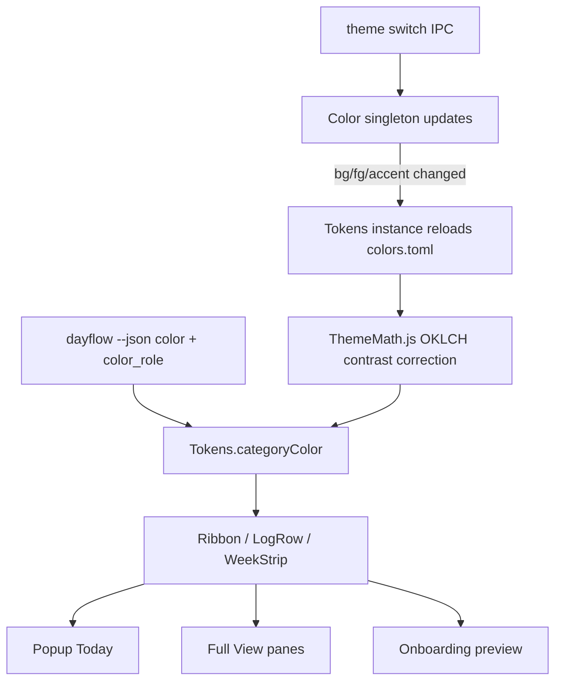
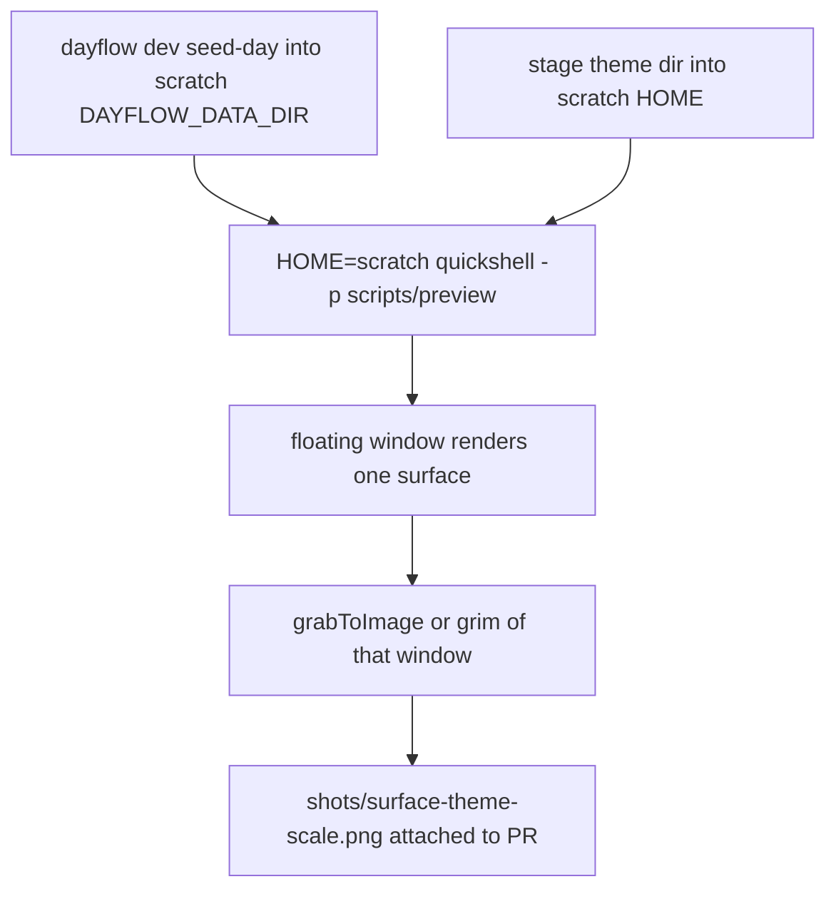

# Ribbon Log UI and Asset Redesign - Plan

## Goal Capsule

- **Objective:** On any Omarchy theme, light or dark, a Dayflow user can see the shape of today at a glance from the bar and popup, and can correct and export it from the keyboard in under 30 seconds. Every Dayflow surface (bar, popup, Full View, settings, onboarding, notifications, TUI, CLI) looks like it shipped with Omarchy and re-skins itself with the theme.
- **Means:** the "Ribbon Log" direction from `DESIGN.md` section 5: a duration-scaled category ribbon next to dense mono rows. Every visual comes from a plugin token layer derived from the active Omarchy theme (KTD1, KTD2).
- **Authority hierarchy:** this plan's R-IDs win on product behavior. `DESIGN.md` is the origin spec and wins where this plan is silent. KTDs win on mechanism. Omarchy shell tokens (`Color`, `Style`) win over any spec value for visuals.
- **Priority:** Plan B (lower priority). Ship P0 units first. P1 and P2 phases may pause at any phase boundary.
- **Stop conditions:**
  - The sandbox preview harness (U1) cannot render plugin surfaces under a non-active theme without touching the live session. Stop and ask before using any live theme switch.
  - A unit would edit `/usr/share/omarchy/` or `~/.config/omarchy/current`. Stop.
  - Q1 (brand ownership) is still unanswered when U5 or U17 is ready to merge, or Q3 (bar recording color) when U4 is. Hold those PRs. Other units continue.
  - Any step would need a paid API call or AI-generated imagery. Stop.
- **Execution profile:** one PR per unit, in Unit Index order. No commits or pushes without the user's explicit request.
- **Who finishes:** an implementer (`ce-work` or a human) executes units. The user approves merges and answers Q1, Q2, and Q3.

---

## Product Contract

### Summary

Rebuild the Dayflow plugin's visual and interaction layer around one idea: the day drawn as a vertical ribbon of category color with dense, keyboard-navigable mono rows beside it. The popup becomes a Today-only quick view. Full View becomes the app and hosts Week, Search, Standup, Chat, Agents, and Settings. All colors come from theme roles through a token layer, so the plugin works on light themes. A small custom asset set (app mark, 12-glyph Nerd Font set, theme-mapped category hues, social card, marketplace previews, typographic empty states) replaces today's mixed glyphs and emoji.

### Problem Frame

The audit in `DESIGN.md` section 2 found five cross-cutting failures. About 28 literal colors in 7 QML files plus engine hex defaults ignore the theme and fail contrast on `catppuccin-latte` and `flexoki-light`. Only 3 qs.Ui kit components are used, so every control drifts from Omarchy's state tokens. Glyphs come from four sources, and two of them are emoji or a runic letter. Equal-weight cards hide the shape of the day. The popup has 6 tabs and duplicates Full View. The bar never shows the state that matters most, a stalled capture, even though the engine already reports it (`dayflow status --json` returns `capture_state: "down"`, `engine/capture.go` `captureState`).

### Requirements

**Theming and tokens**

- R1. No QML file except the token layer contains a literal color. The `DESIGN.md` section 10 grep returns nothing outside it.
- R2. Every surface renders legibly on dark and light Omarchy themes. Category hues pass 3:1 against the surface for ribbon fills and 4.5:1 for tag text, with automatic correction when a theme fails.
- R3. Category hues map to theme hue keys per `DESIGN.md` section 6.2. User-configured category colors still override the theme mapping.
- R4. Theme changes apply live, with no shell restart and no plugin reload.

**Glyphs and assets**

- R5. All icons come from one glyph set of named constants, using Nerd Font Material Design glyphs only, per `DESIGN.md` A2. No emoji and no raw codepoints in panes.
- R6. Dayflow has an app mark (`DESIGN.md` A1) used for the `.desktop` entry, notifications, and empty states. It renders in a single theme color. (A Quickshell `FloatingWindow` has no per-window icon property, so the Full View window takes no icon.)
- R7. The marketplace preview, social card, and README category swatch are rendered from a deterministic fixture day in at least two themes, one of them light, with no AI imagery and no paid calls (`DESIGN.md` A3 to A5).

**Bar widget**

- R8. The bar glyph distinguishes recording, paused (including locked, which differs only by tooltip), stalled (`capture_state` `down`), and engine-missing. It uses `Color.bar.active` while recording and the urgent role when stalled, with no blinking (`DESIGN.md` P0.2, section 8).
- R9. The tooltip reads like `Recording · 4h 12m today · last block 10:15`. Status refreshes within 10 s after a toggle.

**Popup**

- R10. The popup shows Today only: a header with date, total, and a pause toggle; the ribbon and rows; a 7-day strip; exactly three footer actions (`Summarize now`, `Copy today`, `Open Dayflow`); and an overflow menu holding the `Copy week` and `Ignore app` actions (`DESIGN.md` P0.3). Selecting a day in the 7-day strip sets the popup's day.
- R11. Standup, Chat, Week, Agents, and Settings leave the popup. Each one stays reachable as an overflow-menu entry that opens Full View on that destination (see Q2).

**Rows, ribbon, keyboard**

- R12. Each merged activity is one row: start time, duration as `1h 45m`, a category mark, title, and category and app meta. A selected row expands in place to show the summary, app breakdown, and actions. Blocks under 15 minutes appear in the ribbon. In the list they collapse into one expandable `N short blocks` row, so they can still be selected and edited.
- R13. Ribbon segment heights are proportional to minutes. Gaps show as gaps. Idle is a hatched gap and failed blocks are an urgent outline.
- R14. Keyboard model on the popup and Full View: `j/k` rows, `h/l` days, `/` search, `e` edit, `space` frames, `c` copy, `s` standup, `p` pause, `?` shortcut sheet. In Full View, `Tab` cycles focus between the rail, the rows, and the detail column, and `Ctrl+1` to `Ctrl+8` switch rail destinations. Every action is reachable without a mouse.

**Full View**

- R15. Full View's rail hosts Today, Week, Search, Standup, Chat, Agents, Context, and Settings. Today uses three columns (ribbon with hour ticks, rows, detail) at 1280 px and wider, two columns (ribbon and rows together, then detail) from 980 to 1279 px, and stacks the detail below the rows under 980 px.
- R16. The Week pane shows 7 vertical ribbons side by side plus one stacked category bar. The donut and treemap move to an Analytics sub-view. Selecting a day column opens Today on that date.
- R17. Search (`/`) queries the journal and agent sessions and groups results by day. Enter on a journal hit jumps to that Today row, and Enter on an agent hit opens the Agents pane at that session.
- R18. Timelapse playback becomes a frame scrubber under the selected row. When `playback` is off, the scrubber shows a locked state that explains how to enable it.

**Settings and onboarding**

- R19. Settings live in Full View with sections `Capture`, `Model`, `Privacy`, `Categories`, `Agents`, `Advanced`. Changes apply live with inline validation, built from qs.Ui `TextField`, `NumberField`, `Dropdown`, and `ToggleSwitch`. The 9 numeric capture fields and the prompt editors sit under Advanced.
- R20. Onboarding has 3 steps: where the model runs, a privacy summary with the two toggles that matter, then "First block lands at HH:MM" over a fixture-day ribbon preview (`DESIGN.md` P2.3).

**Engine-side surfaces**

- R21. Notifications carry the app icon, map stall to `critical` urgency, offer a `Resume` action when a manual pause has lasted too long, and set a `dayflow.<class>` category hint. Copy stays event-class only, as in the existing privacy rule in `engine/notify.go`.
- R22. `dayflow today` and the timeline text output print a category bar per row using ANSI theme slots and honor `NO_COLOR`. The TUI header gets a one-line ribbon.
- R23. Timeline cards gain additive `color` and `color_role` fields, and week `--json` gains `color_role` next to its existing `color`. The MCP tools that wrap them pick these up. No existing field changes name or meaning.

**Copy and states**

- R24. Every screen designs its empty, loading, partial, error, and success states. Empty and error states are typographic: one specific mono line plus the outline mark, never illustration. UI copy has no emoji and no em or en dashes.
- R25. Motion follows `DESIGN.md` section 8 durations and drops to 0 when the reduced-motion flag is set or Hyprland animations are disabled.

### Acceptance Examples

- AE1. Covers R2, R3. Given `flexoki-light` is active, when the popup opens on a day with coding, meetings, and idle blocks, then coding uses the theme's `blue`, meetings uses `yellow` corrected until it reaches 3:1 on the light background, and idle appears as a hatched gap.
- AE2. Covers R3. Given the user configured `coding = "#ff00aa"`, when any theme is active, then coding renders with the user's color (contrast-corrected), not the theme's `blue`.
- AE3. Covers R4. Given the popup is open, when the user runs `omarchy theme set catppuccin-latte`, then ribbon, rows, and borders switch to the new theme's values without reopening the popup.
- AE4. Covers R8. Given `capture_state` is `down`, when the bar refreshes, then the glyph is the alert glyph in the urgent role and the tooltip names the stall and its fix.
- AE5. Covers R11. Given the popup is open, when the user picks `Settings` from the overflow menu, then the popup closes and Full View opens on the Settings pane.
- AE6. Covers R18. Given `playback` is off, when the user presses `space` on a row, then the scrubber shows the locked state with the enable command, not an empty black box.

### Success Criteria

- The `DESIGN.md` section 10 quality gates pass, with the screenshot matrix reduced per unit as stated in the Verification Contract.
- A keyboard-only walkthrough of the popup and Full View Today completes the daily loop: open, scan, expand, edit, copy, close.
- On `vantablack` and `flexoki-light`, a reviewer cannot find a surface where text or ribbon contrast falls below R2's thresholds.

### Scope Boundaries

- Upstream Dayflow's visual brand (palette, flower mark, bundled fonts) is not adopted. Upstream informs structure only (`DESIGN.md` 4.9).
- No bundled fonts. Type follows `Style.font.family`.
- No illustration, no AI imagery, no paid API calls.
- MCP tool names and existing JSON fields stay unchanged. Only additive fields are allowed.
- Not built (considered): a QML visual-regression diffing system. Screenshots are reviewed by eye per PR. Revisit if theme regressions recur after P0.
- Not built (considered): a CI Qt toolchain for QML tests. Local `qmltestrunner` is enough for a single maintainer. Revisit if outside contributors start touching QML.

### Deferred to Follow-Up Work

- Review mode (`DESIGN.md` P1.6) and assign-and-remember. Both need a new stored rating and rule format, which deserves its own plan.
- All "supreme ceiling" items in `DESIGN.md` section 9, such as drag-to-retime, range "Ask about this range", theme preview in Settings, and the in-bar mini ribbon.
- Launch video and changelog clips (the launch-kit pipeline in the craft research). They depend on U17 assets.
- Moving QML into `ui/` with a `qmldir` (`DESIGN.md` Q7). See Assumptions.

### Outstanding Questions

- Q1 (blocking for U5 and U17 merge only). Brand independence: `ROADMAP.md` says upstream (dayflow.so) owns the brand. Is a distinct mark acceptable for the Linux port, or should it ship a neutral "Dayflow for Linux" wordmark and defer to upstream's icon? The plan builds a distinct mark that does not imitate upstream's. The mark lives in `assets/icon/`, so swapping it touches only U5 and U17 outputs.
- Q3 (blocking for U4 merge only). Recording and stalled share a color on stock themes. Omarchy's `shell.toml` template sets `bar.active` to the theme's `red`, which is also `urgent`, so with R8 as written the only difference at bar size is glyph shape. Options: keep `Color.bar.active` for recording (the Omarchy convention, per `DESIGN.md`'s decision ledger) and accept glyph-only separation, or render recording in a neutral role (`df.fg`) so the urgent color means stalled only.
- Q2 (blocking for U10 merge only). Popup tab cut: remove Chat, Settings, Standup, and Agents from the popup entirely, or keep a slim `More` route? The plan's default is in Assumptions.

### Sources

- `DESIGN.md` (origin spec): sections 2 (audit), 3 (assets A1 to A6), 5 (direction and decision ledger), 6 (tokens), 7 (type), 8 (motion), 9 (screen plan), 10 (gates), 11 (open questions).
- Session research (outside the repo, not committed): `design-research.md` Track 3 (asset pipeline: agent-authored SVG, `svgo`, `resvg`, `oxipng`, no paid imagery) and `craft-and-launch-research.md` A.3 (quality bar). The adopted checklist items are restated in the Verification Contract because those files are ephemeral.
- `docs/plans/2026-09-18-001-refactor-ui-ux-polish-plan.md` and `docs/ui-audits/2026-09-18-omarchy-ui-ux-polish.md`: the prior polish pass. Its KTD1 rejected local theme tokens. KTD1 below supersedes it, for the reason given there.

---

## Planning Contract

### Key Technical Decisions

- KTD1. **A plugin token layer, derived only from theme sources.** `Tokens.qml` exposes the `df.*` roles from `DESIGN.md` section 6.1 and the category hues from 6.2. It reads only `Color`, `Style`, and the active theme's `colors.toml`. The 2026-09-18 plan rejected local tokens to avoid a "parallel palette". This layer holds no palette of its own. It is needed because `Color` does not expose the hue keys (`blue`, `green`, `brown`, `bright_*`). `Color.loadColors` parses only foreground, background, accent, muted, and red into `urgent` (`/usr/share/omarchy/shell/Commons/Color.qml`). Fallback hexes stay inside `Tokens.qml`, the one file R1 exempts.
- KTD2. **The token layer re-reads `colors.toml` on theme change.** `Color`'s own `colorsFile` has `watchChanges: false`. `omarchy-theme-set` replaces the whole theme directory with `mv`, then writes `current/theme.name`, then sends the `applyTheme` IPC. A watch on `colors.toml` would lose its target when the directory is replaced. `Tokens` therefore reloads when a watched `FileView` on `~/.local/state/omarchy/current/theme.name` fires, and also when `Color.background`, `Color.foreground`, or `Color.accent` changes. Both triggers see the complete new file. It then recomputes contrast-corrected hues once. This satisfies R4, including theme switches that keep the same background, foreground, and accent.
- KTD3. **Instance plus JS library, not QML singletons.** No installed Omarchy plugin ships a `qmldir`, and plugin files load by implicit directory import. `Tokens` is one instance owned by `BarWidget.qml` and handed down through the existing `dayflow` object that panes already receive (`property var dayflow` in `TodayTab.qml`, `Settings.qml`, `FullView.qml`). Glyph constants and color math live in `.pragma library` JS files (`Glyphs.js`, `ThemeMath.js`) imported by relative path. This avoids depending on plugin-loader `qmldir` behavior and keeps the marketplace layout.
- KTD4. **Contrast correction in OKLCH, in pure JS.** `ThemeMath.js` converts hex to OKLCH and measures WCAG 2 contrast on the color as it will actually be composited. Ribbon fills are measured as the hue at 0.85 alpha over opaque `df.bg`. Tag text is measured against the hue-at-0.14 tint over `df.bg`. It then moves lightness toward `fg` in fixed steps until the target ratio passes (3:1 fills, 4.5:1 text). It is pure and deterministic, so `qmltestrunner` can test it without a shell.
- KTD5. **Verification runs in a sandboxed second Quickshell instance.** `Color` resolves its theme from `$HOME/.local/state/omarchy/current/theme`. A preview harness launches `quickshell -p scripts/preview/` with `HOME` pointed at a scratch home. That home holds a staged theme (copied from `/usr/share/omarchy/themes/<name>` or `~/.config/omarchy/themes/<name>`) whose `shell.toml` is generated by running Omarchy's own `omarchy-theme-set-templates` under the scratch HOME. It also holds a seeded `DAYFLOW_DATA_DIR`. The harness can never make a paid call: it unsets `OPENROUTER_API_KEY`, puts a failing `omaseal` stub first on PATH, and uses a scratch config with no provider key. A `dayflow` shim first on PATH returns canned `status --json` for a chosen `--state` and passes every other subcommand to the real binary. The harness hosts extracted body components (for example `PopupBody.qml`), never the layer-shell `KeyboardPanel`, which is full-screen and takes exclusive keyboard focus. It renders one surface in a floating window and saves it with `grabToImage`, falling back to `grim -g` of that window. The live shell, theme, and bar are never touched. The harness root links `Commons`, `Ui`, and the other `qs.*` modules from `/usr/share/omarchy/shell` read-only. This is linking, not editing.
- KTD6. **A deterministic fixture day comes from a hidden engine command.** `engine/fixtures.go` captures agent-store schemas, not journal days, so `DESIGN.md` A4's reference to it is corrected here. A new `dayflow dev seed-day --date D` (the harness passes today's date, because the popup is Today-only, with fixed local clock times) writes a fixed, anonymized day (cards, categories, gaps, one failed block, agent sessions) into `DAYFLOW_DATA_DIR`. It refuses to run when the data dir is the user's real default. Harness screenshots, onboarding's preview ribbon (R20), and marketing assets (R7) all use it.
- KTD7. **Stall detection reuses `capture_state`.** `DESIGN.md` P0.2 proposed a new `stalled` field, but `printStatus` already emits `capture_state` with `recording`, `paused`, `locked`, or `down`, where `down` means no capture event within 3 capture intervals (minimum 60 s). The bar maps `down` to stalled. No engine change is needed for R8. R9's tooltip needs one additive engine change: `status --json` gains `today_minutes` and `last_block_end_ts`, which the bar formats on the UI side.
- KTD8. **`color` and `color_role` are additive JSON.** Today, `categoryColorHex` in `engine/weekly.go` reaches only the weekly outputs. Timeline cards (`timelineJSON` in `engine/export.go`) carry no color. `timelineJSON` gains a `Config` parameter and emits `color` from `categoryColorHex`, and every caller (in `engine/main.go` and `engine/mcp.go`) passes it in. A sibling `color_role` (`blue`, `muted`, and so on) is empty when the user configured a custom color. The UI prefers the role, then the hex. `TestTimelineJSONContract` and the MCP card tests are extended, not rewritten.
- KTD9. **Shared row and ribbon components.** `Ribbon.qml`, `LogRow.qml`, and `WeekStrip.qml` are built once (U7) and used by the popup, Full View Today, Week, Search results, and the onboarding preview. This prevents the two-parallel-apps drift that `DESIGN.md` finding 5 describes.
- KTD10. **Full View gains destinations before the popup loses them.** U8, U9, and U18 land Standup, Chat, and Settings in Full View before U10 cuts the popup tabs, so no capability is ever unreachable between PRs.
- KTD11. **Kit-first controls.** New or rebuilt controls use qs.Ui (`PanelActionButton`, `PanelSectionHeader`, `PanelKeyCatcher`, `PanelToolTip`, `TextField`, `NumberField`, `Dropdown`, `ToggleSwitch`, `ButtonGroup`, `ConfirmDialog`). A hand-rolled control needs a one-line reason in its file header.
- KTD12. **Assets are agent-authored SVG, built locally.** The mark is drawn on a 24-unit grid, then optimized with `svgo` and rasterized with `resvg` and `oxipng`, all installed on this machine. Raster marketing images are captured from the harness, not generated. A `scripts/assets/build.sh` makes the assets reproducible.

### High-Level Technical Design

Theme to pixels data flow:

Sandboxed verification (no live-session contact):

Bar state mapping (R8):

| `status --json` | Glyph (Glyphs.js) | Color role | Tooltip lead |
|---|---|---|---|
| binary missing | `download_circle_outline` | `df.fgDim` | Engine not installed |
| `recording` | `record_circle_outline` | `Color.bar.active` | Recording |
| `paused` | `pause_circle_outline` | `df.fgDim` | Paused |
| `locked` | `pause_circle_outline` | `df.fgDim` | Paused while locked |
| `down` | `alert_circle_outline` | `df.danger` | Capture stalled |

### Assumptions

- Q2 default: the popup removes the five tabs. The overflow menu lists the destination entries `Standup`, `Chat`, `Week`, `Agents`, and `Settings`, each of which opens Full View on that pane, plus the R10 actions `Copy week` and `Ignore app`. This covers both readings of Q2 (no tabs, but a reachable route) and can be undone in one file.
- `DESIGN.md` Q3: times default to 24h. Settings › Advanced exposes a 12h/24h choice. Times are formatted on the UI side from raw timestamps (KTD7), never parsed from the engine's preformatted `3:04 PM` strings.
- `DESIGN.md` Q4: when a theme lacks a mapped key (`brown`, `bright_magenta`), the fallback chain is the next key in the 6.2 row, then the ANSI slot (blue→`color4`, green→`color2`, yellow→`color3`, red→`color1`, magenta→`color5`, cyan→`color6`, bright_magenta→`color13`), then the engine default hex. All of them pass through contrast correction.
- `DESIGN.md` Q5: frame retention stays opt-in. The scrubber shows a locked state (R18). Changing retention defaults is a privacy decision that is out of scope.
- `DESIGN.md` Q6: keep 11 categories. Review mode is deferred.
- `DESIGN.md` Q7: QML stays at the repo root (KTD3).
- Verification themes: `vantablack` (dark, user theme) and `flexoki-light` (light) are the minimum per unit. `catppuccin-latte` and `tokyo-night` join for U10, U18, and U17, per the `DESIGN.md` section 10 matrix.
- Scale coverage in the harness uses `QT_SCALE_FACTOR=2` and `=1` rather than physical monitors, because eDP-1 may be off in clamshell.

### Sequencing

Phase P0 (identity and theming): U1, U2, U3, U4, U5, U6. Phase P1 (Full View becomes the app): U7, U8, U18, U9, U10, U11, U12. Phase P2 (depth): U13, U14, U15, U16, U17. U2 gates every UI unit. U7 gates every unit that draws rows. U8, U9, and U18 gate U10. U6 does not wait on Q1: it references the icon by name (`-i dayflow`), and the icon appears once U5 merges.

---

## Implementation Units

| U-ID | Title | Key files | Depends on |
|---|---|---|---|
| U1 | Fixture day, sandbox preview harness, UI lint gate | `engine/devseed.go`, `scripts/preview/`, `scripts/lint-ui.sh`, `PopupBody.qml` | none |
| U2 | Token layer, glyph set, theme math, `color` and `color_role` | `Tokens.qml`, `Glyphs.js`, `ThemeMath.js`, `engine/export.go`, `engine/weekly.go` | U1 |
| U3 | Purge literal colors and stray glyphs | `Panel.qml`, `AgentsPane.qml`, `ContextPane.qml`, `InstallPrompt.qml`, `BusyBar.qml`, `CalendarPicker.qml` | U2 |
| U4 | Bar widget states and tooltip | `BarWidget.qml`, `engine/main.go` | U2 |
| U5 | App mark, desktop entry, icon install | `assets/icon/`, `scripts/assets/build.sh`, `scripts/install.sh` | U1 |
| U6 | Notifications rework | `engine/notify.go`, `engine/capture.go` | U1 |
| U7 | Shared Ribbon, LogRow, WeekStrip, duration format | `Ribbon.qml`, `LogRow.qml`, `WeekStrip.qml`, `Format.js` | U2 |
| U8 | Full View rail and hosted Standup and Chat | `FullView.qml` | U7 |
| U18 | Today pane, edit flow, keyboard model | `TodayPane.qml`, `KeyModel.js`, `ShortcutSheet.qml` | U8 |
| U9 | Settings in Full View on qs.Ui kit | `Settings.qml`, `SettingsField.qml`, `FullView.qml` | U8 |
| U10 | Popup becomes Today only | `Panel.qml`, `PopupBody.qml`, `TodayTab.qml`, `DayNavRow.qml`, `manifest.json` | U8, U9, U18 |
| U11 | Week pane ribbons and calendar heat | `WeekPane.qml`, `WeekTab.qml`, `CalendarPicker.qml` | U7 |
| U12 | Search pane | `SearchPane.qml`, `FullView.qml`, `engine/main.go` | U18 |
| U13 | Frame scrubber replaces Timelapse pane | `FrameScrubber.qml`, `TimelapsePane.qml` | U18 |
| U14 | Agents and Context panes on tokens and rows | `AgentsPane.qml`, `ContextPane.qml` | U7 |
| U15 | Onboarding in 3 steps | `Onboarding.qml` | U1, U7 |
| U16 | TUI and CLI ribbon | `engine/tui.go`, `engine/main.go` | U2 |
| U17 | Social card, marketplace previews, swatch sprite | `scripts/preview/scenes/`, `preview.png`, `docs/assets/` | U5, U10, U18, U11 |

### U1. Fixture day, sandbox preview harness, UI lint gate

**Goal:** Make every later unit verifiable on any theme without touching the live session.

**Requirements:** R1, R2, R7, R24 (enables all of them).

**Dependencies:** none.

**Files:**
- Create `engine/devseed.go` and `engine/devseed_test.go`
- Modify `engine/main.go` to register the hidden `dev seed-day` subcommand
- Create `scripts/preview/shell.qml`, `scripts/preview/run.sh`, `scripts/preview/dayflow-shim`, `scripts/preview/README.md`
- Create `scripts/lint-ui.sh`
- Create `PopupBody.qml` by extracting the content column from `Panel.qml`'s `KeyboardPanel` with no visual change. `Panel.qml` embeds it.

**Approach:**
1. `dev seed-day` writes the KTD6 fixture into `DAYFLOW_DATA_DIR` and refuses when that variable is unset or resolves to the default data dir.
2. `run.sh <surface> <theme> [scale] [--state S]` does the following:
   - builds a scratch HOME and stages the theme into `<scratch>/.local/state/omarchy/current/next-theme`
   - runs `HOME=<scratch> omarchy-theme-set-templates` and moves `next-theme` to `theme`
   - seeds today's data and applies the KTD5 safety environment (no API key, failing `omaseal` stub, the shim)
   - launches the sandbox instance and writes `shots/<surface>-<theme>-<scale>.png` (gitignored)
3. `shell.qml` maps a surface name (`bar`, `popup`, `fullview-today`, and so on) to a Loader that hosts the body component in a `FloatingWindow` with a stub `dayflow` object.
4. `lint-ui.sh` runs the `DESIGN.md` section 10 color grep (excluding `Tokens.qml`), an emoji and stray-glyph scan over QML string literals, an em and en dash scan over UI strings, and `/usr/lib/qt6/bin/qmllint` on changed QML.

**Execution note:** Prove the harness first by rendering the current popup body, extracted without visual change, under `flexoki-light` while `vantablack` stays live. That before-shot becomes the baseline for later PRs.

**Patterns to follow:** env-override style of `DAYFLOW_DATA_DIR` and `DAYFLOW_CONFIG` in `engine/config.go`. Test layout of `engine/backup_test.go`.

**Test scenarios:**
- `seed-day` with a temp `DAYFLOW_DATA_DIR` produces the fixed card count, categories, one gap, and one failed block, and `timeline --json` for that date matches a golden summary.
- Running `seed-day` twice is idempotent and leaves the same row count.
- `seed-day` with `DAYFLOW_DATA_DIR` unset exits non-zero with a message naming the variable.
- `seed-day` pointed at the real default data path refuses.
- `lint-ui.sh` flags a fixture QML file that contains `"#ff0000"` and passes once the color is removed. This is a script self-test, run by hand.
- The shim with `--state down`, `recording`, `paused`, `locked`, and `missing` returns the matching canned status JSON, and passes `timeline --json` through to the real binary.
- Under the harness environment, `dayflow summarize --now` fails with the no-API-key error and makes no network call.

**Verification:** A light-theme screenshot of the current popup exists while the live theme stays dark. `hyprctl` and the live shell show no new windows, theme change, or errors after the run closes.

### U2. Token layer, glyph set, theme math, `color_role`

**Goal:** Give every surface one source of color, glyphs, and spacing derived from the active theme.

**Requirements:** R2, R3, R4, R5, R23. Covers AE1, AE2, AE3.

**Dependencies:** U1.

**Files:**
- Create `Tokens.qml`, `Glyphs.js`, `ThemeMath.js`
- Create `tests/qml/tst_thememath.qml` and `tests/qml/tst_tokens.qml`
- Modify `BarWidget.qml` to own the `Tokens` instance and expose it on the `dayflow` object (KTD3)
- Modify `engine/weekly.go` to add `color_role` next to its existing `Color` fields
- Modify `engine/export.go` (`timelineJSON` takes `Config` and emits `color` and `color_role` per card), plus its callers in `engine/main.go` and `engine/mcp.go` (KTD8)
- Modify `engine/cards_test.go` to extend `TestTimelineJSONContract` and `TestMCPGetTimelineEmitsCards`

**Approach:**
- Token roles and hue table follow `DESIGN.md` 6.1 and 6.2. The reload trigger follows KTD2 and correction follows KTD4.
- `Glyphs.js` holds the 12 named constants from `DESIGN.md` A2. Codepoints are verified with `fc-query` against the active `Style.font.family` file, and the verified list is recorded in the file header.
- `categoryColor(name, hex, role)` returns the corrected color with the precedence from R3.

**Patterns to follow:** `Color.qml`'s `FileView` plus parse approach, as a read-only reference. Existing `dayflow` object passing in `TodayTab.qml`.

**Test scenarios:**
- Covers AE1. `ThemeMath` given flexoki-light `background #FFFCF0` and `yellow #D0A215` returns a corrected yellow whose 0.85-alpha composite over the background reaches at least 3:1, and leaves `blue #205EA6` unchanged because it already passes.
- A theme with only `color0` to `color15` (no named hues) resolves coding to `color4`, not the engine hex.
- Rewriting `theme.name` with identical background, foreground, and accent but a new `blue` updates the coding hue.
- 4.5:1 text correction on a dark theme lightens a dark hue until it passes. The hue angle stays within a small tolerance.
- A hue that cannot reach the target within the step budget returns `fg`-blended output, never an exception.
- Covers AE2. `categoryColor("coding", "#ff00aa", "")` returns the corrected custom hex, not the theme's `blue`.
- A theme missing `brown` resolves `personal` through the Q4 fallback chain.
- Covers AE3. `tst_tokens` swaps the staged `colors.toml`, changes the `Color.background` stub, and sees updated `df.*` and hue values.
- Go: timeline JSON includes `color_role: "blue"` for default coding and `color_role: ""` with the custom hex when configured. Existing fields are unchanged.

**Verification:** `qmltestrunner` tests pass. `go test ./...` passes. Harness renders of a token swatch scene on `vantablack` and `flexoki-light` show all 12 category hues legible.

### U3. Purge literal colors and stray glyphs

**Goal:** Move existing surfaces onto tokens and glyph names with no layout change, so the theme leak closes before any redesign.

**Requirements:** R1, R2, R5.

**Dependencies:** U2.

**Files:** Modify `Panel.qml` (category map near the old `categoryColor` block and the remaining literals), `AgentsPane.qml`, `TodayTab.qml`, `TodayPane.qml`, `ContextPane.qml`, `InstallPrompt.qml`, `BusyBar.qml`, `CalendarPicker.qml` (`<` and `>` become chevron glyphs), and `StandupTab.qml` (the `✓` glyph).

**Approach:** Swap only. Agent status chips map to `accent`, `green`, `urgent`, and `muted` as in `DESIGN.md` P2.1. `⚡` and `?` become `productive` and `low_confidence` glyphs. Remove the `Panel.qml` category hex map so `Tokens.categoryColor` is the only path. `TimelapsePane.qml` is left alone because U13 removes it. If U13 is deferred, add it here.

**Test scenarios:** Test expectation: none. This is a styling swap with no behavior change. Proof comes from `lint-ui.sh` and screenshots.

**Verification:** `lint-ui.sh` reports zero literal colors outside `Tokens.qml` and zero emoji. Harness shots of popup Today, Agents, Context, and Install prompt on `vantablack` and `flexoki-light` show no low-contrast text, compared side by side with U1's baseline.

### U4. Bar widget states and tooltip

**Goal:** Make capture health visible from the bar.

**Requirements:** R8, R9. Covers AE4.

**Dependencies:** U2.

**Files:** Modify `BarWidget.qml`. Modify `engine/main.go` (`printStatus` gains `today_minutes` and `last_block_end_ts`, per KTD7) and `engine/main_test.go`. Create `tests/qml/tst_barstate.qml`.

**Approach:** Map status to a view state per the High-Level Technical Design table, and keep the mapping in a pure function so it can be tested. After a toggle, poll every 10 s for 60 s, then return to the 60 s cadence. The tooltip composes state, `today_minutes` as a duration, and `last_block_end_ts` formatted in 24h by default.

**Patterns to follow:** the existing `WidgetButton` usage and `Process` status poll in `BarWidget.qml`.

**Test scenarios:**
- Covers AE4. A status of `{capture_state:"down"}` maps to the alert glyph, the danger role, and tooltip lead "Capture stalled".
- `recording` maps to `Color.bar.active` and the record glyph.
- `locked` maps to the paused glyph with "Paused while locked".
- Missing binary (process exit 127) maps to the download glyph, dim, with the install hint.
- Malformed JSON keeps the previous state and does not flash an error glyph.
- Go: `status --json` on the fixture day reports `today_minutes` equal to the sum of the fixture's card minutes, and `last_block_end_ts` equal to the last card's end. Existing fields are unchanged.

**Verification:** Harness renders the bar in all 5 states (via the shim's `--state`) on both themes. After a toggle, the glyph updates within 10 s.

### U5. App mark, desktop entry, icon install

**Goal:** Give Dayflow its own mark (A1) for the desktop entry, notifications, and empty states.

**Requirements:** R6.

**Dependencies:** U1. Merge is gated on Q1.

**Files:**
- Create `assets/icon/dayflow.svg`, `assets/icon/dayflow-symbolic.svg`, `assets/icon/dayflow-outline.svg`, and the generated `assets/icon/dayflow-256.png`
- Create `scripts/assets/build.sh`
- Modify `scripts/install.sh` and `scripts/uninstall.sh` to install the icons into the hicolor theme under `~/.local/share/icons/` and write `~/.local/share/applications/dayflow.desktop` (`Icon=dayflow`), and to remove both on uninstall
- Modify `scripts/test-install.sh` to assert the icon and desktop entry are placed

**Approach:** Follow the A1 brief in `DESIGN.md` section 3 (capsule split into 4 to 5 uneven segments, one offset, `currentColor`, no gradients, fixed 2-unit radius). Draw several variants, preview them with `resvg` at 14, 16, 24, and 256 px, and keep one. The outline variant serves A6 empty states.

**Test scenarios:**
- `test-install.sh` asserts `dayflow.svg` and the 256 px PNG land under the hicolor path, and that uninstall removes them.
- `build.sh` run twice produces byte-identical PNGs, so the output is deterministic.

**Verification:** The mark is legible at 14 px in the bar font size on both themes, as harness shots of a mark-at-sizes scene show. `svgo` output has no gradients or raster embeds.

### U6. Notifications rework

**Goal:** Make notifications identifiable, correctly urgent, and actionable.

**Requirements:** R21.

**Dependencies:** U1. The icon referenced by `-i dayflow` comes from U5, but this unit does not wait on U5 or Q1.

**Files:** Modify `engine/notify.go`, `engine/notify_test.go`, and the daemon tick in `engine/capture.go`.

**Approach:**
- Add `-i dayflow` and the `-h string:category:dayflow.<class>` hint.
- Use `-u critical` for stall.
- Add a `paused_long` class. The daemon tick emits it once when the manual pause file's mtime is older than 60 minutes. Only this class carries `-A resume=Resume`. The auto-pause `paused` class (lock, session gone) keeps no action.
- Action sends run on their own goroutine (as `notifyAsync` does today), with an action-listen bound of 10 minutes and a matching `--expire-time`. When `resume` comes back, run `dayflow resume`.
- Plain sends keep the existing 5 s `notifyExecTimeout`, daily cap, and quiet period.

**Patterns to follow:** the stub-binary tests in `engine/notify_test.go` (`TestNotifySendsThroughStub`, `TestNotifyHungBinaryBounded`).

**Test scenarios:**
- The stall class passes `-u critical`, `-i dayflow`, and `category:dayflow.stall` to the stub.
- The `paused_long` class with the stub printing `resume` after more than 5 s still triggers the resume path once.
- A lock auto-pause sends the `paused` class with no `-A` argument.
- A manual pause file younger than 60 minutes emits no `paused_long`. An older one emits it once per pause.
- With the stub printing nothing and exiting, no resume runs and nothing errors.
- When the action-listen bound expires, the goroutine kills the process and exits, so no goroutine leaks.
- The standup class keeps normal urgency and no action.

**Verification:** `go test ./...` passes, and the stub captures exact arguments for every class. Notification surfaces are styled by mako's theme, not by Dayflow. Dayflow's visual contribution is the icon, which U5 verifies on both themes, so no live notification is fired.

### U7. Shared Ribbon, LogRow, WeekStrip, duration format

**Goal:** Build the Ribbon Log primitives once.

**Requirements:** R12, R13, R14, R25.

**Dependencies:** U2.

**Files:**
- Create `Ribbon.qml`, `LogRow.qml`, `WeekStrip.qml`, `Format.js`
- Create `tests/qml/tst_format.qml` and `tests/qml/tst_ribbon.qml`

**Approach:**
- `Ribbon` takes cards plus a time window and lays out segments proportional to minutes. It supports a vertical orientation with optional hour ticks and a horizontal orientation for the 7-day strip.
- `LogRow` has collapsed and expanded states, and collapsed height is `Style.font.body * 2`.
- `Format.js` provides `duration(mins)` that returns `1h 45m`, replacing `fmtHours`, plus time-range formatting with the 12h/24h switch.
- Motion durations follow `DESIGN.md` section 8. A reduced-motion flag (config key plus `hyprctl getoption animations:enabled`, read once) sets them to 0.

**Test scenarios:**
- `duration(105)` returns `1h 45m`. `duration(45)` returns `45m`. `duration(0)` returns `0m`. `duration(600)` returns `10h`.
- A ribbon with a 120 min card and a 30 min card in a 150 min window produces segment heights in a 4:1 ratio.
- A 20 min gap between cards produces an empty span of matching height.
- An idle card renders the hatch style. A failed card renders the outline with no fill.
- Three consecutive cards under 15 min appear in the ribbon and collapse into one `3 short blocks` row, which expands to three selectable rows.
- Range formatting gives `09:15–11:00` in 24h and `9:15–11:00 AM` in 12h.

**Verification:** A harness scene with the fixture day renders on both themes, and ribbon proportions match the fixture's minutes.

### U8. Full View rail and hosted Standup and Chat

**Goal:** Give Full View the R15 rail, and host Standup and Chat there before the popup drops them.

**Requirements:** R15.

**Dependencies:** U7.

**Files:** Modify `FullView.qml` to add the rail destinations per R15, moving Standup and Chat in by reusing the `StandupTab.qml`, `DailyWorkflowGrid.qml`, and `ChatTab.qml` content. Create `tests/qml/tst_rail.qml`.

**Approach:** The rail lists destinations in R15 order. `Ctrl+1` to `Ctrl+8` select them. An `openOn(pane)` entry point lets the popup's overflow (U10) open Full View on a named pane. Destinations whose unit has not landed yet (Search, Settings) are hidden, not stubbed.

**Patterns to follow:** the existing `FullView.qml` rail and loader.

**Test scenarios:**
- `openOn("standup")` opens Full View with Standup selected. `openOn("unknown")` falls back to Today.
- `Ctrl+3` selects the third visible destination.
- Standup copy produces the same text as the current popup Standup tab.

**Verification:** Shots of the rail with Standup and Chat on `vantablack` and `flexoki-light`. Standup and Chat behave the same as in the popup today.

### U18. Today pane, edit flow, keyboard model

**Goal:** Build the Full View Today pane and the shared keyboard model.

**Requirements:** R12, R14, R15.

**Dependencies:** U8.

**Files:**
- Modify `TodayPane.qml`
- Create `ShortcutSheet.qml` and `KeyModel.js`
- Create `tests/qml/tst_keymodel.qml`

**Approach:**
- `KeyModel.js` maps keys to intents per R14, including the focus zones, and the popup reuses it (U10).
- Layout widths follow R15.
- Detail shows the summary, app breakdown, edit fields, and a scrubber slot that U13 fills.
- Edit (`e`) covers the fields `dayflow edit` already supports: title, and category through a kit `Dropdown` with type-to-filter. `Enter` commits through `dayflow edit`, `Escape` cancels. On success the row updates in place. On failure the field keeps its input and shows the error inline with Retry.
- Empty, loading, and error states follow R24. For example, the empty state reads "No blocks yet. First summary lands at HH:MM."

**Patterns to follow:** `PanelKeyCatcher` signals. The existing edit call path in `Panel.qml`.

**Test scenarios:**
- `j` and `k` move selection and clamp at the first and last rows.
- `h` and `l` change the day and never move past today.
- `Tab` cycles focus through rail, rows, and detail, then back to rail.
- `/` focuses search and `?` toggles the sheet.
- Keys typed while a text field has focus are not interpreted as commands.
- `e`, then a new title, then `Enter` calls `dayflow edit` once and updates the row. `Escape` cancels without saving.
- A failing `dayflow edit` keeps the typed title, shows the error, and Retry re-sends it.

**Verification:** A keyboard-only walkthrough on the harness covers open, scan, expand, edit, copy, and close. Shots at 840x560, 1100x700, 1280x800, and 3440x1440 on `vantablack`, `flexoki-light`, `catppuccin-latte`, and `tokyo-night`.

### U9. Settings in Full View on qs.Ui kit

**Goal:** Move settings out of the popup into Full View with live apply and progressive disclosure.

**Requirements:** R19.

**Dependencies:** U8.

**Files:** Modify `Settings.qml`, `SettingsField.qml` (reduce to a thin wrapper or delete), and `FullView.qml`. Create `tests/qml/tst_settings_validate.qml`.

**Approach:** Build the six sections listed in R19 from kit controls (KTD11). Live apply goes through the existing `dayflow config patch -` path in `Panel.qml`, debounced and validated on blur. On error, the field keeps the user's input and shows the message inline. Advanced holds the capture numerics, prompt editors, the 12h/24h choice, and reduced motion.

**Test scenarios:**
- A capture interval below the engine minimum shows an inline error and is not patched.
- A valid change patches once after the debounce, and a second identical change does not patch again.
- When the patch command fails, the field keeps its value, shows an error with a Retry action, and the previous config stays in effect.
- Switching sections keeps unsaved field focus state without losing typed text.

**Verification:** Settings render on both themes with no hand-rolled control left (grep for `MouseArea` toggles). Live apply is visible in `dayflow config` output.

### U10. Popup becomes Today only

**Goal:** Turn the popup into a glance-and-act view of today.

**Requirements:** R10, R11, R14, R24. Covers AE5.

**Dependencies:** U8, U9, U18. Merge is gated on Q2, with the Assumptions default.

**Files:**
- Modify `Panel.qml` and `PopupBody.qml` (remove the tabs and the 780 px expanded mode, add the header, footer, and overflow menu), `TodayTab.qml`, `DayNavRow.qml`, and `manifest.json` (description)
- Remove `WeekTab.qml` and `AgentsTab.qml` once nothing references them. Keep `StandupTab.qml` and `ChatTab.qml` only if U8 hosts them.

**Approach:**
- The header shows `Today · Thu 2 Oct`, the total, and the pause toggle.
- Below it come the ribbon and rows from U7, then the `WeekStrip`. Selecting a strip day sets the popup's day.
- The footer holds 3 `PanelActionButton`s. The overflow menu follows the Q2 default. Overflow destination entries call Full View's `openOn(pane)` through the existing `BarWidget.qml` loader. `Copy week` and `Ignore app` reuse today's popup actions.
- Popup keys from `KeyModel.js`:
  - `j/k`, `h/l`, `e`, `c`, `p`, and `?` act in place.
  - `s` copies the standup draft.
  - `/` opens Full View on Search.
  - `space` opens Full View Today with that row's frames.
  - `n` runs Summarize now, `o` opens Dayflow, and `.` opens the overflow menu.

**Test scenarios:**
- Covers AE5. Overflow › Settings closes the popup and opens Full View with Settings selected.
- `Copy week` and `Ignore app` in the overflow produce the same results as the current popup actions.
- `/` in the popup closes it and opens Full View on Search.
- Selecting yesterday in the 7-day strip loads yesterday's rows.
- `Copy today` puts the existing export text on the clipboard. The output is unchanged from today's copy action.
- An empty day shows the R24 empty line plus the outline mark. The footer actions stay enabled where they make sense, and `Copy today` is disabled with a reason.
- The `panel_expanded` config is ignored without error on existing installs.

**Verification:** Popup shots on 4 themes at scales 1 and 2. A keyboard-only walkthrough. No QML warnings in the sandbox log.

### U11. Week pane ribbons and calendar heat

**Goal:** Show the week as 7 comparable ribbons, and show which days hold data.

**Requirements:** R16. `DESIGN.md` P2.6.

**Dependencies:** U7.

**Files:** Modify `WeekPane.qml`, `WeekTab.qml` (removed by U10 if it is popup-only), and `CalendarPicker.qml`. Create `AnalyticsView.qml` and move the donut and treemap there.

**Approach:** Seven vertical `Ribbon`s share one hour axis. One stacked category bar replaces the donut as the hero. Calendar days are tinted with an accent alpha ramp by tracked hours. Days without data stay untinted.

**Test scenarios:**
- A week with one empty day renders 6 ribbons and one empty column with a label, with no collapsed layout.
- Stacked bar segments sum to the week's tracked minutes.
- The heat ramp gives 0 h no tint, and the maximum day the strongest tint.
- Enter on the Wednesday column opens Today on that Wednesday.

**Verification:** Shots on both themes at 840x560 and 1280x800.

### U12. Search pane

**Goal:** Search the journal and agent sessions, then jump to the matching moment.

**Requirements:** R17.

**Dependencies:** U18.

**Files:** Create `SearchPane.qml`. Modify `FullView.qml`. Modify `engine/main.go` (`printSearch` JSON gains additive `start_ts` and `end_ts`) and its test.

**Approach:**
- Call `dayflow search --json` and `dayflow search-agents --json`. The query runs on Enter, and a skeleton shows while it loads.
- Results are grouped by day and use `LogRow`.
- Enter on a journal hit opens Today on that date with the card whose span contains `start_ts` selected. Enter on an agent hit opens Agents at that session (R17).

**Test scenarios:**
- A query matching fixture rows on 2 days shows 2 groups in date order.
- A query with no match shows the R24 empty line with the query echoed.
- An engine search error shows the error state with a Retry action and keeps the query text.

**Verification:** A harness search for a fixture term lands on the right row.

### U13. Frame scrubber replaces Timelapse pane

**Goal:** Put the screen recording one keypress behind every row.

**Requirements:** R18. Covers AE6.

**Dependencies:** U18.

**Files:** Create `FrameScrubber.qml`. Modify `TodayPane.qml`. Remove `TimelapsePane.qml` and its rail entry.

**Approach:** The scrubber reads `dayflow frames <date> --json`, limited to the selected row's time span. The locked state appears when `playback status --json` reports off. The background is `df.sunken`, never black.

**Test scenarios:**
- Covers AE6. With playback off, `space` shows the locked line with `dayflow playback on`.
- With playback on and 0 frames in the span, it shows "No frames kept for this block."
- Arrow keys step frames and clamp at the edges.

**Verification:** Shots of the locked and populated states on both themes.

### U14. Agents and Context panes on tokens and rows

**Goal:** Bring the remaining panes into the Ribbon Log language.

**Requirements:** R1, R12. `DESIGN.md` P2.1 and S10.

**Dependencies:** U7.

**Files:** Modify `AgentsPane.qml`, `AgentBriefingLoader.qml`, and `ContextPane.qml`.

**Approach:** Workstreams render as rows with session spans on the day axis. Status chips use tag styling (hue text on hue at 0.14 alpha). The Context canvas reads its label colors from tokens.

**Test scenarios:**
- A blocked workstream shows the urgent-role chip, and a completed one shows the muted-role chip.
- An empty agents day shows the R24 empty line.

**Verification:** Shots on both themes. Lint is clean.

### U15. Onboarding in 3 steps

**Goal:** Reach first value faster, and preview what Dayflow will show.

**Requirements:** R20, R24.

**Dependencies:** U1, U7.

**Files:** Modify `Onboarding.qml`.

**Approach:** The 3 steps are listed in R20. Step 3 renders a fixture-day `Ribbon` from a bundled static JSON snapshot of the KTD6 fixture, not the live engine, plus a countdown to the next block boundary. The preview carries a visible `Sample day` caption in the dim role, so fixture activity is never mistaken for the user's own. The existing consent copy is kept and tightened.

**Test scenarios:**
- The step 3 preview shows the `Sample day` caption.
- At 10:07 the countdown target reads 10:15. At 10:15:00 it reads 10:30.
- Back and forward navigation keeps the provider choice.
- Choosing a local model skips the API-key field.

**Verification:** A full onboarding pass on the sandbox harness with an empty data dir, on both themes.

### U16. TUI and CLI ribbon

**Goal:** Give terminal surfaces the same ribbon language.

**Requirements:** R22, R23.

**Dependencies:** U2.

**Files:** Modify `engine/main.go` (`printTimeline` and `today` text output), `engine/tui.go`, and the matching `_test.go` files.

**Approach:** Map each category's `color_role` to an ANSI slot (blue to 4, green to 2, and so on) so the terminal theme supplies the color. Each row gets a `█` prefix. The TUI header gets one line of block characters (`▁▂▃▅▇`) scaled by minutes per hour. `NO_COLOR` or a non-TTY drops color but keeps the glyphs.

**Test scenarios:**
- Timeline text output for the fixture day contains one `█` per row, with the ANSI code for slot 4 on coding rows.
- With `NO_COLOR=1` set, the output has no escape sequences and still has the glyphs.
- `--json` output is byte-identical to before, apart from U2's additive field.
- The TUI header for an 8-hour fixture produces an 8 to 24 character ribbon with no wrap at 80 columns.

**Verification:** `go test ./...` passes. A VHS capture at 80 and 120 columns on dark and light terminal themes.

### U17. Social card, marketplace previews, swatch sprite

**Goal:** Ship honest marketing assets rendered from the real UI and fixture data.

**Requirements:** R7.

**Dependencies:** U5, U18, U10, U11. Merge is gated on Q1.

**Files:**
- Create `scripts/preview/scenes/SocialCard.qml` and `scripts/preview/scenes/Swatches.qml`
- Regenerate `preview.png` and `docs/assets/social.png`
- Create `docs/assets/preview-{popup,today,week}.png` and `docs/assets/swatches.svg`
- Modify `README.md` image references

**Approach:** Build the social card per A4 (mark plus `dayflow` wordmark in system mono, the tagline, and the fixture ribbon) at 1280x640 in `vantablack` and `flexoki-light`. Previews follow A5. All assets come from `scripts/preview/run.sh` (shim state `recording`) and are optimized with `oxipng`. Scenes take an explicit date label instead of reading the wall clock, so re-renders are identical. No other windows or personal data appear in frame.

**Test scenarios:** Test expectation: none. These are generated assets, checked by the visual review below.

**Verification:** Every image comes from fixture data, has no emoji, and passes R2 contrast. The sizes are `preview.png` at the marketplace's expected 560x786 or larger, and the social card at 1280x640. `scripts/assets/build.sh` regenerates them reproducibly.

---

## Verification Contract

| Gate | Command or method | Applies to |
|---|---|---|
| Go build, vet, format, tests | `go build ./...`, `go vet ./...`, `gofmt -l .`, and `go test ./...` in `engine/`. CI runs these in `.github/workflows/ci.yml` | U1, U2, U4, U6, U12, U16 |
| Install smoke | `bash scripts/test-install.sh` | U5 |
| QML unit tests | `/usr/lib/qt6/bin/qmltestrunner -input tests/qml` (local only, not on PATH by default) | U2, U4, U7, U8, U18, U9 |
| UI lint | `scripts/lint-ui.sh` reports zero literal colors outside `Tokens.qml`, zero emoji, no em or en dashes in UI strings, and `/usr/lib/qt6/bin/qmllint` clean on changed files | every QML unit |
| Theme screenshots | `scripts/preview/run.sh <surface> <theme> <scale>` on at least `vantablack` and `flexoki-light`. U18, U10, and U17 also cover `catppuccin-latte` and `tokyo-night` at scales 1 and 2. Shots are attached to the PR | every UI unit |
| Live-session safety | During verification, the live theme name (`~/.local/state/omarchy/current/theme.name`) is unchanged and no Dayflow QML warnings appear in the live shell log | every UI unit |
| Keyboard walkthrough | Mouse-free pass of the unit's surface | U8, U18, U9, U10, U12, U13 |

Quality bar per surface, adapted from the craft research A.3 P0 items:
- The empty, loading, partial, error, and success states are each designed (R24).
- Every error offers a next action.
- Hover, pressed, focus, and disabled states are distinct, and disabled controls say why.
- Contrast meets R2.
- Local actions respond in under 50 ms.
- Copy is in sentence case with specific verbs.

---

## Definition of Done

- **Global:**
  - All units merged, or explicitly deferred with a note.
  - R1 to R25 are traceable to merged units.
  - `DESIGN.md` section 10 gates pass.
  - No dead or experimental code from abandoned approaches remains in the diff.
  - Nothing under `/usr/share/omarchy/` changed.
  - Plugin version in `manifest.json` bumped once per phase release.
- **Per unit:**
  - Its Verification passes, and its test scenarios exist and pass.
  - Light and dark screenshots are attached to the PR.
  - `lint-ui.sh` is clean.
  - Q1, Q2, and Q3 gates are respected for U5, U17, U10, and U4.

---

## Risks & Dependencies

| Risk | Mitigation |
|---|---|
| The sandbox Quickshell instance cannot resolve `qs.*` imports or needs runtime state outside the theme dir | U1 proves the harness first. If it fails, stop (Goal Capsule). Never fall back to switching the live theme without the user's consent |
| The harness's floating window maps into the live Hyprland session and can briefly take focus | Launch it on an unfocused special workspace with no-focus window rules set in the sandbox instance only. Never change the user's Hyprland config |
| Popup hosting depends on the `PopupBody.qml` extraction staying visually identical | U1's baseline compares the extracted body to a `grim` shot of the live popup taken by the user, or to `preview.png` |
| Nerd Font codepoints differ across font versions, or the user's font lacks MD glyphs | Verify with `fc-query` in U2. Fall back to text labels if a glyph is missing |
| Removing popup tabs strands muscle memory | The Q2 default keeps every destination one overflow step away (AE5) |
| `notify-send -A` blocks and can hang the engine | Bounded wait under the existing hung-binary limit (U6 test) |
| A brand conflict with upstream | Q1 gates only U5 and U17. The mark is isolated in `assets/icon/` |
