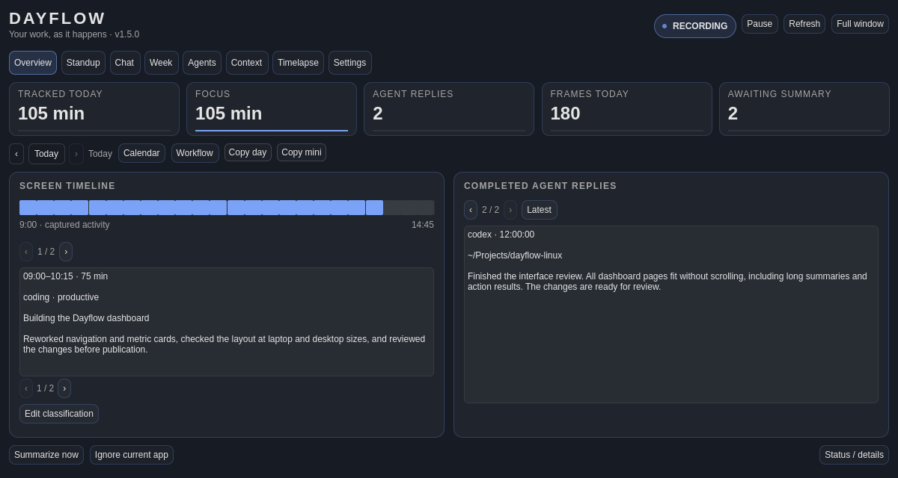

# Pulse-style dashboard

Dayflow's popup and floating window share one dashboard inspired by Pulse's
wide cards, prominent live status and compact navigation. It uses the current
Omarchy popup palette and font. Overview, Standup, Chat, Week, Agents, Context,
Timelapse and Settings are available on both surfaces.



Overview displays captured activity, screen summaries and finished agent replies
separately. Reply records follow the latest completion until you browse an older
record; **Latest** resumes following. Timeline refreshes every two seconds on
Overview and every five seconds on other pages while either surface is open.
Capture status refreshes every five seconds. Finished turns are not proof that an
entire project is complete; see [completion recording](immediate-completions.md).

Long histories, results, provider names and editable text use explicit record and
text pages. Text stays selectable and editable without dropping surrounding
pages. There are no page scrollers. **Status / details** contains provider/storage
information, ignored apps, engine mismatch information, errors and action results.

- **Standup:** Yesterday/today entries, goal completion and paged draft fields.
- **Chat:** Saved conversations, question editor, explicit question actions and
  complete answers. Opening the page or leaving the editor does not call a model.
- **Week:** Hourly heatmap, category/app distributions, distractions, focus blocks,
  timeline, trends, forecast and generated review, with week export controls.
- **Agents:** Workstreams, threads, status/source accounting, full narrative turns
  and safe links to artifact directories. Privacy consent remains unchanged.
- **Context:** Five transition bars at a time with full record labels alongside.
- **Timelapse:** Frame playback, enable/reload, date selection and drag seeking.
- **Settings:** Provider/key/preset, capture/storage/categories, classification and
  provider prompt overrides, completion recording, recaps and optional sync.
  Overrides use **Apply** or Ctrl+Enter; normal settings use **Save settings**.

The existing engine processes and CLI remain responsible for actions. No new
remote service, model default, paid credential, completion sound or capture
configuration is introduced by the interface change.

## Verification

```sh
python tests/ui/verify-dashboard.py
python tests/ui/verify-dashboard.py --filter 1280x720-dark --font-size 16
python tests/ui/verify-fit.py
python tests/ui/verify-completions.py
```

The dashboard runner uses actual Qt rendering with inert command fixtures, not
screenshots of a browser mockup. It checks all eight pages, subpages, empty/error
states, classification editing, calendar, installation, all setup steps and the
status drawer at logical 1280×720, 1280×800 and 1920×1080 in light/dark themes.
It checks viewport bounds, card body overflow, minimum font size, measured text
fit and Unicode paging/edit roundtrips. `--demo` produces shareable synthetic data;
private live captures should never be committed. `--native` uses the active display
for visual review. The full floating window can resize down to 1100×660; screen
fit below the tested viewports still requires host-specific inspection.
